## Table of Contents

* [Background](#background)
* [Lean A3 (PDCA)](#lean-a3-pdca)
* [Prepare with Education](#prepare-with-education)
* [Value-Stream Mapping](#value-stream-mapping)
* [The Desired Future State of the Organisation](#the-desired-future-state-of-the-organisation)
* [The Agile Coaching Team](#the-agile-coaching-team)
* [Enterprise Backlog, Product Backlogs, Areas, and Teams](#enterprise-backlog-product-backlogs-areas-and-teams)
* [Coordination](#coordination)
    * [Synchronized Time Boxes](#synchronized-time-boxes)
    * [Organisational Impediment List](#organisational-impediment-list)
    * [Integration and the Definition of Done](#integration-and-the-definition-of-done)
    * [Communities Of Practice](#communities-of-practice)
    * [Open Space](#open-space)
* [Component Teams, Cross-Functional Teams, & Feature Teams](#component-teams-cross-functional-teams--feature-teams)
* [C-Level Management Shift & More Education](#c-level-management-shift--more-education)
* [Half Way (and for this report the end)](#half-way-and-for-this-report-the-end)
* [Bibliography](#bibliography)
    * [Video](#video)
    * [Books](#books)
    * [Articles](#articles)
    * [Presentations](#presentations)

# First Steps in a Large-Scale Scrum Adoption at Agfa Healthcare

## Background

It is a fact that “Large Scale Scrum” is a strange animal to tame in a gigantic jungle of many tribes and power struggles and it requires many insights and many years to achieve some results. A quest that has been initiated within [Agfa Healthcare’s Enterprise Business Unit](http://www.agfahealthcare.com) after acquiring GWI. somewhere in 2005, integrating the new organisation into the enterprise in 2006.

The acquisition lead to the Agfa Healthcare’s Enterprise Business Unit providing one single enterprise-wide IT solution that included multiple products and modules all connected in some way. A solution designed to enhance the quality of patient care and provides fast and complete availability of patients' histories, including all images and clinical and administrative data.

It is currently one of the leading Hospital and Clinical Information System (HIS/CIS) in Europe with nearly 950 installations across the continent and over 500,000 daily users.

The acquisition brought many challenges to the organisation that lead to new opportunities where scaling Scrum was one out of many. So how did this Agile and Scrum thing came up? Merging different organisations to one Business Unit brings challenges on different levels:

Many different cultures to deal with

* 10+ years of legacy code
* Custom programming languages
* Many analysts trying to figure out the solution
* PMO office creating use cases on their own
* 26 teams in 5 different locations across Europe
* 400+ developers
* Rational Suite
* ...

One could heat, stir, and serve these ingredients to a dish looking like the picture below.

<figure>
  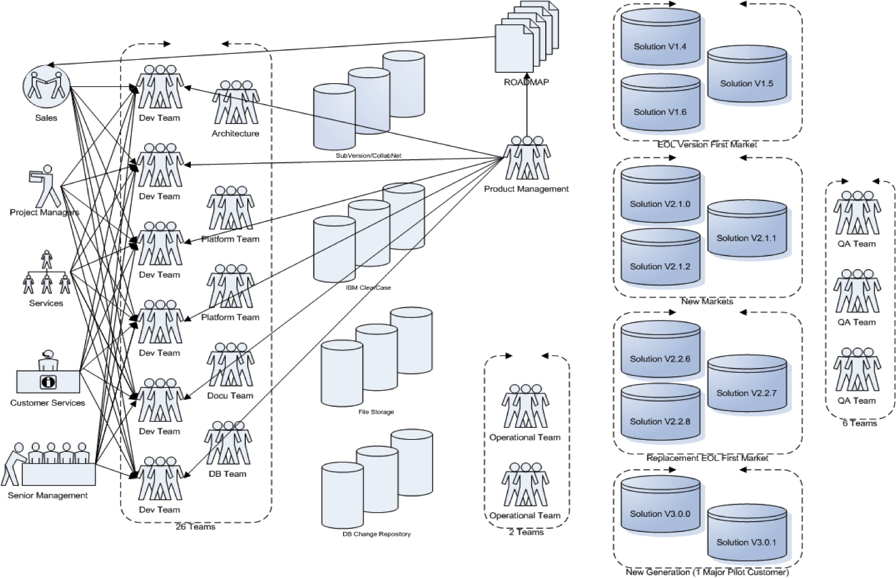
</figure>

Having already several smaller Agile and Scrum initiatives inside the R&D organisation that seemed to work, management had a look how this Agile thing might be a step forward to solve their problems and took on a lifelong journey which is still ongoing today.

This story describes only some initial steps to adopting Large-Scale Scrum (LeSS). There is still a long way to go. For example, only a few complete end-to-end feature teams have been created, though the “narrow-scope” component teams have broadened to cover a wider scope of the code base, at least reducing various problems.

## Lean A3 (PDCA)

In order to get a good understanding what was desired we created three Lean A3 forms that would guide large-scale Scrum adoption steps towards value for the organisation. Inspiration for the A3 workshops and tracking came from the book [“Managing to Learn”](http://www.amazon.com/Managing-Learn-Management-Problems-Agreement/dp/1934109207). Many readers have probably heard of A3 analysis, but perhaps not seen some real examples in a domain they are familiar with. So some of the A3 results are included for your reading and learning pleasure!

<figure>
  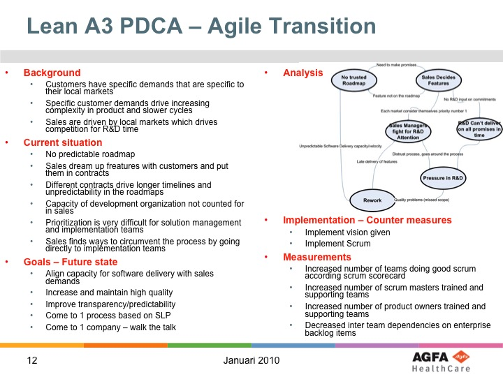
</figure>

<figure>
  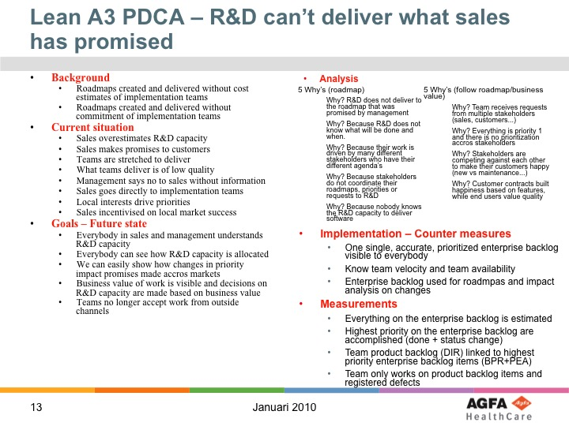
</figure>

<figure>
  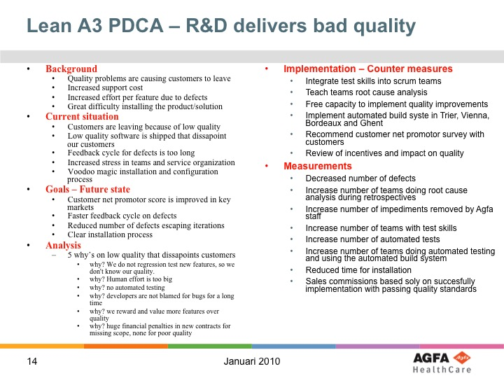
</figure>

## Prepare with Education

Having clear goals for the large-scale Scrum adoption we started setting up several Scrum courses for the entire organisation where content was adjusted according context of the people attending. This went from

* Scrum foundation courses to
* Scrum Master courses to
* Scrum Product Owner courses to
* Agile Management courses as well as
* technical courses

Almost all training courses were provided by external trainers together with Agfa internal coaches. Each course had at least one internal person in front of the class and each course was always given in pairs in order to grow overall competence within the organisation.

## Value-Stream Mapping

In parallel to the education to grow awareness and skills within the organisation, we had to acquire knowledge about the entire process from customer demand to demand fulfilled which was scattered through the 400+ organisation in several silo’s. We had two options:

1. Take the process documentation as it existed as “true”, and work on the basis of that information
2. Re-build the process overview with the people involved and go from there

We chose option-2 and organised a huge workshop (as part of the initial education focus, in 2008) with many people from within all different departments to build the organization's value stream from scratch. This kind of collaboration on process, having people discuss each others activities generated a good buzz and energy to take actions towards improvement.

<figure>
  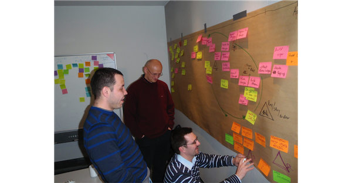
</figure>

We strongly believe that one can not manage a Lean and Agile operation without understanding value-stream maps, as they make your organization's waste clearly visible, you find bottlenecks, long queues of work, conflicts between inputs, and so on.

Improvements noted from a first cycle of value-stream mapping were:

* Combine the many backlogs into one master Enterprise Backlog for the company
* Prioritize that single Enterprise Backlog by some measure of business value
* No other work can be in progress in the teams other than the most important backlog item
* Convince the entire organisation to follow process

## The Desired Future State of the Organisation

Using the input, discussions and output from the first value-stream mapping workshop and inspired by the work of Bas Vodde and Craig Larman on LeSS (in the book, [Scaling Lean & Agile Development: Thinking & Organizational Tools for Large-Scale Scrum](http://www.amazon.com/Scaling-Lean-Agile-Development-Organizational/dp/0321480961)) the group designed a next-state organisation. Noting several topics to address to make it work:

1. Define the “area’s” where teams would work in
2. Find the right people for the new roles
3. Grow self-organising teams
4. Migrate component teams to feature teams
5. Create a state-of-the-art continuous integration system

## The Agile Coaching Team

Looking at the improvement goals and ideas, and taking into account the size of the organization, we soon discovered that we were lacking skilled Lean and Agile coaches on each of the 5 different locations.

So at the end of 2009 we started growing a true Lean and Agile coaching team that was directly reporting to the head of the business unit. Part of the team were internal employees (Philippe Launay, Sebastian Lang, Jürgen De Smet) and others were external coaches (Yves Hanoulle, Deborah Hartmann Preuss, Ralph Miarka, Ilja Preuss) that teamed up to get things going. This reflected the LeSS experiment described in [“Practices for Scaling Lean & Agile Development”](http://www.amazon.com/Practices-Scaling-Lean-Agile-Development/dp/0321636406) to have both internal and external coaches work together.

As coaches we were aware that working at different locations across Europe might drag us into site-specific context and disconnect us from each other. We knew that this kind of disconnection would not benefit us at all and as such we organised frequent online conversations, continuous online group chats, and bi-monthly face to face meetings (each time on a different location and as such balancing between all 5 locations within the organisation). Even though we knew about the risks, mitigated them by increasing our communication bandwidth to each other, we still had it difficult to stay connected and work towards a common goal instead of a local one.

## Enterprise Backlog, Product Backlogs, Areas, and Teams

In a complex environment one can not do things sequential. While the coaching team was in progress of getting hired and introduced to the organisation, Robin Dymond and Jürgen De Smet engaged with the leadership team to work on the frontend of the organisation, setting up a single Enterprise Backlog for the business unit (BU) to feed the beast of 400+ developers.

Together with people from the business, P.O.’s, P.M.’s, PjM’s… a true Enterprise Backlog for the overall solution was created with over 800 items that got prioritized with the BU management team.

Great, but what is missing? Indeed, you guessed it: “estimates”. How will we get estimates from the entire organisation? Some teams were already doing Scrum, others were doing Kanban and some were still strong believers of a more waterfall approach. All this is inherent to a large incremental transition without a big-bang approach.

Hiccup one: what kind of unit could we use for estimates? Not story points, as close to half of the organisation did not understand story points at all and we did not see how to get decent estimates from others in a timely manner. So we decided to go with person days of effort.. This would allow Scrum teams to recalculate their story point estimates back to person days and allow other teams to use their metrics to come with “good enough” estimates. This way the entire organisation was able to provide rough estimates on all items in the Enterprise Backlog.

Hiccup two: how do we get people to be courageous enough to provide a useful effort estimate? (Useful in the sense of helping to prioritize) Some teams were not used to giving estimates, some teams were used to get punished for providing the “wrong estimate” The culture was not everywhere open to such a huge leap forward. That’s where we got inspiration from “The Cone of Uncertainty” by Boehm showing us variation in estimation over time. Next to having a person day estimate we added a notice of confidence in the estimate: “S”mall when you are sure about the estimate given, “M”edium when you are ok about it, “L”arge when you are not sure about it, “XL” when you were blindfolded and threw a dart backwards to get to your estimate. With the confidence given we projected 2 different futures towards management and our internal customers. One based on the estimates given, called the “optimistic” future or the “high risk” commitments as Boehm taught us that these were most probably not going to be met.

<figure>
  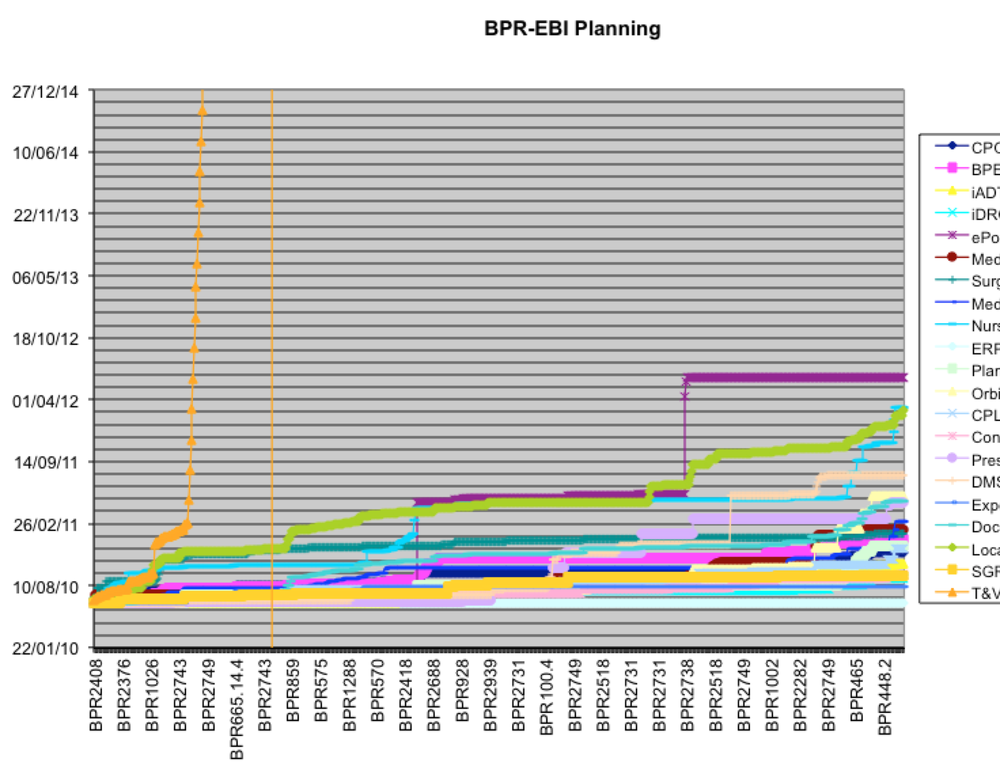
</figure>

Another one was based on the estimates multiplied with a weight coming from the confidence level, based on the cone of uncertainty (XL = 4x; L = 2x; M = 1,5x; S = 1,25x). This future we called the “realistic” future or the “low risk” commitments.

<figure>
  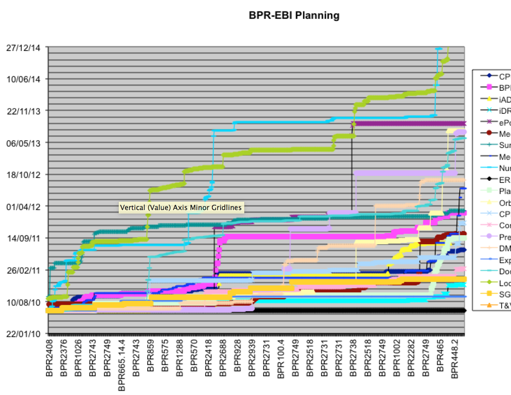
</figure>

We speculated that the truth would be somewhere in between those two projections and how much risk to take when communicating to customers and shareholders was not one to decide on by the teams.

The entire Enterprise Backlog with 800+ items got estimated by all teams involved. They were grouped in 21 areas, spread over 5 sites. The estimates were done in about 3 weeks. The coaches and team representatives spend hours in video sessions with over 100 people attending. Discussions were timeboxed and people were asked to be courageous. The results of this huge effort were taken seriously and became the new truth to communicate roadmaps and other Feature/Date combinations.

Solution Managers took over the Enterprise Backlog prioritisation that was guiding the entire 400+ person organisation. Next to prioritisation they also initiated workshops with customers and team representatives to get a decent understanding of the needs to fulfil. In fact, they acted as Product Managers for the entire solution and helped the teams to focus on the right things and connect to real end-users at important customers or through the organization's C.A.B. (Customer Advisory Board) workshops.

With the Enterprise Backlog set up, the Product Owners (in LeSS terms, the Area Product Owners) pulled in the items to their Product Backlog (in LeSS terms, a variant of an Area Backlog) to feed their teams.

On a two-weekly cycle (Area) Product Backlog items were considered for refinement and execution based on the teams capacity. Up to five Scrum teams consumed a single Product Backlog. In total 21 Product Owners were pulling items from the Enterprise Backlog into 21 Product Backlogs that were consumed by in total 400+ makers (hands-on team members).

And yes… There were still project managers. Why? They were needed as the translators of the internal workings to the outside world and helped in generating documents to comply to ISO/FDA regulations. In theory, the Product Owners could have done this work, but it was too much and too “secondary” to consume the time of the Product Owners. Project managers in the organisation would use the organisation its backlog and filter on their projects to get an overview of where things were and when things might be delivered in order to keep existing communication as it was before the transition to Agile. When disagreeing with calculated dates (based on team estimates and capacities) they immediately knew what kind of impact this might have on items expected by the fellow project managers who were also translating internal information to the outside world that viewed things in terms of projects. Which in its turn lead to more of a project management team instead of individuals that were banging on the PO’s door. As such the PO’s job on facilitating outside communication towards 900+ customers and several C.A.B.’s (Customer Advisory Boards) became easier.

And extra benefit we got from our Enterprise Backlog was an easy way to identify which items were causing the most disturbance and then we could decide to get those handled at the start of a new release or push them out of a certain release.

Aside from that the management got a good overview which areas of teams were out of balance and could take action upon this months before it would become an issue, either by hiring extra mind power or by moving mind power from one area or team to another or...

Having time to decide on actions to take generated a multitude of options. This was in contradiction to the surprises we often see in organisations which leaves the management with no other option quick fixes such as postponing things and/or hiring extra people, which in its turn takes the balance out of an organisation and complicates the situation.

Keeping things smaller is better, having less is better and… better will at the end be more... more satisfaction, more value, more innovation, more interaction…

## Coordination

### Synchronized Time Boxes

The entire organisation was consuming the Enterprise Backlog on synchronised time boxes of 2 weeks, each group started and ended their iterations on the same date. This was important for handling constraints between the teams, as each team had the same goal at hand within the same iteration: get it done! There was no excuse why teams would not work together on getting the constraints sorted out amongst them.

Constraints (or dependencies) were noted on each area-level Product  Backlog item so that it was clear who had to talk to who to get things moving forward. If a constraint was known between teams than this was handled through Scrum of Scrums (SoS) where people in the affected teams would agree on a SoS cadence that made sense to tackle the constraint in a constructive and qualitative manner. This could be daily, twice a week, or even just once a week with a single goal: get the constraint(s) handled and deliver value.

In general the SoS cadence was defined during iteration planning 1 where the teams affected would sync on their needs and ideas defining a high level implementation and coordination plan that was taken with them to iteration planning 2 and consequent iteration execution period. We do consider this kind of coordination through SoS as a key factor to handle multi team constraints. On the other hand if one would need SoS on a continuous base this would indicate that team/area structures are not setup correctly and a reorganisation would be required to improve the delivery process.

### Organisational Impediment List

As you can imagine a multitude of issues came to the surface of which many, not to say most, of them were handled within the teams that had regular team retrospectives to inspect their way of working and design improvements. We could say there was a two-week improvement cycle on the team level that took most of the pain out of the team for their delivery process.

The more mature the teams became, the more they suffered from organisational structures that were hampering them to further improve. This lead to the setup of Communities of Practice (see section below) as well as Open Spaces and some cross team retrospectives that were feeding an organisational impediment list curated by the Agile coaches. This list was one of the main tools used by the organization's leadership team to help improve the system. On a quarterly basis the leadership team came together to evaluate the list, set priorities and take action on the top items in the list. Sometimes by providing the right people, sometimes providing the right money, sometimes by using their political skills… but all in favor of removing issues raised by the teams.

### Integration and the Definition of Done

The fact that we had to handle a lot of technical debt and complexity within the solutions, a Continuous Integration (CI) system became a necessity and not a luxury! Without a decent CI system it would be difficult to keep things moving and keep feedback cycles short and valuable for the entire organisation that in that moment in time already had an agreement on synchronised iterations (same start day, same end day) in order to optimize the work on items with dependencies over multiple teams (which was consequence of still having component teams).

Having the same goal: “get it done” at the same time period, teams were more eager to support each other in fixing dependencies and helping each other. This resulted in another problematic item: having the right environments and tools at hand to quickly validate deliverables and the necessary skills to get this done the right way.

We hired extra “technical coaches” ([Qwan.eu - Quality without a name](http://www.qwan.eu)) to provide training and coaching sessions at all different locations using the code base used by the teams. During those sessions people got more skilled handling a legacy code base, isolating new developments and properly unit testing their code. As different teams move at different paces we discovered some teams were quite successful with their own Continuous Integration setup using Hudson, Maven, Fitness and other easy and cheap tooling. Some were even delivering to their customers (hospitals) every 2 week iteration! This was amazing considering the software is not cloud based, the customer base is huge and very regulated to get things in a production environment within a hospital, still respecting ISO & FDA regulatory requirements.

So how do we get this kind of knowledge spread? How do we get to a more uniform Definition of Done (DoD) for all different teams within the organisation?

Instead of pushing a certain level of “done” to the teams we made an inventory of what teams were able to do and what they are missing to get to “done” as being published into production within their iterations. The inquiry amongst the teams gave us information about tooling, about skills and where to invest and get external help. From that moment on we connected less skilled teams with more skilled teams to get cross team coaching arranged and increase the overall DoD. within the organisation. Having an increased DoD within the teams lead to better quality and faster time to market as well as a reduced cost to deliver the entire solution to the customers.

### Communities Of Practice

At the same time of setting up cross team coaching on a decent CI system an architecture Community of Practice (CoP) was started. This community of people from the entire organisation were discussing overall technical problems and produced guidelines for their fellow workers and themselves in order to solve some cross team technical issues. Similar as the community itself, the guidelines were a work document and a never ending story, every now and then agreements were reviewed, documents were removed while tackling some big and less big architectural and technical issues amongst all different teams.

As this seemed to work on a technical level we initiated (or better, we guided others) to have similar community activities sharing and caring about Product Owner issues, another one about Scrum Master issues, etc. Some of those communities of practice were there to stay, others had a life of a couple of months. All of them were born out of a common problem across multiple teams, the ones that discontinued were the ones where no new problems came to the surface that could justify its existence or where people were not motivated to put effort on it.

An initiative called “IKT” or Internal Knowledge Transfer that died a silent death, got polished and re-used within the different CoPs to share their learnings amongst other interested people within the organisation. Every 2 weeks on friday there was a time slot reserved, meeting rooms booked on all locations and a WebEx video conference initiated for the CoPs to use. Topics were announced and people joined at own interest while providing feedback on the IKT itself as the content delivered in order to improve both.

### Open Space

One of the biggest issues we had to deal with was the integration of the business departments (outside scope of coaching) within the R&D departments (in scope of coaching) and this frequently came up during Product Owner CoP sessions as something to work on. Seemingly this didn’t work out very well and an Open Space was mentioned as one of the opportunities to get the ball rolling. We had used Open Space on a smaller scale before (at a single location) but not like this one (all locations involved, 50 to 80 people or maybe more).

The full coaching team took this up and discovered that selling an Open Space to management is not an easy job! What do you mean you do not know what will be discussed?! You want people flying in from all different locations?! Do you know how much this will cost?! What do you expect as result?! Except of calculating the actual cost we could not answer that many questions but still were convincing enough to get it going. Struggle one was done, up to the next…

Ok, we got management support and support from the Product Owner CoP but this does not mean that we got the support within the complete organisation. We would need a very convincing and clear invite that motivated our target audience to attend as this open space (much as any other meeting should be) was not mandatory at all and nobody would nag when somebody didn’t show up. We investigated to what extent people could make their own decisions as this would be motivating to know that they can decide; what were the issues that could trigger them to come; who would need to send the invite;... and many more items to clear out to get to a single page invite as shown below.

<figure>
  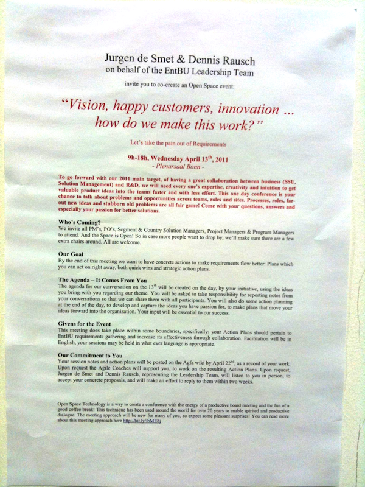
</figure>

At the end we got 63 participants coming to Bonn (DE), some from Bonn itself and others from Trier (DE), Vienna (AT), Bordeaux (FR) and Ghent (BE). They build their agenda for the day (second image below), they had fun, they struggled through some very complex issues and closed the open space (last image below) sharing learnings amongst each other.

<figure>
  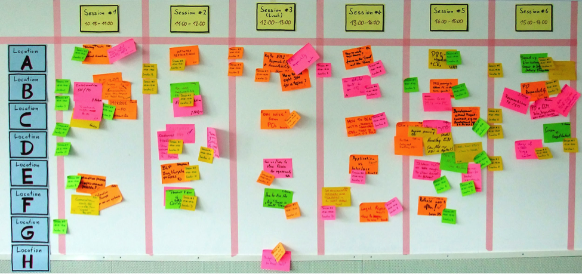
</figure>

<figure>
  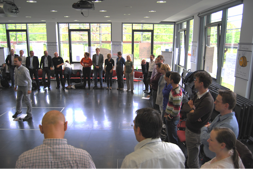
</figure>

2 weeks after the Open Space a report was given to management on the value of having the Open Space session with that many people from different locations (considered a big investment in time and money). Below a snapshot of what was achieved as visible results, things people invested even more of their time to make it visible and linked to the initiative.

<figure>
  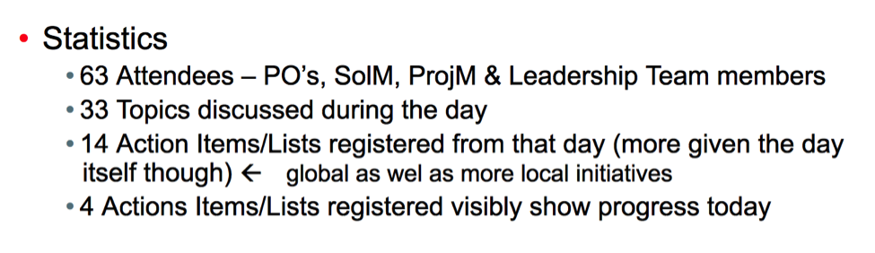
</figure>

When management is willing and daring to trust their people to make the right decisions you’ll see great things happening! This was one of the most energizing moments for the organisation and provided tangible and sustainable results related to a multi dimensional and multi site problem people were struggling with for multiple years! A success and a recommendation to every organisation out there to try a open space as a technique to solve their issues. Within Agfa Enterprise BU this technique has been and is being used on several occasions, even with customers.

## Component Teams, Cross-Functional Teams, & Feature Teams

As you have noticed before in this experience report, the organisation had component teams in place at the start. And that lead to lots of waste from a Lean perspective on things. While teams were growing their DoD they also became cross-functional in the sense that test skills entered the team. Only in edge cases this kind of extension of skills was done by adding (test) people to the team. Rather, most of the time adding test skills was handled by the existing team members learning more, with help from the Testing CoP (people in other regular teams, with a specialty in testing).

This was (and is) a very large group. In this case, LeSS does not recommend a large big-bang component-team to feature-team change, but a more incremental approach, such as in one area at a time.

But even that is easier said than done! There were strong dependencies, a huge technical debt and many other factors that didn’t help us to convince the organisation to start moving. As I remember we had only 2 teams that worked their way to “contribute” to what were called the platform teams. Contributions as they are happening in many open source projects, the people in the application teams (teams delivering to end users) were allowed to contribute to the platform source code and the people in the platform teams were reviewing and committing the code. This was a huge step forward but not what should be called perfect feature teams. But it was a step of creating broader-code component teams into a larger “Development Area” as described in the LeSS books.

But Rome wasn’t build in a single day and this was a good step in the direction of teams working on broader code.

### C-Level Management Shift & More Education

While Agile mentality and practices were growing within the organisation, other things do not stop moving. In 2010 we had to deal with a reorganisation that was initiated with a new CEO and his direct reports. As many people know, new management = new rules of engagement! And taking over what previous management initiated is not very commonly done. We feared the worst but got new opportunities instead!

After the reorganisation took place and many conversations about our Agile quest with the new leadership team we received a new opportunity to have the entire leadership team educated or introduced in what we do, how we do it and why we do it. A challenge we did not refuse! The complete Agile coaching team worked together to do this work and all of us did some part of the 2-day courses/workshops with the executive team.

What do you do with a complete leadership team?! It is impossible to get a diverse team like this one through the complete jungle of Agile values, principles, and processes, and getting them to adapt to an Agile mindset in 2 days is also close to impossible… so what do you do?

We choose to work with the executive team on being a team themselves while providing some insights of what Lean and Agile mean within an enterprise organisation. On day one we started with introductions, journey lines of each participant and some exercises around trust, and then a very small part on an introduction to Lean and Agile practices.

On day two we took them through the Bottleneck Game providing insight into Theory of Constraints as a way to manage and extended this with their and other people’s roles within the organisation and how that fits more to a self organizing company (in other words: less layers, less managers, less overhead, less…). It was a tough 2 days but worth it, as these 2 days made life easier for us and other people in the organisation to keep tackling impediments to growth and continuously delivering customer value.

### Half Way (and for this report the end)

I (Jurgen) left the group in 2011 to pursue more coaching experiences. At that time, this large group of 400+ people was still in the early stages of Large-Scale Scrum adoption, but definitely headed in the right direction.

At the end of 2011, another value-stream mapping workshop was held, as of course the context had changed during the years. New improvement actions were noted that lead to an overall process posted as presented below.

<figure>
  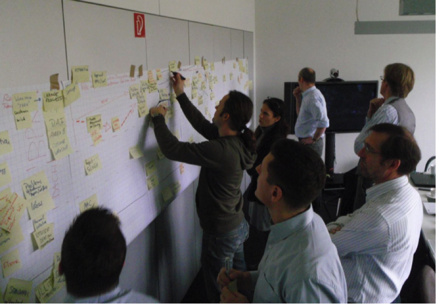
</figure>

<figure>
  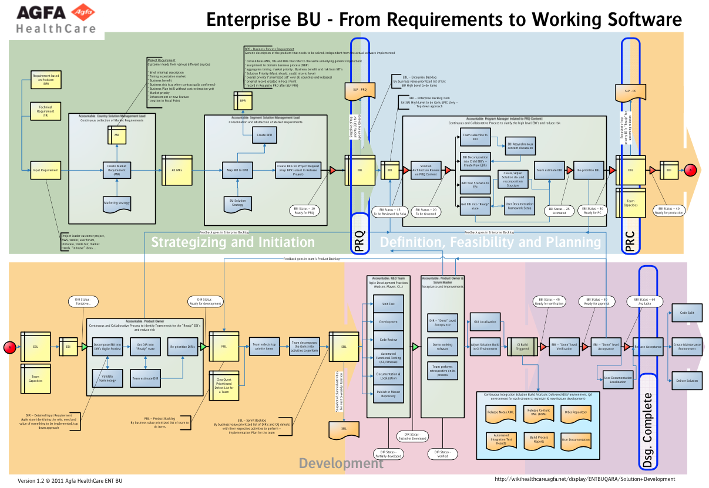
</figure>

Has it been a success? Yes… No… It depends on what you understand as success.
But…

> “We learned a lot! “

## Bibliography

### Video

* [Agile Eastern Europe 2009: Cooking the product stew by Robin Dymond & Jürgen De Smet](https://vimeo.com/7848658)

### Books

* [Managing to learn: using the A3 management process to solve problems, gain agreement, mentor and lead by John Shook and Jim Womack](http://www.amazon.com/Managing-Learn-Management-Problems-Agreement/dp/1934109207/ref=sr_1_3?s=books&ie=UTF8&qid=1421313324&sr=1-3&keywords=LEAN+A3)
* [Scaling lean and agile development: thinking and organizational tools for large scale scrum by Bas Vodde and Craig Larman](http://www.amazon.com/Scaling-Lean-Agile-Development-Organizational/dp/0321480961/ref=sr_1_1?s=books&ie=UTF8&qid=1421312498&sr=1-1&keywords=scaling+lean+and+agile+development)
* [Practices for Scaling Lean & Agile Development: Large, Multisite, and Offshore Product Development with Large-Scale Scrum by Bas Vodde and Craig Larman](http://www.amazon.com/Practices-Scaling-Lean-Agile-Development/dp/0321636406/ref=asap_bc?ie=UTF8)
* [LeSS website](http://less.works)

### Articles

* [From a Project to a Product Approach Using LeSS at Afga Healthcare](http://www.infoq.com/articles/project-to-product-agfa-less)
* [Agfa acquires G.W.I. - press release](http://www.agfa.com/global/en/main/news_events/2005/CO20051128_RSNA2005.jsp)
* [Christian Reinaudo becomes C.E.O. of Agfa - press release](http://www.agfa.com/co/global/en/internet/main/news_events/2010/CO_20100209_CC_CR_UK.jsp)
* [Bottleneck game - T.O.C. educational game](http://www.agilecoach.net/coach-tools/bottleneck-game/)

### Presentations

* [How to evolve from specialized individuals to a co-working team – an experience report from Agfa Healthcare by Katharina Fritz and Ralph Miarka, Scrum Gathering London and Agile Tour Vienna, 2011.](https://www.scrumalliance.org/system/slides/54/original/Agfa-How%20to%20evolve....pdf?1319549645)

