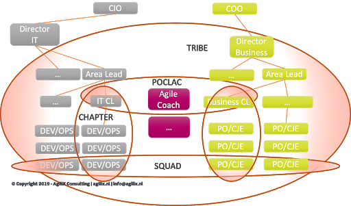
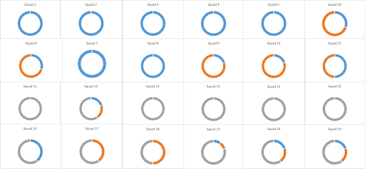
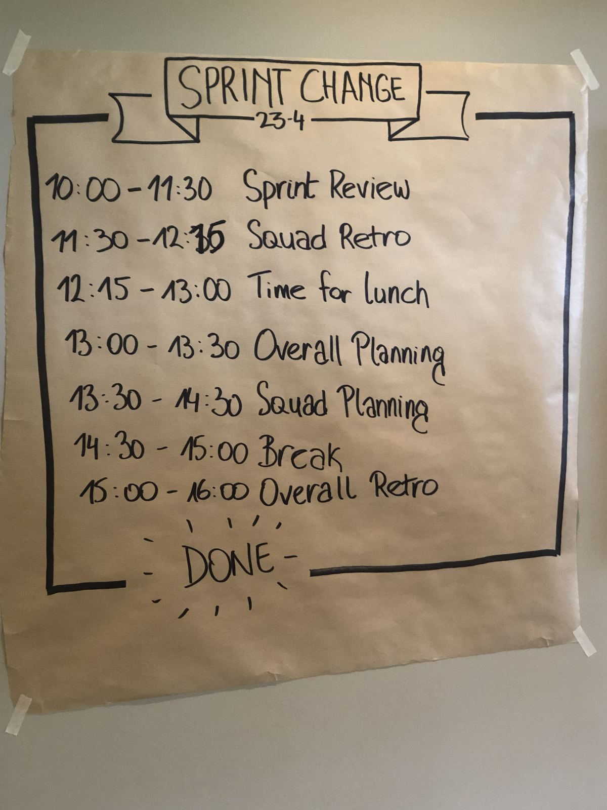
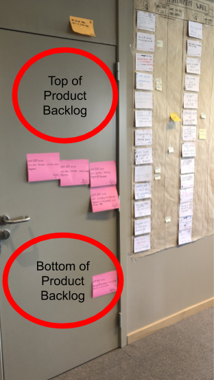

# 荷兰大型银行-我们迈向规模化敏捷的旅程

本案例由Cesario与该荷兰大型银行的一位需求领域产品负责人，一位总监，及一位IT区域主管共同撰写。出于法律相关考虑，本文中的人及银行的名字均已隐去。

## 介绍

本文是关于我们如何在荷兰大型银行的一个部落中改进其基于Spotify所创造的模型的。

我们的企业贷款产品由3个地点的20多个团队开发。每个团队都包含业务，IT和运营技能。在这种配置下，我们能够每2周向客户交付有价值的产品增量。我们通过采用LeSS原则进一步优化了我们现有的受Spotify模型启发的工作方式，从而实现了这一目标。

在这里，我们从4个不同的⻆度分享我们的故事：

* 部落的负责人。
* 顾问。
* IT主管。
* 与所有客户旅程（译者注：customer journey，是一种可视化分析工具和方法。想了解更多的，可以参考这篇[文章](https://www.infoq.cn/article/customer-journey-mapping)）相关的区域的产品负责人。

## 观察：我们为什么这样做？

大约1.5年前，我（ **总监** ）来领导这个部落。一个由500多人组成，包含业务人员和IT人员的小组来打造一个企业贷款产品，相关客户忠诚度小组所负责的工作也在我们的业务范围之内。以前，我曾参与过从零开始筹建一家零售银行以及按揭贷款方案的开发。在前一份工作中，我集中精力通过引入敏捷的工作方式，打造一个高绩效组织的模型。

最初几周，我决定花些时间做观察。期间，我注意到这些团队很开心，团队目标也似乎与小队的目标保持一致。这些团队是自主的，并通过大量的便签和站会来一起工作。
一切看上去都还不错，但这时候我们即将推出产品的第一个大版本。

我们每6个月可以交付一个产品版本。在这些版本发布之后，会有2个月进行缺陷修复，等待该产品稳定后将其发布到市场。我们在这些版本中包含了很多功能，但并非一定是正确的解决方案。漫⻓的发布周期和充满了惊叹号的缺陷修复期使我们很难为客户或董事会提供可靠的市场预测。

我受命对这个痛苦的发布周期进行改进。我与来自部落各条战线的人们进行了各种会谈以提出改进措施。业务人员指出，IT人员无法交付高质量的代码。反过来，IT人员指出，业务人员并不了解他们的客户地图，提供了错误的需求。因此，我们开始组织一些会议进行共同学习；所有希望能从我们的错误中学习的人共坐一堂分享他的理解，思考和观点。这是打开人们心态的第一大步。我们认识到我们都必须实质性地改变一些东⻄。

我邀请了新人们（在这个部落工作了不到6个月的人）与我分享他们的观点和看法。他们指出的一个问题是业务与IT之间缺乏尊重。他们提出的另一个问题是当小队们（团队）在实现他们的小队目标的时候，是否实际上也在为我们的客户和部落提供最重要的功能。

同时，在为比利时和荷兰搭建目标平台时，我也遇到了挑战。两个国家的团队都不拥有所需的能力，而且思维上仍然是很强的“他们？还是我们？”模式。如何才能将所有这些结合在一起？

### 服务热线：很久以前...

我不知道该从何下手，所以开始寻求帮助。幸运的是，就在那个时候，一位IT主管参观了我们的学习会议，我跟他分享了当时的情况。他说，他认识一个人，可能可以帮上忙，这个人甚至以前还曾对我的团队进行过Go See；于是，他把我介绍给了Cesario。

我（ **顾问** ）与该银行的接触发生在一次聚会上，当时我正做一个演讲。演讲的话题是关于大规模开发中的开发人员的。演讲结束后，一位绅士来到我的身边，与我分享了他在工作中遇到的一些挑战。后来，他介绍说他是一个荷兰大型银行的IT主管。

几天后，他给我打了电话。他建议说或许我应该过来看看他的团队。那时是2017年末。

我其实并不真正感兴趣，所以我说我将在本周晚些时候给他发一份提议。他回答说：“嗯，我以为敏捷是关于客户合作而不是合同谈判” ......他的回答令我感到好奇，于是我决定去银行看看。

所以，几个星期后，我去了这家银行几天进行Go See。

## 了解系统动态

我的许多活动都是以Go See开始的。我进行Go See会谈，表示了对团队和领导的尊重，并了解工作在整个组织层面是如何展开的。

在Go See中，我不断寻找的事情之一就是反复发生的事件。随着时间的推移，模​​式会不断重复。为什么？因为模式通常是组织结构，工作流程和政策共同作用的结果。这些系统性问题可能只能通过改进组织设计来解决。与通常的看法相反，您不能通过仅仅关注人来对系统性问题进行实质性改进。

但不幸的是，我不能在那里呆很长时间来观察随着时间的推移所涌现的系统模式。因此，取而代之的是，我依赖于在那里工作的人告诉我的故事，依赖于个人的观察，依赖于提问和谦虚的探询来获得对系统动态的洞察。

我与开发团队和领导层进行了各种对话和工作坊。我观察了会议和工程实践，作了结对编程，并研究了待办列表来了解工作环境。

基于所有获得的信息，我对工作经过时间的流逝进行了理解，并利用这种系统的理解提出了以下建议。

### 基于Spotify所创造的荷兰银行模式

产品组称为部落。总监来自于业务方，是熟知企业贷款市场的专家。她被称为部落首领。这些团队称为小队，包括业务人员（客户旅程专家）和IT工程师（拥有DevOps知识和相关背景）。每个小队都有一个产品负责人（PO），负责管理小队的待办事项。人的技能和能力发展是分会负责人（Chapter Leads）的责任。分会同时也有IT部⻔主管和业务部⻔主管。

敏捷教练支持部落按照荷兰银行敏捷模型的标准工作方式开展工作。产品负责人，分会负责人和敏捷教练组成了一个三元组，称为POCLAC 。

下图描绘了这种组织结构。

<figure>
  
</figure>

### 小队的局部优化

部落由24个小队组成。有些小队的成员分散在多个办公地点。大多数的小队就是我们在LeSS中所说的组件团队。

每个小组都有一个“产品负责人”，他们忙于了解需求，待办列表管理，团队之间的协调以及团队的管理任务。

小队的PO会做优化，但都是本地优化。我发现了很多例子。比如：第3小队需要改动一个API，而第6小队是计划进行更改的团队。但是后来，第6小队决定不做这些更改，因此第3小队就无法完成工作。各个小队发现很难与部落的愿景及整体产品目标保持一致。

尽管每个小队都有明确的目标，但该目标通常对最终用户没有意义。从以下事实可以清楚地看出，大多数小队无法独立交付最终客户价值。另外，这些小队只能完成完整特性的一部分。大多数小队之间存在特性间的依赖关系，范围从30％到80％不等。依赖关系会减慢特性开发的速度，增加小队之间的排队，延迟市场反馈回路，降低部落的敏捷性，并且在整个产品级别变得难以预测。这是一个很大的问题，当您开始添加越来越多的组件团队时，问题将指数级地增加。

我认为他们的工作方式是对[拷贝粘贴式规模化](https://agilix.nl/resources/ScaleYourProductNotYourScrum.pdf)的完美实现。基于重复的思维模式做规模化敏捷，得不到好的效果。

反复出现的问题是，预测不可靠，部落级别的聚焦程度低以及无法对涌现的想法做出响应。而这些都与工作在这样的系统中密切相关。

### 研究工作间的依赖机制并进行最大优化

当我研究整个部落预计在来年计划完成的工作时，我识别出3个高度依赖的区域，出于法律原因，在这里让我们将其称为蓝色，灰色和橙色。在蓝色区域，我们发现该工作除了需要7个全职团队外，还定期需要另外3个团队的支持。

在下面的图形中，您可以看到24个小队的依赖关系。圆圈的颜色部分表示在特定区域开发最终客户特性所需的时间百分比。一个完整的蓝色圆圈则表示该小队100％的时间都需要投入到蓝色区域中。

<figure>
  
</figure>

研究的结果表明，蓝色小队1、2、3、4、5、7、8、16和 21应该在同一产品上协同工作，因为几乎所有功能都需要这些小队。

### 单一职能经理和POCLAC

分会负责人担任单一职能经理。例如，有针对特定技术（例如Pega或Java）的IT分会负责人。单一职能经理鼓励人们在单一技能的职业道路上发展。他们不去促进人员的多技能发展，而这恰恰是创建适应性团队所必需的。

团队的问题通常不是由团队讨论，或者与团队一起直接讨论。相反，产品负责人，敏捷教练和分会负责人在POCLAC（代表Product Owner，Chapter Lead及Agile Coach这三个角色）会议中讨论了这些问题。这样的会议剥夺了团队对流程的所有权，决策的自主权以及如何做事的自组织权利。如果您想要一个不断改进的团队，那么情况恰恰事与愿违。随着时间的流逝，团队所有权会越来越少，“POCLAC”活动也会越来越多。

### 持续集成

17 个小队工作在特性分支（Feature Branch）上。也就是说，他们彼此隔离地工作了数周甚至数月，而没有将代码与其他小组集成。而且我发现，除了“这就是在这儿的工作方式”之外，没有什么充分的理由支持产生这么多的分支。

分支会抑制协调并导致延迟，引入集成问题，减少重构的可能性，并导致后期持久且痛苦的稳定化阶段充满了诧异。

如果没有持续集成，协调就会很差。每次发布都是痛苦不堪，预测的结果也无法预计，这些都不足为奇。（另请参⻅[为什么您当前的规模化敏捷方法行不通？](https://agilix.nl/case-study/why-isnt-your-current-approach-to-scaling-agility-working/)）

### 输出物驱动的开发

我要分享的最后一个观察结果是输出物驱动的开发。每个季度都有一个“季度业务回顾”会议，向小队分派包含了需要完成的用户故事的Epic。绩效就根据完成的Epic和用户故事数量跟踪来进行评价。目标是按照季度初所承诺的那样完成所有的用户故事。您的结果越可预测，您的得分就越高。

使用此方法时需要注意到两个要点。首先，您在本季度初希望完成的工作可能并不能真正解决客户的问题或实现您的业务目标。为什么？因为那时候您可能根本不知道您的解决方案是否真正解决了客户问题。更重要的是，您可能首先去为客户解决的是个错误的问题。

因此，目标是提供解决方案或相应的一套Epics，而不是实现一个具体的结果。团队面对的只是要做的工作，而非待解决的问题。

其次，使用输出物驱动的开发，团队没有任何动力去验证假设，他们也不被鼓励去那么做。您冒着风险提供很多解决方案，但是却解决了错误的问题。部落使用的计划方式是预测性的，而不是开发复杂软件时需要的适应性的。

## 领导力挑战与组织设计

重新设计部落的方法有两个方面。首先，领导层致力于对齐目标，他们需要应对什么样的挑战？其次，需要什么样的组织设计来应对这些挑战？

一些主要挑战是：

* 作为一个部落，我们如何变得更加可靠？
* 如何在部落内增强聚焦和一致性？
* 如何处理跨站点的开发？

我们在Go See会谈中获得的洞察为我们指引了以下方向

### 作为一个部落，我们如何变得更加可靠？

如果我们在任何时候对部落的季度目标都有更好的了解，那么可靠性就很可能会提高。

我们认为如果每隔两周就知道产品在整体层面上什么完成了，什么没有完成，那么透明性将会提高。

为了实现这一目标，我们决定：

* 尝试告诉团队问题，而不是告诉他们要实施什么“解决方案”。
* 尝试让所有小队在每个Sprint结束时对可工作的产品负责，而不只是为自己工作的那部分负责。
* 尝试逐步消除所有分支。所有团队都工作在主线上。分支仅仅用于产品的发布版本上。这样可以提高协调性，减少中断并提高速度。（起初，人们对非常惊讶，他们甚至连想都没有想过可以不使用任何分支。基于现有的配置和技术做持续集成似乎是不可能的。）

### 如何在部落内增强聚焦和一致性？

根据Go See的结果，我们认为如果减少小队的一点自治权，通过要求各个小队每个Sprint达到一个共同的目标来达到，那么在部落层面上的聚焦和对⻬可能会增加。

为了实现这一目标，我们决定：

* 尝试形成小队（蓝色小队）工作聚焦在客户主张领域。让他们共享一份待办列表；这种聚焦将提升速度和适应性。
* 在我们确认第一个领域可以这么工作了以后，尝试为其他小队引入新的LeSS领域。
* 尝试做以结果为导向的计划，而不是以输出物为导向的计划。例如，不要要求团队交付“5个Epic”。相反，要求他们找到缩短贷款批准时间的解决方案。
* 尝试每天至少两次将所有小队的代码集成到主线中。这样可以减少在开发后期甚至交付后发现缺陷的⻛险。

### 如何处理跨站点的开发？

有些小队从形成以来就分在两个站点独立工作，但现在我们需要开发的是一个产品。在每个站点，人们只了解他们所对应的特定的产品详情，特定的系统，特定的客户和市场动态。由于所有这些原因，我们的系统、数据和流程中存在大量的重复，需要迁移到某个单一位置中去。

因此，我们需要一种方法来进一步开发产品，同时在部落层面上保持聚焦和可靠性。而且，我们还需要确保每个人都参与到将系统和数据从一个站点迁移到另一个站点的工作中。

为了实现这一目标，我们决定：

* 尝试暂时的跨站点团队合作模式。这意味着小队将由来自两个站点的成员组成。
* 接受跨站点团队分布式工作所带来的痛苦，培养⻓期的部落间的理解与对齐。

因此，刚开始我们并没有使用同地的团队。而是使用跨站点团队，让来自多个站点的人员进行交流，以加快对跨国系统、业务流程和客户的了解。

### 打破规则

无论与您期待的结果是相符还是相悖，您都可以从做事中学习。例如，当您尝试做某事并收到预期的反馈时，您将能对当前的假设和价值判断进行确认。另一方面，当您认为做某事行不通，但结果却是行得通的时候，您就知道自己的某个假设，价值判断或思考方式是不正确的。

问题在于，通常我们会避免去做一些我们认为”无用“的事情。

在本次导入中，我们做了很多我认为”无用“的事情。

因此，我们没有遵循传统的方法来解决问题。我们打破了很多“规则”：

* 没有教育所有人LeSS的相关知识，实际上我们没有教育任何人。相反，人们是在工作时了解其工作方式的。通过组织研讨会，解释这么做的原因、目标以及策略。通过开展小型工作坊，期间人们可以讨论他们面临的现实问题。
* 没有使用志愿者的方式。取而代之的是，人们通过邀请加入。在经历一些迭代之后，才开始让人们自愿参加。
* 没有取消团队PO这个角色。取而代之的是，团队PO在第一个迭代之后自愿将自己的⻆色抹去了。
* 在反转之前没有准备持续集成系统（CI）。取而代之的是，我们将CI放在整体待办列表上好几个月。现在这件事情可能发生了，因为我们终于有了单个产品负责人。
* 没有使用同地团队。取而代之的是，在比利时和荷兰的成员组成了跨站点团队，以加快对跨国系统、业务流程和客户的了解。
* 没有秉承1个Scrum Master为1..3个团队服务，实际上我们根本没有ScrumMaster。取而代之的是，我们有4名全职的敏捷教练，在多团队的事件中提供帮助。
* 没有使用LeSS这个词，而是聚焦于挑战。几个月后，我提到我们正在做的是LeSS，他们说，“是的，我们知道，我们并不愚蠢:)”。

## 我们如何工作？

我们（ **产品负责人** ）的改进目标是：

* 提高Epic的完成率
    * 通过聚焦一份以最高客户价值排序的产品待办列表
* 每个迭代都交付价值
    * 跨职能/组件团队能够交付可发布的产品
* 提高幸福感并提升/拓宽技能
    * 通过投资于员工的技能和专业知识，为目标解决方案做出贡献

荷兰银行企业贷款产品的第一步是让7个小队与一名产品负责人一起工作。小队的工作遵循标准的LeSS流程。唯一值得一提的是以下的内容。

所有小队每个Sprint都参加多次同步多团队待办列表梳理工作坊。这增加了知识共享并减少了团队之间的依赖。人们对他们所了解的进行选择性的分享，例如Pega开发。

所有小队都做国家间的旅行以进行迭代评审。迭代历时2周，这意味着所有的荷兰成员每月去一次比利时，反之亦然。当我们都聚在一起时，会花一整天关闭当前的迭代然后开始下一个迭代。

一个典型的迭代评审议程包括：产品愿景，产品目标，并行的团队演示，逐步处理反馈和对下一个迭代的展望通常融合交织在一起。

<figure>
  
</figure>

## 好难！

过去，小队们工作在属于自己的产品的那部分，流程或客户领域很⻓时间。但一天天，这一切都发生了变化，人们拥有了一些很棒的机会来学习从不同的⻆度看世界。放弃旧习惯和局部优化对人们来说总是很难。以下挑战是我们要分享的：

### 我已经知道我需要做的了，为什么我们还要做梳理？

在最初的几个迭代中，有些人认为所有的多团队梳理都是浪费时间。他们的理由是他们已经非常清楚需要做什么了。那么，为什么我们需要与所有的人，包括哪些可能根本不会工作在那些条目的人们再次讨论呢。这是低效的，而且非常浪费。

我会说：“我理解您可能已经了解这个产品待办条目的全部内容了，但是其他的团队成员呢？”

“我们的目标是所有的小队都需要能够从产品待办列表中挑选任何条目作为迭代目标，可如果是有些条目您知道所有信息但是其他人都不知道，怎么办？”假设您是主题A的专家，而所有其他成员都是主题B的专家，那么当我们的待办列表中仅仅包含主题A的时候，会发生什么？那不是我们想要的。

### 计划是什么？

传统上，人们使用⻓期计划，而且这些计划是详细的。在新的工作方式中，下季度的计划是详细的，但除此之外，仅仅计划了业务目标。

我会说：“我们对业务影响做出预估，但是无法预估什么时候交付什么功能（用户故事）。当我们获得并加以研究有关使用情况和业务目标的反馈时，需要的功能就会涌现。”

最重要的是，人们还没有习惯被要求去解决问题，而是被要求去做任务。在这种新的思考方式下，他们得到了机会通过自己的技能和创造力为客户定义完美的解决方案。

这对于小队的人们以及部落以外的领导者们来说都很难理解。我们仍在与此作斗争。

### 排优先级，“我为什么需要工作在这个上面？”

小队们共享一份相同的产品待办列表中。优先级排序是基于对部落最有价值的东⻄。这与过去有所不同，过去待办列表的工作是以保持小队忙碌和提高局部效率为目标来排优先级的。

在迭代计划期间，关于本地效率的观念变得清晰起来。在迭代计划期间，小队可以选择他们想要的产品待办列表条目。通常小队会选择他们工作起来更舒适的条目。小队没有按照优先级选择条目。下面的图片展现的是小队挑选完条目后的产品待办列表。

小队选择了处于顶部和底部的条目来工作。他们选择了底部较低价值的条目，而不是中间较高价值的条目。

<figure>
  
</figure>

当教练问起时，小队说如果工作在放在中间的条目上则会效率不高，因为他们对底部条目的了解更好。

多数情况下，我都是拿着这些处于中间的条目，请小队们先挑选它们。我反复地告诉大家，这可以促进学习和增进对整个产品的了解。我们的目标是任何一个小队都可以从产品待办列表中拿任何一个条目。这很难并且花了很⻓时间才让小队采纳了这个新想法。 当有1个小队有勇气拿起这类条目之后，很快就有其他小队紧随其后。尤其是当那些避免挑选不在其专业领域的条目的小队遇到了恰恰是另外小队的专业领域的时候。

### PO的工作太多

在早期的迭代中，我非常渴望并尽一切努力来促使目标达成。那段时间，白天很长夜晚很短。回答问题，与许多用户、干系人沟通，编写用户故事，Epic，准备会议等等。实在无法忍受。不能这么继续下去；否则我怎么能成为7个小队的PO？

我知道为了解决这个问题，团队需要能自己与客户进行需求条目的梳理。我需要集中精力做总体规划，与客户和干系人一起工作，思考Epics的优先级，操心Epics的预期结果，并从业务的⻆度表述验收标准。我需要在战略层面上做更多的工作。

当我们要求团队创造用户故事地图来解决我们的主要挑战时，情况发生了变化。解决方案成为他们的计划，这确实使得梳理工作更容易，更有效。

### 所有权和持续改进

流程改进以前是由团队PO和敏捷教练推动的。由于他们的影响范围有限，大部分改进只是针对他们的团队的。很难实现跨多个小队的大一些的改进。

整体回顾会议引入后从根本上改变了这个动态。在每个迭代结束时，小队代表和管理人员就聚在一起讨论发生的问题。小队完全可以尝试他们想要的任何改进。这带来了许多改进行动，例如通过”群殴式编程“来共享知识，引入各种标准，改变梳理会议的方式，改变小队的组成结构，甚至改变做整体回顾的方式。

## Key Results

We have been working in this configuration for over 6 months now, and we got some interesting results as you can see below.

* Epic Completion
    * Steady increase in achieving planned outcome. From 55% to 80% in 3 quarters.
* Deliver value in every sprint
    * Over 50 reviews of valuable functionality to our users / customers. In contrast to less than 10 previously.
* Improve happiness and Improve/broaden skills
    * Slight increase in employee satisfaction too. From 5.85 to 6.04.

## Key Insights we want to share

The key insights we think are essential to have achieved what we have now are:

* 1 shared vision, 1 goal is very powerful
    * Co-creating the product vision with  people over time.
    * Repeating the product vision over and over again
    * Understanding purpose increases intrinsic motivation.
* Reduction of dependencies between squads
    * We have more autonomous squads because more teams can work on customer facing item independently.
    * The work of the squads has become more meaningful because their work contributes directly to customer value.
* Create ownership, do not tell people what to do, ask them to solve problems!
    * Use all the intelligence that is available in the group.  Set ambitious goals and have  people come up with solutions.
* Instead of making false predictions , first become more reliable.
    * Multi Skilled people and cross-component feature teams increase reliability because the squads are better tuned. Measure of progress is transparent because progress is measured at the level of the feature.
    * Forecasts are hard to make. But having reliable quality of the product reduce the surprises during the stabilization phase.
    * Continuous integration with automated tests is essential to increase predictability.
* Working in feature teams revealed that people formerly known as  heros were actually preventing others from developing.
* It is not about autonomy, but about tuning the teams.
    * Working together with lots of teams might look the squads have less autonomy. But actually this is a false assumption. Autonomy is about being able to do your work without dependencies. Our configuration reduced the dependencies between the squads.
    * The key insight is that autonomy is about how the squads are tuned with respect to each other. Moving all autonomous in the same direction requires constant tuning and being aware of the whole product.

We are still struggling and working hard to improve. An important difference is that improvement became everybody’s concern. It feels like the whole group is taking ownership of the process and taking initiatives to improve. This has made work challenging, meaningful and more fun.

