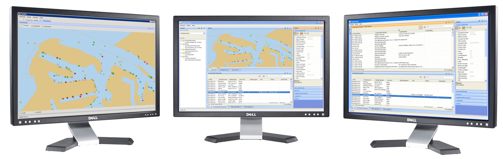
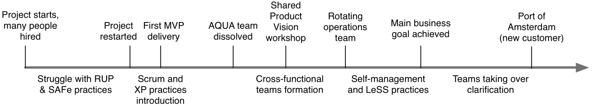
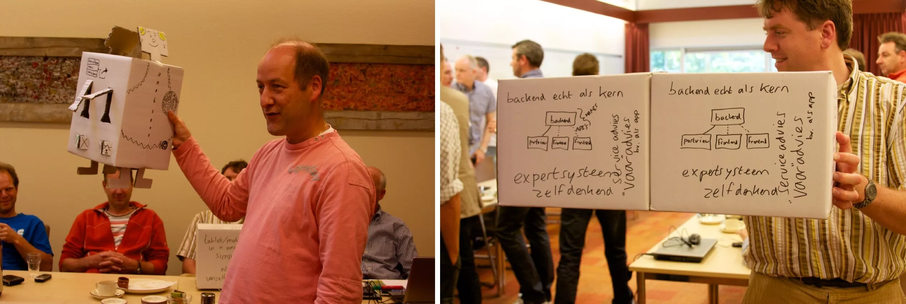
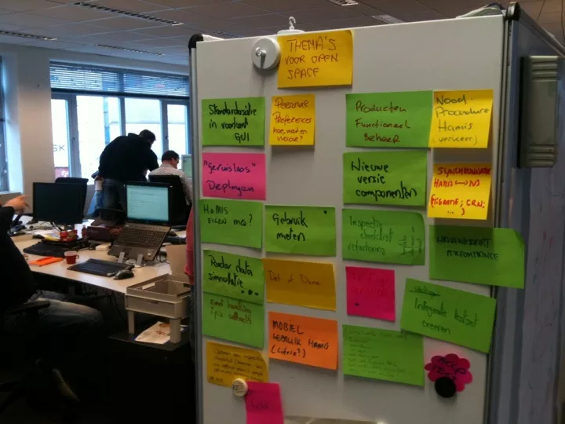
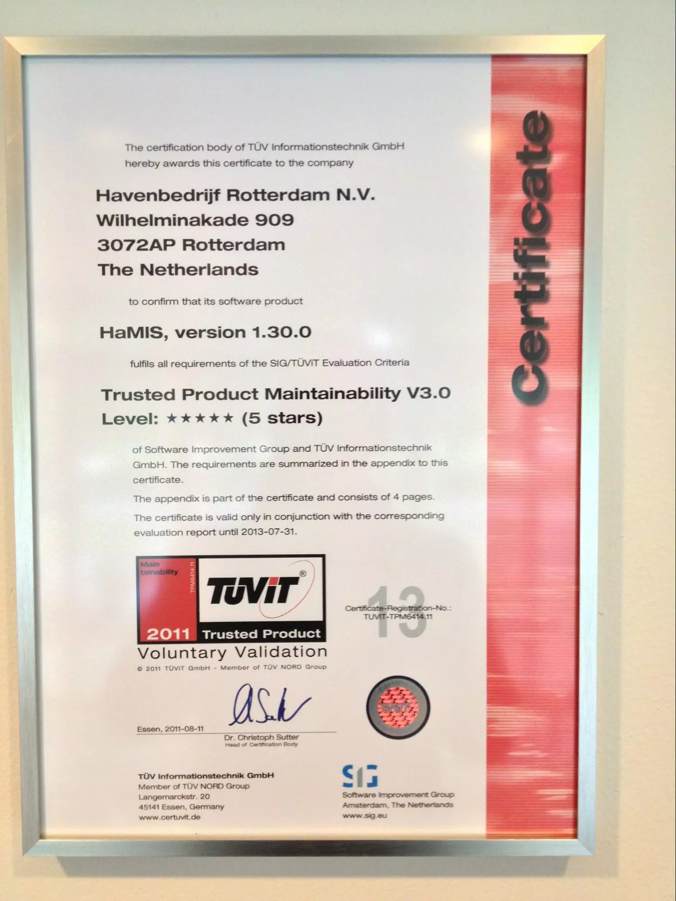
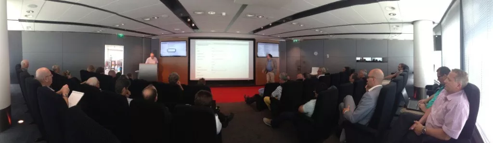
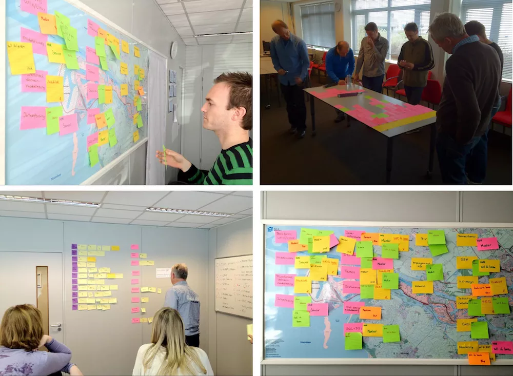
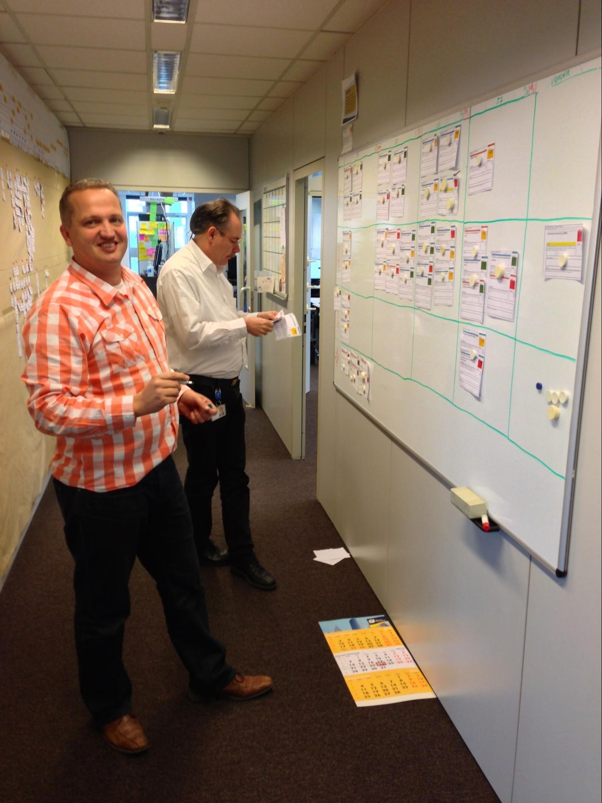
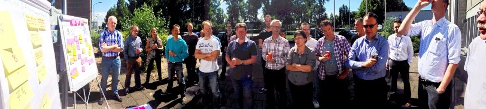
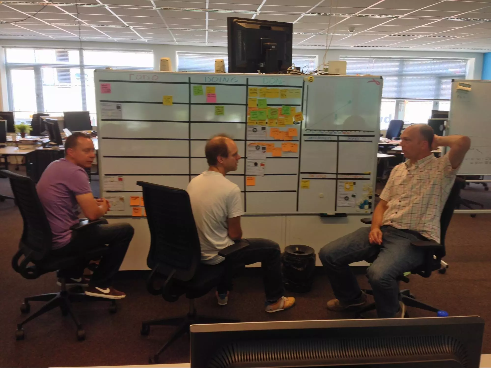

## 鹿特丹港口信息管理系统开发：从LeSS的角度看

*这是一篇将鹿特丹港案例与LeSS原则以及组织设计进行比较的文章。它讲的是四个跨职能特性团队交付并运营一个至关重要的，7x24小时运转的港口管理产品的故事，该产品由船舶交通服务运营人员和其他几种类型用户使用。*

## 上下文与客户

鹿特丹港口管理局营业额约为 6 亿欧元，拥有 1,100 名员工，负责商业、航海和基础设施相关等各不相同的职责。 [特性团队](/less/structure/feature-teams)的首要客户是港务部门（Harbour Master）。该部门确保了航运交通（每年大约 33,000 艘远洋船舶和 110,000 艘内河船舶）能平稳、流畅并安全地运作。

用户多种多样。一些为港务部门工作，一些为其他部门工作，还有一些为鹿特丹港的众多合作伙伴工作。

<figure>
  
  <figcaption>图 1：在常用物理设备上显示的实际 HaMIS 用户界面</figcaption>
</figure>

主要业务流程的核心是一个名为 HaMIS（Harbour Management Information System，港口管理信息系统）的产品。 HaMIS 的想法诞生于很多年前，当时的需要是替换掉既有的。 既有系统已经在鹿特丹港很好地运行了 20 年，但旧的技术和架构已经成为对业务流程做出任何重大改进的主要障碍。 鹿特丹港正在发展和变化，既有的老系统已无法满足要求。

产品的首要目标很简单：最小化过时的老系统带来的负面影响。 但另一方面，次要目标并不是太明确。 鹿特丹港正在增长，尤其是随着 [Maasvlakte 2](http://en.wikipedia.org/wiki/Maasvlakte_2) 的扩建。 该产品必须能在工作人员数量不变的情况下支持港口不断增长的交通情况。 这意味着需要加强信息交换、对相关利益方更好的协调，以及更好地支持港务部门的主要流程。

## 一起是如何开始的

在决定用 HaMIS 替换旧系统之后，就开始了制定计划、制定预算、涉及供应商和软件集成商的可怕的采购流程一系列复杂的过程。预期中这是一个外包开发项目。在这个过程中产生了很多文档，但除了概念性验证（POC）之外没有真正的代码产生。

最终，港口管理局做出了一个勇敢的决定，全面停止这个过程。开发计划太复杂了，不可能成功。需求复杂且高风险。太多的不确定，而且如果项目失败，这将会是荷兰的大新闻。如果有缺陷的系统投入到生产，后果可能会更糟糕。

但现有系统已接近其使用寿命，因此港口管理局别无选择，只能以一个主要目标重启该项目：用至少提供相同功能的新系统替换当前系统。但这一次，港口管理局选择了作为一个内部产品开发，而非外包给一个或多个系统集成商。

新产品的开发选择的方法是 RUP 和伪 Scrum 的组合（当然，它没有正式标记为“伪”）。虽然有 3 个完全由开发人员组成的“Scrum”团队开始举行站立会议并尝试其他实践，但是也存在在另一个独立的由 8 名不同类型的架构师和分析师组成的名为 AQUA（architecture and quality assurance）的架构和质保团队。

这么看来，最初的意向是**改善**。在现有组织的各种假定限制内，准备实施“开发级别的 Scrum”。而这项工作是由分析师和架构师组成的一群人设定的。

### 从 Scrum-But-But 到 Scrum-But

 RUP和Scrum-but-but的组合体并不真正地发挥作用。一家教练服务公司被引入来帮助他们学习如何转向Scrum。这家公司提供了Scrum培训和具体的工作辅导。但还是没有转为全面使用Scrum。比方说，团队决定培养并任命两个人为“Product Owner”，同时，任何事件中实际上都是一个项目及程序经理做决策。

 译者注：
 1. RUP：https://zh.wikipedia.org/wiki/统一软件开发过程
 2. Scrum-But-But：Scrum-But是指团队无法全面使用Scrum进行产品开发的原因。这些原因有特殊的句法结构来描述，“我们使用Scrum，But......”，Scrum-But也由此得名。作者这里的Scrum-But-But是指比Scrum-But还要更低一个层次的状态。

Scrum作为实践而非会影响既有团队和经理角色的*组织设计变革*不正确地导入。AQUA团队仍然存在，并且“Scrum”团队既非跨职能、自管理，也不能展现多面学习和多技能。没有一位真正的产品负责人，项目经理仍然存在，为“达成目标”负责。一些SAFe实践，比如“架构跑道”，仍然被讨论或引入了。

教练辅导公司引入了许多团队及技术层面的实践。比如，一次代码提交后（使用SVN，基于主干的集成），构建服务（Jenkins）就开始了包含使用Sonar进行质量检查的构建。测试包含单元测试，少量的Fitnesse测试以及通过录制播放工具进行界面测试。后来后者被完全弃用。此外，在这个阶段自动化测试还没有作为自动化构建的一部分。

改善在进行并逐步靠近Scrum，成果也不断地展现出来。迭代是3周，所有的Scrum会议也都被践行。最为重要的是，每个迭代后，一个**单一的潜在可交付产品增量**被发布到一个预生产环境，然后一些关键客户会试用新功能。

### 从 Scrum-But 到 Scrum

这个时候我作为架构师兼敏捷教练入场，同时那家教练服务公司离开了。

尽管他们叫我敏捷教练和架构师，但我那时的意图是作为Scrum Master来引入真正的Scrum推动组织设计。每个团队都有一个任命的Scrum Master，但实际上他们只是比其他成员多承担了一些引导工作的普通团队成员。

> LeSS规则：Scrum Master负责一个运转良好的LeSS导入。他们关注于团队、产品所有人、组织和开发实践。一个Scrum Master不只关注一个团队，而是整个组织系统。

我们做的第一件事是以“系统改善”为目标，逐步废除AQUA团队。废除工作通过逐步把决策权转移到特型团队来进行。此外，剩余的AQUA团队成员并没有坚持待在老的团队中。尽管如此，他们中有些人在AQUA团队被废除后仍然想保留他们在分析、架构及质量保证领域的权威性。

最后，没有什么活儿留给那个团队做了。换句话说，真正的可以端到端交付的Scrum特性团队成功地建立起来了。在特性团队与用户之间也没有任何人了。AQUA团队成员要么加入特性团队，要么就是做一些产品开发组织之外的任务。

与需求和架构关注点相关的知识，经验，新的洞察以及业务的持续改变都始于团队。

这一转变真正有挑战的地方是AQUA团队成员的特定头衔和角色。在经过很大的努力后，它们才被完全移除。这些头衔和角色，如不同的分析师和架构师，是双重的。他们真正的在组织中被公司和HR授予的岗位从来没有被正式地改变过。与此同时，在组织变革后，这些岗位和角色从HaMIS产品开发的角度看已经变得没有意义了。

有时，当直线部门试图通过人们的角色来影响产品开发时，这会产生一个小问题。一个例子是对“项目完成后移交到运营”的讨论。但实际上，项目已经不在存在，只有持续的产品开发和管理。另一个稍大一点的挑战是直线经理试图（并没有成功）将任务分配给他的下属，尽管他们已经完全分配给 HaMIS 产品开发。此外，还有一些KPI需要通过相关年度评估。一些团队成员因为没有达成他们的KPI而获得全部加薪。

这些问题的根本原因是持续存在的矩阵管理结构，从官方定义来说人们汇报给他们的直线职能经理及项目经理。组织变革移除了对项目经理的汇报，但是对直线职能经理的汇报仍然保留在后台。这个问题只是影响着少数的人，并且由于典型的荷兰企业文化以及优秀的总体成果，他们能够简单地忽略直线经理的影响。

在这个时间点上，我们仍然有一个活跃的项目经理正在学习着如何放手。他仍然可以表达他想要什么，而非所有的控制都在一个真正的产品负责人手中。

两个伪产品负责人中的一个开始表现得像一个真正的产品负责人，他也被看作是真正的产品负责人。两个产品负责人都是从港口管理（业务）部门来的。[真正的产品负责人](/less/framework/product-owner)也是那个做优先级排序以及产品代办列表更新的人。他拥有足够的权力来做产品相关的决策。第二个人官方也被叫做产品负责人，但是实际上并不被视为“产品负责人”。不幸的是，他持续地充当团队和用户之间的中间人（业务分析师），增加了交接，与人们谈话并且收集反馈。这个问题从来没有被完全解决过，只是及时减少其影响。我后来学到的教训是拥有一个待在团队和用户之间做分析师的伪产品负责人存在非常重要的缺点。这是我曾经在一开始时（错误地）以为这是一个可接受的妥协，并没有预见到它会带来的复杂度。

> LeSS规则：对整个可以交付的产品有一个产品所有人和一个产品待办列表。

在这个阶段真正的产品负责人负责对产品待办列表的排序，并且通过澄清条目及提供对任何问题的答案与团队合作。不幸的是他仍然持续地充当一个团队与其他干系人的中间人，而不是去直接连接团队和干系人。

> LeSS规则：产品所有人不应该独自工作于产品待办列表的梳理；他通过让多个团队直接和客户／用户以及干系人工作来获得支持。

在这次更具意义的组织设计变革之后的最初五个月里，在产品待办列表上高优先级条目已经不再是老功能的替代，而是全新的功能。这一结果带来的技术含义就是相当简单，团队可以快速交付。此外，用户也更期待着去使用这些HaMIS中的具有真正价值的，在老系统中没有的新功能。

在这一切之前，当陷在超载的RUP和SAFe船里时，注意力集中在交付各种文档和做出太多推测性的架构决策上。在移除RUP并开始Scrum后的第一个迭代中，焦点已经转向嵌入敏捷思维。每个人都在谈论这个叫做Scrum的东西以及它是如何工作的。有些人持怀疑态度（例如，关于持续的实验），但大多数人都在渴望尝试和学习。此外，开发生命周期的每个方面都已开始改善。持续集成、TDD、ATDD、结对编程和其他XP实践逐渐被嵌入。有人可能会说，尽管在学习上花费了精力，但团队已经在每个Sprint之后，根据**统一的完成的定义**将新功能交付到生产环境中。但我更愿意说，由于努力学习了，团队在每个Sprint都提供了新功能！

每个（对）开发人员代码的签出和签入周期时间开始从每天一次改进为大约每小时一次。简而言之，团队开始走向真正的持续集成（CI）。开发人员在本地构建期间不断扩展质量检查。最终，即使是稍微复杂的函数也会使构建失败。产品始终处于准备好发布的状态。每当有人在没有运行这些检查而匆忙做事时，为大家带来美味的蛋糕成为一种惯例。这不包括由于频繁集成而中断构建的时候。过了一段时间，构建系统变成了一个多阶段CI系统，3个构建阶段主要由自动发布到下一环境和一些并行处理所驱动。最终，开发人员形成了一种行为改变的文化，即持续地集成（这才是真正的“CI”），而不仅仅是使用了构建服务器就错误地认为这就是“CI”。

### LeSS

*因为LeSS（大规模Scrum）是与多个团队合作时对Scrum的直接、简单、一致的扩展，所以即便不熟悉2008年和2010年出版的LeSS书籍（由Larman和Vodde出版），各个小组重新创建大部分或全部LeSS可能很常见。这也是我们在2010年第一次开始这个旅程时的情况（Scrum在港口的引入）。因此，现在我对LeSS有了充分的了解，反思我们所做的工作，将我们的案例与标准LeSS进行比较和对比，这对我来说很有趣。*

因此，“[LeSS]（/less/framework/index）”开始形成，尽管我们从未提到过LeSS框架。工作方式和实践是根据以前的经验引入的，但更多的是作为**实验**。这些是开始时最重要的原则：

* 整个产品聚焦在每个迭代产出潜在可交付的增量
* 尽可能地离客户近
* 每个人都聚焦在整体产品上，移除任何不必要的角色和职责
* 让团队直面挑战，不要试图在团队外解决它们

[LeSS巨型框架](/less/less-huge/index)在这里绝对不需要。在重组之前，有3个组件团队，1个架构/QA（AQUA）团队和1个运营团队。重组后，我们有3个特性团队。很久以后，扩展到了4个特性团队，如后文解释的那样。

> LeSS规则：多数团队都是以客户为中心的特性团队。

在这次重组之后，大力推动自管理。这个推动的含义将在后文解释。项目经理逐渐停止了他们的干预，他们停止了做出任何决策或分配任何工作，而只是安排预算并与组织的其他不太了解敏捷开发是如何工作的成员进行沟通。理想情况下，这项工作应该由产品负责人完成，但他缺乏项目经理的影响力。虽然项目经理态度的转变很慢，但却是无痛的。主要原因是其中一位项目经理是Scrum的第一个也是主要的倡导者。现在，他不再是项目经理了。

> LeSS规则：在LeSS里，管理者是可选的，但是如果管理者还存在的话他们的角色可能会改变。他们的焦点从管理日常产品工作转向改进产品开发系统的价值交付能力。

<figure>
  
  <figcaption>图 2: HaMIS 时间表</figcaption>
</figure>

## 产品

在Scrum引入之前，产品的第一个版本已经部分实现。基本的技术元素包括使用 Java，一个用 Swing 编写的独立 Java 客户端与 JIDE 结合使用，服务器端使用 IBM WebSphere 平台，以及基于 HTTP 的 SOAP 作为客户端和服务端之间的协议。甚至还包括一个带有企业服务总线的 SOA（Service Oriented Architecture，面向服务的架构）。后端的设计和分层基于标准的 JEE 模式（服务、业务、数据）。通过使用Erdas Apollo软件的基于服务的独立解决方案向客户提供地理空间数据。总的来看，这绝对不是最简单的解决方案，它被过度设计了。事实上，前端部分是基于概念验证（POC）时的实现，不幸的是，这个实现并没有被扔掉。不管怎样，经过一些调整，它在第一个迭代中是可行的。

几乎所有的原始选择在后续的几年中都经历了重大改变或者被废除，随着不断增加的功能数量和内部复杂性，取而代之的是更简单的方案。“我们需要选择复杂技术以应对后续更为复杂的需求”这样的观点被证明产生了相反的结果。所选择的技术不再被需要，其它技术就逐步取代了它们。

与此类似，原有的总体设计在重组为跨职能特性团队后放到了一边。焦点转移到了*实际代码*，设计已经体现其中。
  
团队仍然聚焦在架构和设计上。推动着架构不断演进的是被请求的特性而非推测。对团队来说，这形成了以下几个重要的设计规则：

* 如果这不是当前迭代或下一迭代的业务需求，那么我们不用去做决策，设计或构建。可以对此进行讨论，但是简短点就好。
* 我们必须尽快替换掉老系统。

这里最大的挑战并不是设计技术和知识，而是如何从业务专家和用户那里得到清晰的信息。复杂的主题意味着没有多少人能够解释清楚外面的事物是如何运作的。

寻求简单解决方案的思路逐渐嵌入到每个参与者的心中。这种想法体现在不断地质疑和替换已经实现的选择，以及在澄清和估算大大小小的条目时始终选择最简单的选项。其中一个例子是使用 Hessian 二进制协议替换客户端和服务端之间的基于 HTTP 的 SOAP 接口。这也就意味着删除大量代码，这感觉真的很好。

然而，在进行任何这些技术讨论之前，团队不仅要知道后续迭代中要实现的需求条目，而且还要了解它们在上下文中的合理解释，它们背后的业务流程，以及可能影响做出选择的其它任何需求。

团队是在解决问题，而非仅仅是交付解决方案。这在一整天的产品愿景工作坊上最为明显，团队与港务长及其他业务人员密切配合，以定义产品愿景。

<figure>
  
  <figcaption>图 3: 产品愿景工作坊，初始产品待办列表工作坊的一部分</figcaption>
</figure>

这次工作坊的成果是未来两年产品待办列表的共同愿景和高级别条目。在这次之后还有更多不同类型的工作坊。

团队没有花大量的时间来选择能为未来二十年服务的宏伟新技术，而是重新专注于理解哪些需求将满足当前的设计和技术选择。当目前缺乏相关需求或者需要在未来进一步澄清时，团队将考虑：

* 目前的选择是否会阻止我们在未来满足这些要求，
* 取代这个选择会很昂贵吗？

如果不会的话，进一步的分析就成了浪费。

换句话说，我们花费了大量的时间在理解短期和长期业务需求上，但在下个迭代后就不使用的东西的设计和架构上花费了很少或根本没有花费时间。

所有重要的决策，有很大影响的决策，都在两类**跨团队设计工作坊**中做出：

* 由任何团队的即时需要出发，用于当前或下一个迭代
* 从主题墙上选择，任何人任何时间都可以贴上任何的讨论主题到墙上

<figure>
  
  <figcaption>图 4: 技术债或架构相关主题墙</figcaption>
</figure>

这类会议的时间盒通常是一个小时，一般遵循分散/收敛的会议讨论结构。一小时后团队或者做出决策，或者决定要进行更多的研究。

所有的设计决策都是由团队做出。一开始，是由最有经验的团队成员来做这些决策。这在团队动态上带来了一些问题。设计相关的讨论通常产出决策和白板上的草图。由于这些图很大程度上定义了属于一个故事的任务，其他的团队成员就会感觉到脱节。

> LeSS规则：跨团队协调由团队决定。

最终，设计和架构相关讨论成为了团队和跨团队的工作。他们通常在[迭代计划会议第一部分](/less/framework/sprint-planning-one)开始，但真正的工作是在某个团队工作在一个特定条目之前完成的。当某个条目需要与其他团队进行协调的时候，只需直接交谈，即可自然的解决依赖问题。不需要任何在团队之外的跨团队协调。

> LeSS指南：通过开放空间进行协调，加入其他团队的Daily Scrum、Scrum of Scrums、多团队工作坊，或“简单”地在同一空间工作，相互交谈，并使用视觉化管理。

在更详细的层面上，如果需要的话一个迭代可能会举办一次针对每一个条目的讨论。经验法则是当所有的团队成员都理解了设计，并可以参与具体的代码实现时，这个讨论就结束了。在这些会话中，更有经验的开发成员仍然是最活跃的。其他团队成员通常是提问题，然后经验丰富的开发成员来回答问题。所有团队都被邀请参加具有重大影响的决策和讨论会议。

架构的每个方面都在逐步地演进或变化。除了有计划地逐步替换过期的技术外，一切都是仅在需要时才引入。一开始， 只有一个服务器实例为用户提供服务，数据库和领域模型都只包括当时所构建的故事所需要的类，我们有只有一条腿的[行走骨架](http://alistair.cockburn.us/Walking+skeleton)。它可以跳跃，在那时这已经足够好了。一旦我们意识到由于额外重量导致失败的时候，我们引入了另外一条腿，一个集群由此诞生。

*In my experience, a complex architecture like this can definitely emerge as long as teams constantly spend a considerable amount of time on design and architecture through discussion and workshops.*

*根据我的经验，只要团队持续地通过讨论和工作坊投入相当大的时间在设计和架构上，一个这样的复杂架构就一定可以涌现出来。*

<figure>
  
  <figcaption>图 5: 一次外部代码质量审计结果</figcaption>
</figure>

一个了不起的成就是当产品的内在复杂性也在不断增长的时候，团队正在提高整体质量。使用Sonar和许多相关工具持续地监控质量。那时，一家外部机构还做行了一场审计并将该系统评为全球前5%。对高质量的驱动力主要来源于大多数团队成员的匠艺精神。

由于团队和产品负责人能够决定如何使用时间，他们通常会选择进行实验和新创新。我们经常举办黑客马拉松和ShipIt Days活动，在活动中，我们尝试在一天内交付尚未在产品待办列表中的东西，或多或少不受任何限制。

## 流程

### 聚焦用户

我们使用了许多众所周知的实践来了解业务需求：用户故事、史诗、主题以及版本规划。尽管它们很有用，但团队主要的精力花在简单地邀请用户来或者团队自己去用户工作现场，与他们交谈，而且最重要的是观察他们的工作（“[我和我的影子](http://www.innovationgames.com/me-and-my-shadow/)” - 一个创新游戏）。即便产品负责人没有参与，HaMIS 团队成员也主动地安排这些访问。作为这一努力的结果，史诗和用户故事经常被重写或者替换。这些与用户的互动之后，团队会把产品负责人拉进来。虽然产品负责人经常缺席这些互动，他或她仍然决策相关需求条目是否应该放入到产品待办列表中，放的话放到什么位置。

> LeSS规则：所有的优先级排序都通过产品所有人，但是澄清尽量由团队和客户／用户以及干系人直接进行。

用户参与了这个过程，并且每周访问团队。有些时候整个团队会带着笔记本电脑去用户所在的地方工作几天。有些功能需要更多的反馈，而近距离会让这种协作更加有效。

在迭代评审（每个团队展示他们的功能）时， 产品增量被展示并收到反馈。会议室会挤满了用户和业务人员。不幸的是，能够让他们在每个迭代持续地来变得越来越困难。多年以来，不断地提供新功能已经成为惯例。一开始的时候，每个人都对这么快速的交付感到兴奋。

> LeSS 规则：有一个产品的Sprint评审；对所有团队都是共同的。确保足够的干系人能够参加并贡献有效检验和适应所需要的信息。

<figure>
  
  <figcaption>图 6: 迭代评审</figcaption>
</figure>

一个重要的教训是来自于产品负责人或类似角色的人的评论，永远无法取代与用户的交谈。在复杂的挑战中与用户的协作变得更加重要。有时团队会误解需求。这会导致在后续的迭代中重写相关功能。一个有趣的观察是与用户交谈似乎有时候很困难。但用户被问到具体的问题时，他们真的很喜欢说。当我们在寻找具体问题的具体答案时，他们会阐述各种细节。这是因为他们看待世界的视角跟我们的软件世界有所不同。尽管如此，团队成员发现与真实用户交谈绝对是探索需求的最有效最准确的方法。所以即便困难重重，但是总是值得付出的，所有的参与者都受益于此。

另一方面，需求往往不明确或理由不当，这通常是由于用户使用旧系统的方式与港口管理部门对改进现有流程的期待之间存在差异。解决这个问题的通常解决方案是简单地选择一个最可行的方法，并向所有人展示。换句话说，做一个**实验**。与进一步讨论或将问题推回业务人员相比，对这条捷径做任何更改仍然更具成本效益。可能这一方式起作用的最重要的原因是高级管理层对产品负责人的**信任**。想象一下，四个团队在一次或多次迭代期间的成本，以及在后续迭代中部分或者全部替换相关功能的重复成本。

我们犯的一个重大错误是，产品负责人与所谓“主题专家”或“领域专家”的合作，他们实际上是收集信息、与人会面和编写需求的分析师。

他们创建了另一个“功能分析请求的队列”，包含了更多的WIP，换手和信息分散浪费。这种方式阻碍了团队真正地理解问题及去问“为什么”。不仅可能导致真正的理解在翻译过程中丢失，而且还切断了第一个反馈环。

最终，我们决定应用这条 *LeSS指南：进行实际开发的特性团队更多地帮助产品负责人，与用户直接交谈并承担大多数的需求澄清工作。因此，产品负责人更聚焦在优先级排序，团队聚焦在澄清。*

因此，对需求条目的分析和探索从分析师转移到了团队。“书呆子”提不出正确的问题因而不应该与业务方直接交流的假设被证明是完全错误的。

### 改善交付的及时性

我们已经完全移除了（功能分析请求）**队列**并逐步减少了批次大小。在前20个迭代中，一个需求条目就绪前要做很多工作。 当一个需求条目不够清楚的时候，每个团队都倾向于拒绝。在早期阶段（大多数的澄清由团队来做之前），这就会促使产品负责人和“领域专家”(实际上只是分析师）继续花时间“准备”。因此产品负责人通常会提前许多迭代准备条目。在某个时候人们意识到这种“准备”只会让事情变得更糟。前置时间很长，过早准备在本质上是使反馈环更长或太晚，毕竟准备的信息毕竟不是真正有用的。只会让过分加工、WIP和换手带来的浪费增加。

这首先转变为更加有意义的和强化的产品待办列表梳理活动，产品负责人有时会给出几乎还没有确定的想法，然后团队将对其进行定义、拆分或者编写为更细粒度的条目

换句话说，*团队接手了条目澄清工作*。团队做澄清做得更加及时。需求条目只是在一个迭代前才准备。此外，团队在迭代期间开始愿意接受相对“没怎么准备”的需求条目，然后进行所有需要的分析(与用户交谈以进行条目细化和澄清）。在某些时候，任务没有在迭代计划会议的第二部分中定义，而是在迭代期间当团队准备工作在下一个条目的时候就开始编写。这么做的原因是当有人问，“有人知道这项任务是关于什么的吗？”的时候就产生了浪费。这是任务太早被创建了的缘故。改变后的效果就是减少了任务的批次大小。

另外一件团队成员做的事就是在每日站会上，在准备开始一个新条目之前，先不断地互相提问“如何帮助完成已经开始的条目”。这样的做法能够将 WIP 减少为每个团队两到三个。接受这么一个事实，当有团队成员没有太多工作时，先试图帮助其他人完成一个条目。结对非常适合这个实践。

### 更多的工作，更多的团队？

我们的团队在持续的改进，并且取得了很大的成果。组织里的其他人也注意到了。这带来了两个影响：
* 其他的IT部门和团队开始引入看板或者Scrum
* 有预算的业务人员开始提出越来越多的请求，甚至来自于鹿特丹港以外的地方

大概两年前阿姆斯特丹港也想要用HaMIS来替代他们的系统。这并不意味着他们直接下载我们的软件使用；这意味着我们的团队和产品负责人突然有了一群全新的干系人和用户群体。增量交付和与用户和客户密切协作的原则仍然适用。但团队还需要去阿姆斯特丹待一阵子。

> LeSS 原则：产品的定义应该是在实际的前提下尽量广并且以终端用户／客户为导向。随着时间的推移，产品的定义可能会扩大。我们倾向于更广的定义。

产品待办列表包含了好几年的工作。所有的干系人都希望获得自己的价值，而且最好是在昨天。这会自动的触发扩展到更多团队的问题。更多的人也就意味着更可以交付更多，对吗？每当这个问题响起的时候，团队的答案都是“不！”

我们意识到请求更多的团队这本身就是一个不正确的请求。更多的团队和更多的交付之间的相关性充其量是微弱的。在最坏的情况下，它可能会产生完全相反的效果。在这些请求被提出之后，团队也提出了一些问题：
* 需求到底是什么？足够清晰了吗？
* 这应该属于HaMIS产品的范畴之内吗？

最重要的结论是团队宁愿通过更好的协作方式来提高效率、改善组织，特别是与用户和干系人合作，而非引入新的团队或团队成员。最终团队和管理层就这份思考达成了一致意见。我们都强烈的感觉到，即使在四年后，系统中也有很多东西可以被改进。我们再次观察到，最重要的改进领域之一就是产品代办列表。这也是产生上述问题的原因。

在最初的三年，只有三个团队在开发HaMIS。最终，团队自己决定可以雇佣更多经验丰富的男女工匠，创建另一个团队，并且仍然保持战斗力。有新团队成员加入的一个好处就是他们在其他项目中获得的经验。

## Organisation

### Self-managed, cross-functional feature teams

It took a lot effort to give teams the authority to make decisions on their own. The challenge was not the teams, but the rest of organisation. Management and other involved people were accustomed to certain ways of working (“It is part of my responsibility as a manager to make these decisions”), which needed to be moved to teams. The main mantra, whenever someone from outside suggested to change something or make a decision, became: “Bring this subject to the teams!”.

This trust given by management to a whole team created sense of *responsibility*. It is the trust that teams were very much capable of making decisions with large impact. Management and PO also gradually stopped approaching individual team members for specific tasks or any kind of performance review or feedback.

> LeSS rule: Each team is (1) self-managing, (2) cross-functional, (3) co-located, and (4) long-lived.

Team members *identified* mainly with a whole product and therefore all teams together, and secondly to their own team. Teams were fairly stable, although they decided to shuffle 3 times in 4 years for more fun, better knowledge sharing and getting to work more closely with other people too.

This shuffling was a **self-designing teams** session and was done in about 1-2 hours:

1. Define all skills / disciplines a team should have with post-its.
2. Remove doubles or similar skills.
3. Have consensus about remaining skills
4. Make 4 copies of each remaining post-it and place one set on each table of the 4 tables.
5. Everyone uses 3 different colours post-its with own name on each: one colour is skill she masters, other was skill with average knowledge, and last one is skill she would like to learn.
6. Everyone walks around and places all of his/hers post-it on one table on specific skills.
7. After this first team composition, each team discussed if they are well-balanced compared to other teams and potentially discuss this with other teams directly, and make adjustments accordingly.

<figure>
  
  <figcaption>Figure 7: Self-designing teams session</figcaption>
</figure>

### Internal and external focus

One of the biggest challenges was getting rid of statements such as: “We shouldn’t be responsible for these things, they (business, management, somebody else) should deal with it. If we deal with it, then we have less time to code”. For a long time there was a *lack of external focus* driven by combination of factors. The focus shifted very gradually with realisation that all those “external” things, such as understanding how users do their work in real life is crucial for delivering real value, and that working code itself is not necessarily same as value. Self-managing teams became significantly more efficient than anyone outside in dealing with these issues. There were no translations, *no broken feedback loops* because of e.g. technical limitations.

### Growing multilearning team members

The teams were **cross-functional** and capable of taking care of *all aspects for a full delivery*. This was achieved quite early. What also happened is gradual cross-pollination of skills within each of the teams. Pair-work and overall collaboration enabled team members to learn new skills. At some point, almost all team members were capable of doing any of the disciplines and therefore became **generalising specialists**. E.g. in the beginning, testers were mainly building automated tests, but gradually started to deliver production code too. Operations guys from former operations team, spent most of their time coding since there was not much to do in operations.

### Cross-component teams

When Scrum was introduced, teams were cross-functional, but still specialised in certain components. One team took care of messaging, other team dealt with “port map”, and yet another “ship inspections”. The PO would select a **qualified feature team** for a feature. In time, they started to become more **cross-component**, and therefore take care of any component required to deliver any feature. In time, any team was capable of doing anything. In other words, teams invested in deep learning in less familiar territory. Eventually, there was *no significant difference* between teams concerning knowledge areas.

A very interesting advantage is reduced architectural complexity. There was a less tendency to choose overly complex solutions. In contrary, more redesigns and refactorings are done in order to reduce cross-component complexity.

### Coordination between teams

During the early days of “Scrum-But-But” (very fake Scrum) , there was a Scrum of Scrums meeting where the so-called Scrum Master of each team would come together with project managers to discuss topics. Ouch!

After some time, representatives from each team would come, and not necessarily the “Scrum Master”. In time, not much relevant was discussed in these meetings.

Eventually, as all project management related activities disappeared or replaced by Scrum activities, real coordination happened directly between team members as needed, and in many different ways. There was no special dedicated meeting for this. When needed, anyone could organise **multi-team design workshops** for any significant decision. Everyone is invited, but they were not compelled to participate.

Besides design workshops, we organised regularly coding dojos for knowledge sharing purposes, TDD katas, discussing some tricky approaches, etc. Because of strong generalising specialist culture and already strong collaboration between everyone, and being just a few teams together at the same site, there was no need for  formal **communities of practice**. Rather, emergent multi-team coordination mechanisms were good enough.

### Reporting

Scrum practices are the only means of reporting at HaMIS. Teams didn’t really report to anyone in any way. Line management existed, but was even further away. More than half of team members are contractors, and others were employees. Any direct line manager of team members didn’t really know what they were doing or had any influence on their work.

The most remarkable about this situation is that team members really felt part of HaMIS, and not their official organisation.

### Cross-cutting activities

Decisions from workshops often led to some work (often, some supporting infrastructure work such as replacement of the application server or Java version upgrade) that is not related to a single feature. This work item was added to the bottom of the Product Backlog, and after the Product Owner’s consent during Sprint Planning, one of the teams would take the responsibility for delivery. This team becomes essentially a **temporary infrastructure team** for one or few Sprints, although we never named the team as such.

### UI Design knowledge

In the beginning Scrum-But-But days, UI design was done by a dedicated technical “architect” who designed and developed the front-end of the system up-front in a proof of concept. He was not a UI design specialist. After Scrum introduction, this responsibility is fully given to teams. Therefore, anyone was allowed to make suggestions for user interface design and together as a team make a decision.

Unfortunately, this was not enough because none of members had proper knowledge and experience to do this really good. Everyone, PO, users, and teams were not happy with the design or resulting user experience, but nobody knew how to properly deal with the problem.

The solution was to hire a specialist to be a **generalizing-specialist in her home team**, but who in addition also acted as a teacher and coach to other teams. In the early days, she spent more time *showing* other teams a good design; later, she could spend more in pair-work or reviewing other teams’ UI designs.

### Cross-team working agreements

All teams share one **Definition of Done**. This was inevitable since any team could deliver any of the features.

Any significant architectural decisions, which would immediately affect production code were first shared with other teams. Everyone was invited to discuss the solution, and attending team members were permitted to take decisions on behalf of everyone. Decisions making were almost always based on consensus, not compromise.

Anyone could suggest anything, and therefore could organise a session where significant decisions could be made. The person who made a suggestion had to have valid argumentation, which was challenged by others. Therefore, nobody except the Product Owner had special authority to force any decision, whether it was subtly based on too aggressive influencing or directly imposed.

## Events

### Sprint planning

At the start of the Sprint, all teams would first gather in front of a physical (cards on wall) Product Backlog where items for the upcoming 3 Sprints were always visible, together with the Product Owner. Each team would choose, negotiate with other teams and possibly clarify any cross-team coordination issues. In short, a common  **Sprint Planning part 1**. The whole meeting took between 10 and 15 minutes.

The chosen items were then further discussed and planned by each team in their own Sprint Planning part 2. The PO was not always present during part 2 meetings, but could always be contacted by phone if needed.

> LeSS rule: Sprint Planning consists of two parts: Sprint Planning Part One is common for all teams while Sprint Planning Part Two is usually done separately for each team.

### Product Backlog Refinement

In the first year, we held a Product Backlog refinement (PBR) workshop with all teams all together. Everyone knew quite well all items, but it didn’t feel efficient. There was also not much collaboration. Team members felt guilty to speak up in an already inefficient meeting.

<figure>
  
  <figcaption>Figure 8: Product backlog, top priority items. Each lane are items chosen by a team. Columns are potential items for each Sprint</figcaption>
</figure>

This was changed into a “gut feeling estimation” workshop, where everyone participated. In LeSS  terms, **multi-team PBR** focusing on estimation. Teams would ask questions and discuss crucial points, where everyone continuously learned to stay out of details.

We had considered only *representatives* in the workshop, but the knowledge gained during this workshop proved to be very useful to everyone, and there were only a few teams.

After multi-team PBR focusing on estimation, each team did their own **team-level PBR** after choosing set of items most likely to be done by their own team.

A problem with this approach was that during Sprint planning, items could be switched between teams because of changing priorities or to remove constraints between teams. That’s good agility, but this would often require doing refinement all over again for this item by the new team.

In retrospect, the LeSS guide to hold an **overall PBR** meeting with representatives from each team, to due some lightweight clarification all together, would have reduced that problem. At least a few people from all teams would have had some exposure to all items, to increase flexibility across teams. But we didn’t try that.

> LeSS Rule: Product Backlog Refinement (PBR) is done per team for the items they are likely going to do in the future.

> LeSS Guidance: (1) Hold an overall PBR with representatives before each team PBR to explore which teams might work on which items, and to increase learning and alignment. (2) Hold a multi-team PBR to increase shared understanding and exploit coordination opportunities.

### Retrospective

Right after the Sprint Review, each team held own team retrospective, which took 1 hour usually.

> LeSS rule: Each Team has their own Sprint Retrospective.

After this retrospective, all teams got together for an **overall retrospective**. Each team presented own conclusions / actions they wished to communicate, and things they wished to discuss with other teams.

An example of a difficult to solve system-level issue was a big bang effect (not a minimal viable product) caused by prioritization in the product backlog. One or multiple teams had noticed that although the goal is to turn off the old product as soon as possible, they were working on items which didn’t seem to align with the stated goal. In other words, most important PBL items didn’t seem that important.

During the group retrospective, the issue is explained and action defined if other teams also agreed that issue should be resolved. The action is assigned to a specific person. This could be a team member, the PO, a Scrum Master, or a manager. In the above case, it was a PO who would tackle the problem together with teams during a next Overall PBR meeting. During this Overall PBR meeting, the teams would go into details of the problem, propose prioritization suggestions to PO, with reprioritization as a result.

In this process, the question was raised “Can we (teams) resolve this problem ourselves?” Only if not, the problem was given to someone else. Once an action is assigned, there was no specific process. It was suppose to be taken care of as soon as possible. Teams didn’t have a list of system-level issues or improvements, since they focussed on resolving them as fast as possible instead of keeping a list.

In a next group retrospective, everyone was reminded of actions from a previous retrospective and whether they were already done. It was usually only one system-level action and maximum three.

If action was given to a specific team, this team would usually place a post-it note on their Scrum backlog, next to other actions related to their team only.

> LeSS rule: An Overall Retrospective is held after the Team Retrospectives to discuss cross-team and system-wide issues, and create improvement experiments. This is attended by Product Owner, Scrum Masters, Team Representatives, and managers (if there are any).

<figure>
  
  <figcaption>Figure 9: Overall retrospective on a sunny day outside</figcaption>
</figure>

### Sprint backlog & Daily Scrum

Every team used visual management for their Sprint Backlog and held their Daily Scrum in front of it. They were not held at the same time, to enable other teams to observe. There were often a few members from other teams.

<figure>
  
  <figcaption>Figure 10: Sprint Backlog of one team (this was not Daily Scrum :-))</figcaption>
</figure>

> LeSS rule: Each Team has their own Sprint Backlog.

## Practices

### ATDD

Teams started to use Fitnesse and several other tools already during Scrum introduction. It took some time before they learned to properly define tests, also without making a mess. At some point, they started to use Fitnesse to document specifications by using ATDD / Specification by Example practices. This happened at the beginning of the Sprint, together with PO, subject matter experts, or users.

### Definition of Done

> LeSS rule: The perfection goal is to improve the Definition of Done so that it results in a shippable product each Sprint (or even more frequently).

A **Potentially Shippable Product Increment** was brought into production after every Sprint (with few exceptions, which they felt as a big failure). Production deployment happened a few days after the Sprint was finished. This short process of about 1 hour didn’t involve HaMIS teams. Only **travelling infrastructure expert**, PO and external infrastructure provider were involved.

Everything else was part of the **Definition of Done** and done within the Sprint. It took us a lot of effort to achieve this. In time, this was more and more challenging because of growing complexity, and dependencies with other systems that were less agile than our group. This involved all testing (fully automated), customer documentation, deployment scripting, scripted production database changes, etc.

> LeSS rule: One shared Definition of Done for the whole product.

Also, all supporting work was done by the feature teams. E.g. configuration, upgrades of all tooling.

### Real DevOps: Elimination of the Separate Operations Group

When Scrum was introduced, three teams were building the new product, while a separate operations team of six people dealt with the existing system 24/7. When the first parts of the new system were released, this operations team took on responsibility for operations of the new one also. In the beginning, this was not much of a problem because the required availability of delivered features was not high. The development teams could usually take care of any problem the next day.

In time, HaMIS grew and larger changes were put in place. Although the operations team had limited or no Java experience, we all decided to introduce **DevOps**: to dissolve the separate operations team and spread operations people over HaMIS development teams and increase the responsibility of the feature teams to include operations. To start, the ex-operations people (now in feature teams) were still scheduled for 24/7 standby, just in case something happened in production. Gradually, the operations people would contribute more and more to HaMIS development. All of them were given an opportunity to learn from their teammates about Java and many applied practices and technologies.

On the other hand, as mentioned before, the new product definitely had issues entering production. Someone had to take care of those. The solution was to appoint one feature team as the **operations team** during one Sprint. Therefore, we didn’t have permanent operations team anymore, but a *rotating team*. A normal development team would temporarily become an operations team, in addition to doing normal feature development. They would take care of any issue and provide second-line support. In the beginning, this team would spend the whole Sprint on incidents, monitoring, issues, and so on. Since any developer would rather build something instead of solve self-created defects, all teams would spend time analysing and preventing these issues; this is popularly called “eating your own dog food”. Eventually, the number of issues dropped, even with growing system complexity. An “operations team” would start delivering more and more regular feature items. Ever more powerful **Continuous Integration** (behavior and system) helped a lot too.

By the way, the teams usually treated any work on infrastructure configuration as one or multiple tasks belonging to a Product Backlog feature-item. Even large infrastructure work was preferably split into smaller parts and done incrementally in the context of customer features.

Officially, the infrastructure was managed externally. In reality, the development teams were monitoring the whole infrastructure, introducing and scripting changes. The external company was more or less only executing tasks teams defined. We have spent a lot of effort in involving them in the process, thereby increasingly resembling a single team, and in the process removing this last **functional unit** dependency. Communication between the teams and the company was direct, through Skype, and one day per week a visit to our office.

Probably the most crucial cog in this was to have an infrastructure expert **as a traveller** between teams. He made sure that the delivery process was going smoothly and did most of the communication with the external service provider. Ideally, this work was not needed, but thanks to him we managed to deliver after almost every Sprint.

With this measure, this infrastructure and all other **shared resource queues** are removed. Teams were capable of fully delivering business or user requests into production. In the beginning there was one week between delivering the PSPI and the actual deployment on production. By having someone of the external company once a week at our location, the waiting time was decreased to about 2 days. Besides this, team did not have to wait for anyone to make a delivery.

IT management started also to realise that this was *not a project anymore*, but **continuous product development**. Especially in the last year, a massive influx of new requests resulted in new budgets being reserved. Mainly thanks to great results, the project-paradigm organisation rather silently transformed into a product-paradigm group.

### Project management

Speaking of “projects”, In the early Scrum-But-But days, HaMIS had two project managers and one program manager, due to traditional assumptions within the larger organization still based on a project- rather than product-paradigm One of the project managers was an official HaMIS project manager while the other was mainly concerned with external communication and coordination with partially dependent projects in other companies or departments.

Unfortunately, these roles were imposed to remained after the reorganisation to a better Scrum adoption. This created some systemic conflict with the Product Owner, because the PO should have been fully responsible for communicating with external stakeholders, and coordination with other major parties. But the project managers and program manager also tried to do that.

However, they did help with administrative tasks such as producing traditional reports for traditional managers, and most important, ensuring everyone got paid ;)

Any organisational aspect concerning teams were done by teams, not managers, including: teams (re)design, hiring (except financial part) and firing people, significant architectural decisions, changing working processes. By the way, hiring was done via one full day hands-on evaluation by one of the teams. This included pair-programming, participation in Scrum meetings, and design workshops.

Effectively, although still there, the project and program managers were not part of the organization in any meaningful way, but would occasionally help by doing teams’ requests.

