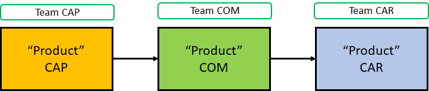
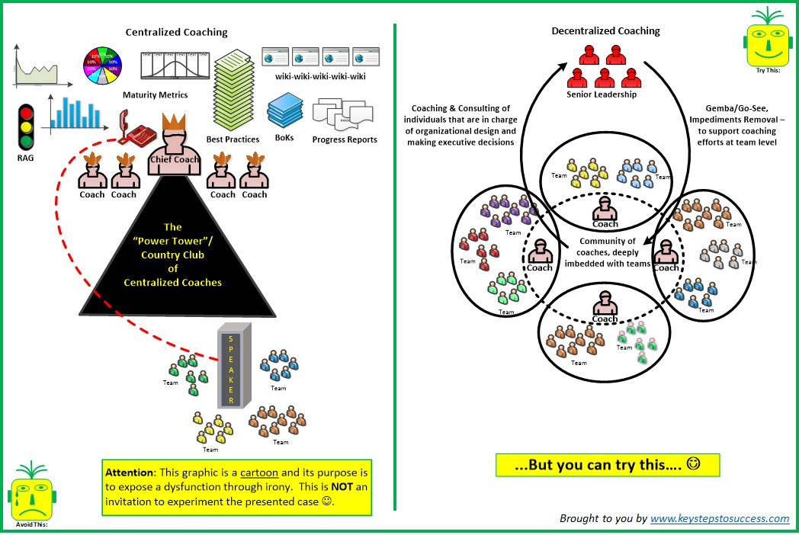
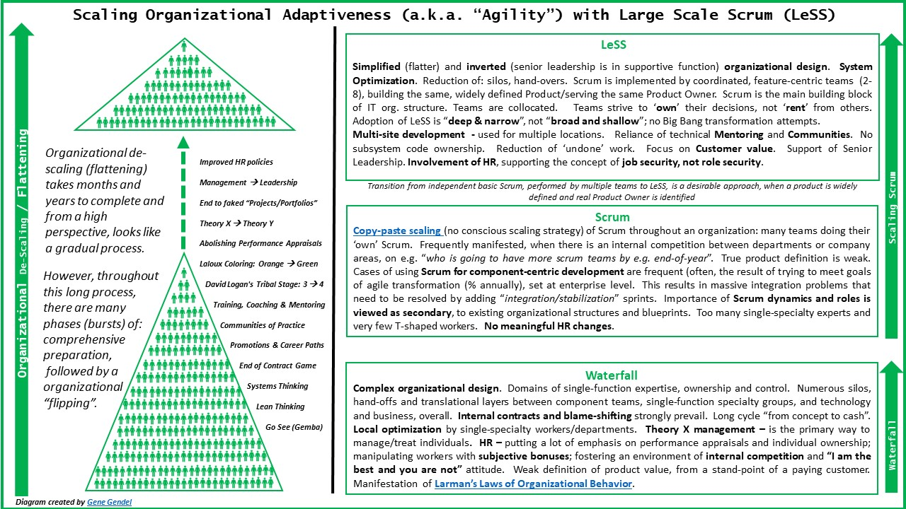
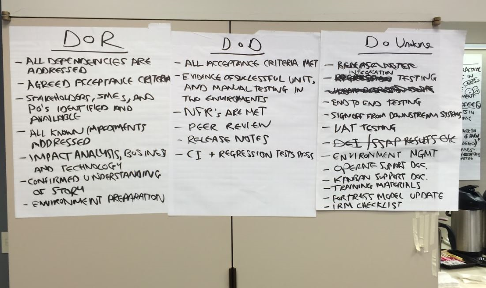
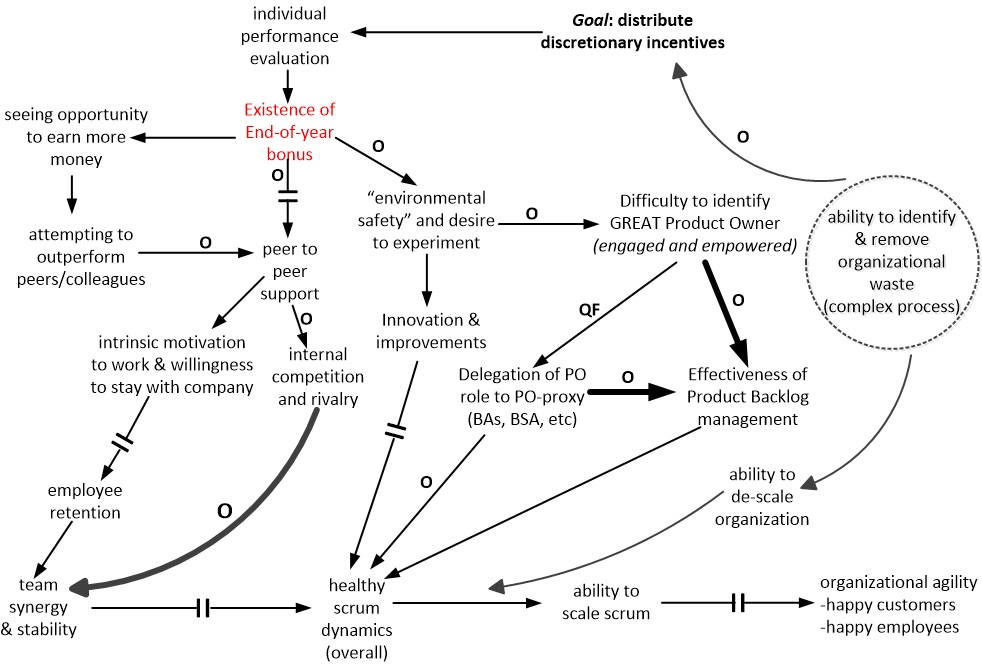

# 在大型投资银行中导入LeSS 的步骤

## 背景

（VBB是个代称，公司政策不允许我们使用真实的公司名称。本案例研究中的所有个人名称也是化名。

此报告是关于VBB在2015-2016年大规模Scrum（LeSS）的应用经验，由两名敏捷教练Sean和Gene分享，他们被VBB雇用帮助其实行敏捷转换。教练们事先对VBB的内部动态有一定的了解。

这次LeSS导入所涉及的产品范围是一个文件管理系统，用于法律和财务文件的获取，传输和存储。

## 之前的组织结构

VBB具有传统的组织结构，有多层汇报关系和各种中间人。例如：

开发团队：在负责整体管理的VBB CIO和做实际工作的开发人员之间平均有5-6层汇报关系。

[业务团队](http://www.keystepstosuccess.com/wp-content/uploads/2018/09/vbb_case_study_org_design_Biz.jpg)：在软件的最终实际用户和做事儿的开发人员之间，存在多层级的“传话人”和“代理人”，比如BA，PMO和各种项目经理。

在采用LeSS之前，开发团队被分成了不同的组件团队。

一般来说，需求获取的工作是由开发团队的业务分析师对接业务团队的业务分析师，然后业务团队的业务分析师再对接其他中间人或实际用户来完成。

### 组件团队和产品

在采用LeSS之前，文档管理解决方案是由几个定义狭窄的所谓产品，但其实是组件组成的。这些组件有固定的组件团队来负责，自然也就没有哪个组件团队能够独立完成跨组件的以客户为中心的端到端的特性。

组件团队与其负责的软件“产品”，**见图1**：

<figure>

  <figcaption>Figure 1: Component Teams as Products</figcaption>
</figure>

* CAP - 一个较新的用来获取数据的组件。有三种获取渠道：另一个上游系统，一个外部的实时数据更新服务， 人工输入
* COM - 一个较新的组件，用来在系统间传输获取的数据，最终将其存为文档
* CAR - 一个遗留组件，用来记录所有文档

### 导入“伪Scrum”

最初曾尝试过导入"伪Scrum"。每个团队成员仍然只是某一个职能的专家。他们的职称是“业务分析师”，“测试人员”，“前端开发人员”，“经理”，“架构师”等等，所以他们几乎没有兴趣去学习别的职能领域知识或技术。学习额外的职能领域知识或技术受由直线经理强制执行的个人目标设定和绩效评估流程所驱动。每个人的年终绩效和柔性激励（奖金，晋升）都是基于对个体能力的评估，个人要证明他们是按照最初的岗位描述交付了成果（并且比同事做得更好）。例如，要度量业务分析师“编写故事”的效率，要度量测试人员发现错误的数量，等等等等。这也导致了每个职能的 *局部优化* ，以及整个组织系统的 *次优化*

正因如此，每个人都会规避风险，并且不愿意去尝试新的或创新的东西，因为这会使他们看起来“效率低下”。这是[拉曼组织行为法则的第5条](https://www.craiglarman.com/wiki/index.php?title=Larman%27s_Laws_of_Organizational_Behavior)（“文化遵循结构”）的一种经典表现，其中指出我们不能在实际中期望人们的举止行为与组织系统背道而驰，特别是当它涉及工资和职业晋升时。

自然地，这种具有组件团队、单一职能专家、传统经理角色的“Scrum”应用，以及对应的策略，对增加适应性没有任何效果，也没有加速端到端高质量功能的交付，反而显示出巨大的浪费。

### 有利于LeSS导入的前提条件

以下是在教练入场之前，开发内部有利于LeSS指南和实验的前提条件:

* PMO（Project Management Office，项目管理办公室），作为一个组织单位已经被解散。一些剩余的类似于PMO的职能（例如：排期，预测，工作分配，进度监视）被开发团队和业务人员吸收。（LeSS实验：*避免... PMO*, *避免... 所谓的敏捷PMO*）
* 大家有清楚的认知，认为让Scrum Masters对团队成员进行绩效评估会带来严重的功能障碍。(LeSS实验: *避免... Scrum Masters 做绩效评估*)
* 即使在最初采用”伪Scrum“时，团队已经开始定义并遵守每个Sprint的（非常不完善）DoD（Definiton of Done，完成的定义）。 (LeSS指南: *创造DoD，逐步发展完成的定义*)
* 开发团队每个人都明白将“假”团队成员（例如项目经理，“powerpoint架构师”）添加到团队中无济于事，相反，这只会创造一种”大团队“的假象。(LeSS实验: *避免... 假的团队成员*)
* 资深经理们很乐意被称为并提供IRS（Impediment Removal Service， “障碍消除服务”），而不是“变革管理团队”。(LeSS实验: *尝试... 障碍服务而不是变革管理*). 例如，某个资深经理接到团队成员的关于某个问题的电话或邮件，他不会委托下属处理，而是召集一个会议。
* 通过利用一些简单的工具和视频设备，多站点的计划扑克已经有效运作（LeSS实验：*尝试...眼见为实-无处不在的廉价视频技术和视频文化。* *尝试...多站点计划扑克（估算扑克）* ）。 例如，每个团队的个人公共区域都配备了摄像机，扬声器和小白板。 这使得可以使用实体计划扑克（无需用更复杂的软件），因为每个团队成员都可以将其实体计划扑克牌展示给房间里的人，也可以给摄像头对面的人。 白板则用来做快速笔记，以便房间里的人和通过摄像头参会的人都可以看到信息。
* [中央（组织）教练部门](https://www.infoq.com/articles/centralized-decentralized-coaching)（例如，所谓的“敏捷卓越中心”）和中心化的敏捷/精益指南已被视为一种对敏捷进行篡改的符号，重新标榜既有现状以及局部优化，最终将导致打造出孤立的筒仓和特权的教练（LeSS实验：*请尝试...偏爱去中心化而非中心化解决方案。避免...有正式权威的中央教练组。避免...内部敏捷/精益指南*）。 该组织看到了与团队、业务或产品人员密切合作的深入型教练的价值。 人们偏爱和深入型教练作为一个社区共同努力（图2中的右图），而非与世隔离的“首席教练”权力结构。 **见图2**

<figure>

  <figcaption>Figure 2: Centralized vs Decentralized Coaching</figcaption>
</figure>

## LeSS导入的初始步骤 Initial Steps for the LeSS Adoption

教练限制了初始采用LeSS的人数，大约开发50人，业务人员20人。

这与[三项LeSS导入原则](https://less.works/less/adoption/three-principles.html)之一一致，该原则指出，为了成功进行组织的LeSS导入，必须要“*深而窄优于宽而浅*”。进一步，LeSS指南之一还建议组织在采用LeSS时必须 “ .. *将LeSS导入的工作重点放在某一个产品团队上，为他们提供所需的所有支持，并确保他们工作得很好* .... ”

### 定义一个更宽泛的产品

与LeSS中定义一个尽可能宽泛的软件产品的规则一致，CAP、COM和CAR组件被合并定义成一个更宽泛的产品。 为什么没有定义得更宽泛？ 这是受到参与到本次LeSS导入中的管理层的影响范围的限制。

教练们意识到，将CAP，COM和CAR组件合并到一个更广泛的产品定义中，仍然不能创建一个完整的端到端客户体验的软件产品。 为了使该软件成为完整的端到端软件，它实际上必须包括银行系统中的其它软件组件（和团队），例如：

* **监管**组件
* **客户引导**组件
* **法律**组件
* **人力资源和招聘**组件
* **采购**组件

然而，目前还做不到。

### 向特性团队迈进

由于组件团队的存在与提高全局适应性、从最高价值入手、缩短端到端的响应时间的目标不一致，因此必须换成跨组件的特性团队，这反映了LeSS规则，即“大多数团队都是端到端特性团队*。

在教练的引导下，代表了三个组件的高级管理人员和利益相关者一起进行了“工作坊前的准备活动”。他们使用了几种可视化技术（业务价值流，用户体验地图，用户故事地图）来吸引参与者展开对话和一系列用例模拟，这些用例模拟揭示了，没有哪个组件能代表完整的端到端客户或用户特性。

在准备创建特性团队的这个步骤中，最重要的教育活动可能是：

**经理们必须学会明白组件团队的发展是集成问题和过多的跨团队协调问题的根本原因。**

他们能够了解一些从组件团队到特性团队的组织影响，这是很重要的。具体来说，随着特性团队的发展，需要消除现有VBB“组件所有者”的控制权。正如后面将要探讨的那样，这个事情将成为这次导入紊乱的一个问题来源。

最初的CAR组件团队在一家外部（且非常远程）的供应商公司中。它增加了额外的复杂度：时区，供应商中间商，移交，尤其是商业合同影响了内部“合同”行为的产生并导致了功能失调。作为向特性团队迈进的一部分，决定将供应商开发人员与内部开发人员混合使用，从而不再强调属于不同公司并强调属于同一功能团队。与VBB和供应商经理举行了一系列会议，讨论以支持敏捷工作方式的方式编写法律合同的重要性。在了解了现有组织动态的背景下，介绍并讨论了一些LeSS实验：

* *尝试...律师们研究由筒仓心态和缺乏系统思维引起的问题*
* *尝试...律师们学习敏捷、迭代和系统思考的概念*

教练还建议邀请公司的律师们参加未来的培训和辅导课程。

教练还组织了**一个<u>全体培训工作坊</u>。** 教练们介绍了Scrum和LeSS的基本原理。 还特别聚焦于角色，事件和工件在Scrum和LeSS之间的区别。 在培训中，每桌由开发人员与业务人员、经理们混合组成，以实现更好的协作和学习（没有“开发人员专用”表格或“管理人员专用”表格）。 在研讨会期间，教练们介绍了LeSS的所有规则和原则。 他们还讨论了LeSS指南，并提供了已记录的LeSS实验的案例。 还向听众介绍了LeSS Huge，但显然这次不会采用（因为少于“8”个特性团队）。

#### 自设计团队会议

在引导自设计团队会议之前，两个教练学习了[之前的一个案例研究](https://less.works/blog/2018/12/27/how-to-form-teams-a-story-of-self-designing-teams.html)，它描述了在另一家大型银行金融公司的类似事件。这很有帮助，因为教练了解到一些可以在团队应用的实用技术。

新产品团队的关键元素在在巨型白板上用图形可视化的方式进行展示，包括：组件、组外的其他支持应用，所需的个人技能和领域专业知识，以及地理位置。另外几个白板纸上画了一些插图，展示了从历史教训中学到的筒仓工作模式的缺点，来提醒人们该实践背后的“原因”。

在会议期间，为了解决出现的组织问题，一些经理随时待命。 具体来说，在参加本次会议时，有一些担忧：

* 前面设计团队的尝试会影响后面的决定
* 按照现有的汇报关系或者单组件（比如，UI或DB团队）来构建团队
* 人们不想和不喜欢的人在一个团队，等等

经理们被明确要求不要参与自设计团队会议，除非这些担忧成为现实。幸运的是，唯一需要经理参与的工作是提供有关几个最新招聘的几周内会加入团队中的开发人员的信息。 另一个管理层的输入是，再次强调新成立的团队将长期存在。

当然，会议的关键活动是人们自组织成新的团队。 这是通过所有人聚在一起讨论最佳的方法来组建可以交付端到端特性的团队来完成的。 这里使用了LeSS“使用志愿服务”的导入原则。 工作坊一开始，就提醒每个人产品和本次工作坊的目标，以及组建结构合理的团队的意义，确保每个团队在同一地点工作，跨职能，熟悉多个组件，自我管理，3至9人，并且长期存在。

最后，形成了三个在同一地点的，做同一产品并共享一个产品待办列表的特性团队。

### 初始PBR工作坊

在开始Sprint 1之前，产品组决定遵循LeSS指南之一，举行一个*“初始”*产品待办列表梳理（PBR）工作坊，期间澄清了产品的范围和愿景，选择了工作所需的关键人员，识别出了最高优先级的特性，并阐明了初始“完成的定义”。

以下是CAPCOMCAR愿景声明的例子：

>“ VBB员工和外部客户将更喜欢使用我们的文档捕获平台作为最有效的解决方案，该解决方案能够及时地设置和管理产品和帐户，并符合全球，法律，监管和控制的需求。该过程将包括信息捕获，通信和存储”。

在工作坊上，业务和开发利益相关者都同意了高层的产品主题、战略和长期目标。在教练的协助下，这是通过结合用户旅程识别和故事地图技术来完成的，并有助于可视化具有战略意义的“大块工作”。将来的所有工作都被记录在一个共享的产品待办列表中。

### 找到一个产品负责人和领域专家

确定谁来担任产品负责人的角色是有难度的。实践中几乎不可能找到一个具有足够战略眼光并能得到足够的组织授权来为多个团队设定优先级的人。最后，在业务组中找到了这样的人。

但是随后面临另一个挑战：她不了解基本的Scrum（更不用说LeSS），所以也不了解产品负责人这个角色。这个问题是通过让她参加Scrum培训然后安排一位教练提供持续的个人辅导来解决的。

最后，给产品组直接引荐了*内部的实际用户*，并要求他们安排时间为团队澄清需求，提供详细信息。我们特别小心地选择这些人，确保他们不是中间人、委托人或代理人。确定了三个人，他们对前面提到的三个组件（以及文档管理过程中的相关步骤）都具有丰富的实践知识：CAP、COM、CAR。

### 形成社区

根据LeSS指南和实验，创建了几个社区。 （*LeSS实验：尝试...培养实践社区。尝试...使用CoP促进技能学习。*）

首先开始的是“ Scrum Master社区”。重点是提高Scrum Master的引导技能及其区分团队级别（内部）障碍和组织（外部）障碍的能力。通过观察其社区参与情况，很容易识别哪些人可以成为Scrum Master角色的优秀候选人，哪些人不能。通过社区，Scrum Master们能够进一步成长。

自动化测试的成熟度较低。为了对此进行补救，创建了一个**测试自动化社区**。这样可以共享经验，提高测试实践水平。 这催生了将测试自动化活动逐渐吸收到团队中的过程。

### 使组织结构和沟通扁平化

(*LeSS实验: 尝试... 尽可能使组织扁平化*)

经常向管理层传递的一个关键信息是：影响组织文化和个人行为以及整个组织系统行为的*首要因素是组织设计*。人们使用了各种辅导工具和技术来帮助大家了解这一点：因果关系图，问卷调查，讨论会。因此，采用了以下措施来改善开发团队的情况：

* 高级管理层向大家传达了强烈的信息，成为“直线经理”（按职称）及增加下属数量并不意味着晋升或加薪
* 建议每位经理的汇报人数上限提高到20-25。
* 鼓励个人*不要*将其直线经理视为不可逾越的层级，*不要*将跨级接触视为禁忌。相反，管理者发起了一系列员工与跨级经理的会议。
* 为了强化说明直线经理*不是*唯一的沟通渠道，更多的高级管理人员（在教练的建议下）实行了障碍清除服务（“IRS”），以便任何团队成员都可以升级他们的问题。

下图（**图3**）是用来向组织讲解，组织扁平化的概念是规模化组织适应性所需要的：

<figure>

  <figcaption>Figure 3: Organizational Flattening</figcaption>
</figure>

## 早期迭代

### 运行LeSS的Sprint

团队实施了以下内容：

* 迭代计划会 - 多个团队全体参与。
* PBR(Product Backlog Refinement，产品待办列表梳理) - *总体*PBR 会议之后是*多团队* PBR，团队讨论了底层实施细节。教练明确指出，采用单团队PBR是不可取的，因为这将导致每个团队分别创建“隐藏的”产品待办列表和做本地优化。
* 迭代评审 - 所有团队、产品负责人、用户以及利益相关者一起参加。
* 回顾会议 - 有仅需要Scrum Master和团队参加的团队回顾会议；也有全体回顾会议，需要产品负责人，团队成员和开发经理都参加。开发经理被邀请来学习并承担消除组织级障碍的责任。

### 早期成果和业务感知

采用LeSS的第一步是扩展产品定义和打造特性团队，这给用户留下了深刻的印象，因而他们会要求*更多*。简而言之，他们说：“*我们真的很喜欢你们的这些产出，我们想要更多。需要做哪些事情才能够让你们更频繁地交付更多功能*？

用户为什么对LeSS导入的*初始*结果感到满意？

* 首先，他们能够在每个Sprint的末尾看到更完整的功能，而不仅仅是需要进一步集成的相互分离的组件。
* 其次，由于团队改进了设计和稳定性，交付的一致性得到了提高。从而，进一步提高了向用户交付功能的预测能力。
* 第三，由于前两点，业务和技术之间的整体关系得到了改善。信任和尊重开始建立。
 
### 特性团队从三个扩展为五个

由于这些益处以及对更多特性的渴望，又新组建了两个特性团队，成员是来自于同一技术领域的开发人员。然后进行了一些初始准备工作。

这些工作包括：关于基础Scrum的进修培训，LeSS简介，使新团队熟悉产品待办列表，优先级和战略目标，然后将他们纳入LeSS产品组加入下一个Sprint。

前面三个团队中有一位经验丰富的Scrum Master被要求服务新团队，另一位Scrum Master则为最初的三个团队服务。现在，由五个团队组成的产品组拥有两个Scrum Master。这符合LeSS规则：“*Scrum Master是专注的全职工作。一个Scrum Master可以为1-3个团队服务*”。

前三个团队的几位高级开发人员被要求暂时扮演<u>开发人员-旅行者</u>的角色（*LeSS 实验：尝试...旅行者*），并加入新的团队，以身作则，提供一些指导。旅行者通过不仅向新成员传授LeSS动态，还教授新团队所不知道的不同组件的某些细微差别，从而暂时成为每个新创建的团队的"支点"。

为了加快与更有经验的团队的同化进程，所有团队都同意，两个*新*团队*全体*参加多团队LeSS活动（Sprint计划一，多团队PBR），而三个经验丰富的团队将只派代表参加。此外，对于最初几个Sprint，两个新团队至少与最初的三个团队中的一个团队进行多团队Sprint计划二。这种方法使用了几个Sprint，直到每个人都确信新加入的团队已经对LeSS事件的流程感到足够舒适。

#### 五个团队同时跑Sprint时的调整

Sprint计划第一部分（”做什么“）和第二部分（“怎么做”）在目的和出席人员方面区分得更清楚了。出席计划第一部分的，只有三个成熟团队的代表，以及所有新增加的团队的*全体成员*。让所有新团队成员参加是有意义的：只要计划会议现场不过于拥挤，新人就会从参与和共同学习中受益。

在Sprint计划会第二部分中，团队的目标是定义自己的Sprint待办列表。 考虑到工作的性质以及一起讨论技术解决方案的偏好（这将提高大家的领域知识以及对工作的彼此了解，也就使将哪个团队来选择哪个待办事项的决定推迟到最后一刻成为可能），这5个团队通常会*一起*进行计划（* LeSS指南：多团队参加的Sprint计划二*）。 而很少将团队分为2+3的小组来做计划。

## 限制改进的组织元素

### 财务和预算政策

(**LeSS实验**: *尝试... 超越预算*)

在VBB，人们坚信“每个人都必须遵循计划并在预算内”，而不是“每个人都必须能够应对变化并抓住新的机会*”。因此，按照惯例，预算仍然是每年做一次，即每年将一个固定金额分配给新项目（具有固定的时间表和范围），然后根据前一年的支出和由不做实际工作的开发经理给出的粗粒度估算做出决定。

采用这种方法，不断地要面对以下挑战：

* 当然，由于采用的是项目模式而不是产品模式，普遍存在交付错误的情况，以及对变化和学习没有反应。
* 由开发经理而不是业务端的产品负责人决定要做什么。
* 预算估计的不准确会导致意料之外的关键功能范围缩减，从而使用户不满意。
* 急于在没有进行适当测试的情况下快速交付产品，从而损害了产品质量。
* 解雇优秀但更贵的开发人员，雇用廉价的低水平开发人员。
* 与上述所有情况相关，增加预算的申请流程繁重，经常伴随着开发人员与业务人员之间的相互指责，从而导致关系恶化。
* 开发人员没有能力进行试验和创新，因为试验和创新未列入预算。
* 在某些情况下，如果分配的预算到年底仍未完全用完，则将其“消耗”在不重要的事情上。否则，第二年就有可能得不到相同的金额。

教练们组织了一个工作坊来教育管理人员，内容涉及：

* 自适应预算计划
* 在具有连续自适应交付功能的*产品*上工作，而不是*项目*
* 产出与结果之间的差异

解读Bjarte Bogsnes的“实施超越预算”中所述的行业案例（讨论学习了书中部分<u>摘录</u>），引入了LeSS实验之一的“*尝试...超越预算*” 。

尽管教练们*能够*在这些想法上赢得管理层的赞赏，但不幸的是，在LeSS导入的过程中，财务年度计划仍然是采用了官方既定的常规的自上而下方法来做预算。

而教练们的“有限胜利”是，说服了管理层在预算预测层面与团队更频繁地直接协商，在新需求和（重新）设定优先级方面与产品负责人协商。这些协商对话每个月（每隔一个Sprint）会发生一次。

### PO的可获得性

有个问题是：某个重要的利益相关人一直没有时间，他的输入对产品负责人和团队至关重要。此人一直在出差，并不热衷于参加Sprint评审会。 相反，她会委托别人参加以“*代表她的观点*”。但这是不够的，因为信息在传递中经常被歪曲和扭曲。资深管理层采取了一些必要的步骤，以确保必要的人员能参加未来的Sprint评审会。

### 现有的汇报结构

尽管LeSS结构占了上风，并且自组建的团队也进行了自我管理，没有一线管理人员的明显干预，但是正式的传统报告关系并未*正式*被消除。 这主要是由于人力资源部门强制的每年两次的绩效评审流程。这导致了各种浪费和一些冲突。

### 产品负责人身边的经理们

即使在正确定义了CAPCOMCAR产品、合理安排了团队结构，选出了产品负责人后，仍然存在一个问题：*沟通*。

在LeSS产品组之外的开发技术经理仍在尝试要求团队做一些技术改进和"编外工作"，而没有事先和产品负责人协调（并用他感知到的紧迫性为自己辩护）。尽管教练们强烈建议不要这样做，而且LeSS"入门"指南中建议的是："*只有产品负责人为团队提供工作*"和"*让项目经理远离团队*"，这种情况仍然持续了一段时间。

鉴于拒绝遵守上下级汇报关系对开发人员可能产生令人不快的影响（例如，指责他们不尊重下属的边界，导致低绩效评估），团队尝试了一项实验，他们向产品负责人通报了这种管理类的"紧急变更"。这项实验是隐式而不是显式进行的，以避免陷入尴尬的局面，具体如下：

有几次PBR会议，直线经理被邀请作为客人，在产品负责人和一些关键利益相关人面前明确、坦率地说明他们最紧迫的需求。这是在团队的能力和来自业务的优先事项的上下文中来讨论的。非常外交地讲，直线经理们被置于这么一种情况，他们不得不直接和产品负责人协商优先级，而*不是*和团队协商。团队只需要观察，并通过各种方式来协助这个对话（比如：澄清团队能力、限制、依赖等）。通过摆脱潜在的不安全谈判，团队能够更多地专注于工作，而非政治。这种方法行之有效，因为团队不再是无所遮蔽，不再会受到伤害。

#### 最小化编外工作，支持单一产品待办列表

由于存在大量的打断，提高计划外的/“隐藏的”/编外工作的成本透明度就变得至关重要。 在辅导大型企业组织变革过程中，通常需要采用经验主义方法。为此，我们建议团队*停止使用单独的待办列表来管理打断和额外工作*，而应将所有工作放在一个共享的产品待办事项列表中。 这样，产品负责人就可以参考一个单一的“信息源”而不是多个彼此独立的“愿望池”，来了解团队被要求交付的总体工作量，以及优先级冲突，进而可以设定真正的工作优先级。

把不可避免的工作中断纳入管理，有助于管理团队的容量，并更好地反映在计划中。几个Sprint之后，高级管理层看到了数据，这些数据说明了临时的、计划外的中断性工作是如何影响团队专注力的，这使他们偏离了计划好的以产品为中心的工作。用来阐述问题的主要方式是通过从累积流图（CFD，Cumulative Flow Diagram）收集的数据，这些数据揭示了Sprint里的工作在每种状态下平均花费的时间。 总体来说，每个Sprint待办事项的WIP很高，这主要是由于频繁的中断（启动-停止-启动-停止）所致，这些中断是由经理强行加入Sprint的计划外工作导致的。

这导致做出一些艰难而又必要的决定：强制要求那些试图将其工作优先级放在产品负责人的优先级之上的个人和业务组，马上停止这样做。 开发和业务团队的负责人们对此进行了讨论并达成了共识，所有请求都要经过产品负责人。

### 传统管理沟通途径 

如上所述，VBB的管理等级导致了上下级之间的命令和控制行为。无论正确或错误，任何偏离上级经理管理方针或挑战现有规范和秩序的行动，通常被视为冒险且不鼓励。

揭露潜在问题和障碍的大多数尝试都是徒劳的。这表明公司自身存在一些问题，因为从历史上看，该公司积极抵制变革。

教练们面临两难的境地：“*如何帮助高级管理人员承认问题是存在的，而且是需要被关注的，然后让其他人都愿意站出来，讲出来并参与进来？*”

为了克服这一障碍，教练们提出了一种折衷方案。它至少为一些更有勇气的人提供了一个安全保障。否则，为了让高级管理层知道自己的观察和顾虑，他们只有选择通过层层等级来升级问题，而这将置其本身于危险之中。

作为实验，教练们与高级管理人员进行了几次会议，向他们介绍了“ *gemba /go-see* ”的好处。告知经理们（基于LeSS指南“Go See”），go-see的目的不是微管理，不是下达指令，也不是直接尝试解决团队的问题。相反，*go-see* 的目的是学习/理解团队的问题，并教他们如何在管理控制之外独立解决问题。

我们鼓励管理层深入团队工作区，在其工位上与个人交谈，询问他们工作上的顾虑，征求反馈。教练们特别指导管理人员，不要将问题推回团队，也不要尝试直接解决团队的问题。取而代之的是，管理层被引导去“教导”团队如何独立地解决问题。

管理层还决定采用各种分散式的升级问题的方法，以鼓励层级较低的个人直接与较高层级的经理进行沟通。还引入了“IRS”（Impediment Removal Service，障碍消除服务），一个将问题从团队和Scrum Master们升级到高级管理层的安全方式。它以专用内部电子邮件地址别名的形式出现，任何人都可以以社区讨论的形式提交其个人面对的挑战和问题。

### 组件负责人

组件负责人是最初抵制形成跨组件特性团队的一个根源。为什么？对于组件负责人而言，*所有权* 意味着展现个人重要性的机会、权力和控制力，从而，有利于个人升迁和薪资增长。

因此，更高层的经理们需要找出一种方法，以确保在LeSS导入期间将先前的组件负责人角色从组织中去除。如何能迅速做到这一点？

仍拥有强大技术技能的组件负责人可以参加团队并成为实际贡献者，还可以选择做“组件导师”，其职责是教授其他开发人员。

其余的组件负责人被转岗到其他部门。

为了避免上述的变化造成太多麻烦，高层经理们与之前的组件负责人进行了一轮讨论，向他们解释说：今后，对他们的个人贡献和绩效评估会减少在 *组件所有权、自己做、和分配他人做* 方面的考量，增加在 *教授/指导他人做* 方面的考量。他们得到管理层的保证：通过培训队友，之前的组件负责人不会使自己的重要性降低，更不会使自己的工作面临风险。 LeSS指南：“工作安全而不是角色安全” --- 被用于此。

### Management and Engineering Practices

**LeSS测试** - “*避免... 测试部门* - *避免... 单独的自动化测试团队* - *尝试... 对发现的缺陷零容忍* - *尝试... 接收测试驱动开发* - *避免... 传统的需求交接*”

遗憾的是，手动测试在VBB中早已存在很久，这意味着新组建的团队中也有手动测试人员。为了对此进行补救，整个团队开始大力推动测试自动化和优秀工程实践的分享。其中一位教练（Sean）通过培训和辅导对此提供了支持。主要的承载工具是工程社区（参见LeSS指南：*社区*) ，并在出现特定需求时提供有针对性的培训。鼓励团队从传统的"测试待发布版本"流程过渡到作为"完成的定义"的一部分的特性测试，可以是手动或自动。

**图4** 显示了所有团队在其中一个启动工作坊中得到的就绪/完成/未完成的定义。遗憾的是，请注意，尽管在 LeSS导入中引入了一些自动化测试，但完成的定义中仍继续包含*初始*手动测试项。

<figure>

  <figcaption>Figure 4: Definition of Done</figcaption>
</figure>

很不幸，应团队的要求，以下两种情况仍然使用手动测试：

1. 第一种是团队在所有环境里执行的集成测试
2. 第二种是一个独立的外部团队执行的用户接收测试，他们有自己的节奏。

团队和技术/业务经理都认为，在对自动化工具套件建立足够的信心之前，继续使用手动测试是非常重要的。如上文“完成的定义”中所述，对于每次部署，手动集成测试应该至少覆盖以下环境中的两个，即DEV环境、UAT环境和生产环境。这也包括在每个迭代 （Sprint）结束时在DEV环境的部署。UAT环境的部署工作就作为"未完成的工作"这些工作被放到后续的迭代里。这导致了大量的持续的浪费。由于反馈缓慢和过多的发布相关签核会议，团队被频繁打断，因此很难快速引导团队做出全面的积极变革。例如，在特性功能被产品负责人接受后，通常会等待数周来完成UAT签核。任何需要改动代码的来自于UAT团队的反馈，都会导致开发团队的紧急中断。通过UAT后，版本进入生产将需要跨每个应用程序进行协调和更多的手动测试，并且只允许在受限的时间窗口中进行。当然，这导致了大量浪费的继续。

**LeSS设计和架构** - “*避免... 特性团队之外的系统工程师和架构师* - *尝试... 技术领袖通过工作坊传授知识* - *尝试... 雇佣并努力挽留大师级程序员“架构师”* - *避免... 建筑宇航员 (PPT架构师)*”

VBB的另一个功能障碍是在存在单独的架构组（经理希望维持其现状，不做改变），而且多层级的，包括开发组内部和全公司范围。

*公司范围*的架构组经常进行干扰，这可能具有极大的破坏性。当地开发架构组不幸继续存在的一个的好处是，至少他们可以吸收这种干扰，让它不会影响到新团队。

然而，架构组并没有解散。这个单一职能团队负责制作文档和指令，而不是代码，这是持续的浪费。

除了架构组之外，技术经理还希望主导架构决策，因为他们的传统职位就是基于此。一位开发经理（无需与团队协商）每周召开一次"设计会议"。这严重阻碍了在当下和未来的工作，是所有团队的开发人员冲突的根源。因为它是由中层经理强加的，因此很难废除。在高级管理层认识到问题（Scrum Master 将此问题升级为组织障碍）之前，团队花费了好几个迭代，最终废除了这种低级的集中决策模式。

### HR政策

在导入仿"Scrum"的过程中，每个团队成员仍然是单一领域专家。几乎没有兴趣学习新的功能领域或技术，因为每个人的职称是"业务分析师"，"测试者"，"前端开发人员"，"经理"，"架构师"等。缺乏学习额外的领域职能和技术技能的动力是由直线经理个人目标设定和绩效审查过程推动的。每个人的年终绩效和可自由支配的奖励（奖金、晋升）都基于个人能够证明他们按最初的工作描述交付（并且做得比同事/同事更好）。例如，业务分析师的衡量基于他们"写故事"的效率，测试人员根据他们发现的错误数进行测量，等等。这也导致每个职能部门的本地优化，进而对整个组织系统进行了*次优化*。

正因如此，每个人都厌恶风险，不愿意尝试任何新的或创新的东西，因为这会使他们被视为"效率低"。这是一种经典的现象 [Law # 5 of Larman’s Laws of Organizational behaviour](https://www.craiglarman.com/wiki/index.php?title=Larman%27s_Laws_of_Organizational_Behavior) （"文化遵循结构"），在这种现象中，我们不能在现实中期望人们的行为方式与组织体系截然相反，特别是当它涉及到工资和职业发展时。

教练们能够做到的是说服管理层来鼓励以下行为：知识共享、走出通常的舒适区、学习、共同所有权、*swarming*等，这些行为也是管理者希望看到的。

在教练离开几年后，他们以前改善工作角色的努力终于得到了回报：更通用化的拥有广泛技能的"开发人员"角色被引入，并在VBB公司范围内增加了*Scrum Master*的职称。这是一个辅导的果效可能会延迟体现的典型案例。

### 文化受组织设计影响

教练必须面对的组织文化中最具挑战性的方面之一是对*个人表现*的重视程度。在组织范围内，存在着一个深层的系统性问题，必须被解决。

从历史上看，VBB有着鼓励超级英雄和内部竞争的文化。人们主要受到外在动机和超越同事的渴望，竞争奖金、晋升和其他福利。个人绩效评估和年终评审定义了个人行为，并经常导致系统游戏，尤其是在年底。*这种英雄文化和内部竞争的文化受到* **组织设计** *的强烈影响*。

这种文化不利于形成LeSS团队所期望的工作方式。

例如，下面的因果循环图（**图5**）揭示了涉及个人绩效评估过程的基本系统动态，以及它是如何对开发组内的基本Scrum动态产生不利影响（提醒：在教练加入之前已经引入了伪"Scrum"）。

<figure>

  <figcaption>Figure 5: Individual Performance Reviews Systems Model</figcaption>
</figure>

为了缓解LeSS产品组中的问题，教练决定利用以下LeSS实验："*避免...与绩效相关的奖励*，和"*尝试...淡化奖励*。目标是*不改变*整个企业的规范和标准。相反，目标是教育有影响力的管理层采取改变行动，来改变每个人的态度和行为，使个体更加尊重集体所有制，并愿意培养"我们一起"的心态。详见下文。

**LeSS 实验**： *尝试...淡化奖励* - *避免...针对生产率度量的激励* - *尝试...团队激励，而不是个人激励* - *尝试...没有物质奖励的基于团队的目标* - *避免...绩效评估*

就评估和奖励过程的有害影响，我们对参与其过程的开发团队管理层进行了教育。如何？我们为管理人员和人力资源代表举办了几次工作坊，讨论了以下话题：

* 个人绩效评估及其与金钱激励的联系是如何对员工和组织造成伤害的相关研究（正如以下案例总结的，[case 1](http://www.keystepstosuccess.com/2016/02/quotes-from-get-rid-of-the-performance-review-how-companies-can-stop-intimidating-start-managing-and-focus-on-what-really-matters-by-culbert-samuel-a-laurence-rout/) 和 [case 2](http://www.keystepstosuccess.com/2016/02/quotes-from-punished-by-rewards-the-trouble-with-gold-stars-incentive-plans-as-praise-and-other-bribes-by-alfie-cohn/))
* 个人绩效评估/奖金与Scrum动态运行状况之间的系统因果关系。下图（**图7**）是在和管理者讨论的过程中产出的因果循环图，用于把问题可视化，并帮助人们有更好的行为。

这些变革的范围当然是局限在开发团队。开发团队的LeSS导入是"银行"内部组织重组的一个实验，正如我们在银行内部指导的所有银行一样，它深深植根于传统、等级、自上而下的指挥和控制文化，旨在将巨额现金奖金转移给银行经理。因此，我们并不幻想这些变革可以扩展到边界之外，所以试图用栅栏把这些变革隔离在本地。

本地控制范式的一个例子是强调团队级的所有权、责任和绩效，而不是个人层面。虽然全银行的个人绩效评估过程仍然存在，但开发团队管理层非正式地淡化了其重要性。重视（和赞扬）团队绩效胜于个人绩效越来越成为主流范式。消除评估奖和奖金的机能障碍政策是不可能的，但在管理层的支持下，有可能减少危害，转移重点。这阐释了LeSS实验“*尝试...减少尚无法删除的策略的危害*"

因此，在组织约束下，管理层试图创造有利于改善开发人员行为的环境。在开发团队组织的活动中和定期沟通中，明确并持续强调以下要点：

• 成为T形人才的重要性
• 学习新的开发工具和技术的好处
• 以支持他人的方式对待其他队友，重视团队绩效胜于个人表现

最重要的是，管理者强调了LeSS的整体交付情况会是确定团队以及随后个人财务奖励最有影响力的因素，这有利于增加团队幸福感。

虽然在年底，开发团队的每个员工仍会有年终审核和"成绩单"，但它对员工获得财务奖励的影响要小很多。个人坚持并真正支持敏捷转型工作和LeSS导入比个体交付和英雄主义更有价值。

信件分级（绩效评估定级）仍由管理人员非正式地分配（按照人力资源部的要求，在集中记录系统中输入），但每个人都理解并并畅所欲言地谈起定级对大家没有什么价值。这说明了LeSS实验*尝试...填写表格*，这意味着当无法消除浪费的人力资源流程时，只需以最少的精力投入来提供基本上毫无意义的信息来玩游戏，而真正专注于改进如何取悦客户的重要实际工作。

## 结论

LeSS导入带来了一些积极影响：

* 用户对频繁交付有用的特性感到满意。他们可以更好地预测.. 此外，LeSS导入带来的透明度和可预测性也越来越高。在LeSS导入期间，技术部门与业务之间的关系处于最佳状态。
* 开发人员和商务人员双方面都学会了如何识别组织障碍，也能够将表面的现象与的深层的系统性根源联系起来，这些根源问题影响到广泛的系统。我们相信这种学习会长期伴随他们。
* 社区帮助个人和团体学习。
* 现代工程实践在开发领域内外的根基越来越深，对更多的技术团队产生了积极的影响。
* 培养了一些经验丰富的Scrum Master，他们中的一些人对成为变革推动者充满热情，以至于他们决定让这一切成为职业之旅。

在两位教练离开时，以下挑战仍未解决：

* 组件/应用的*所有权*没有完全转化为*辅导关系*。仍然有旧的组件所有者暗中抵制放弃控制权并成为导师。
* 在LeSS中不再需要其原始角色的人失去了岗位（例如业务分析师、项目经理和手动测试人员），VBB其它部门并没有进行有效的安置，也没有提供有效的交叉培训，以获得额外的技能（成为一个有用的弹性团队成员）。因此，这些失去岗位的人继续对LeSS导入进行暗中抵制。
* 自我管理仍然是一个挑战。例如，个人仍然需要*与管理者合作*制定个人职业计划，即使在管理者对其计划决策影响不大的情况下也是如此。
* 绩效评审和主观奖金继续影响个人的士气，尽管其重要性被轻视：绩效评审与主观货币激励完全脱钩没有发生。

