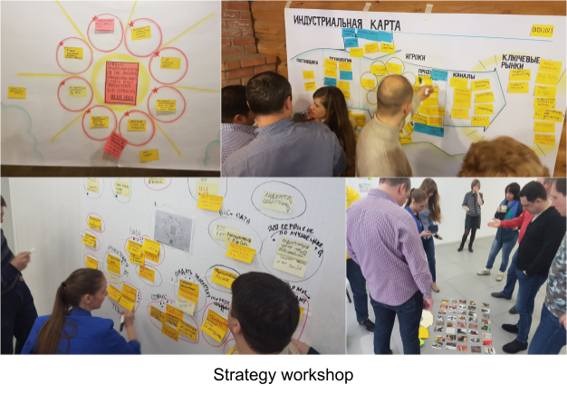
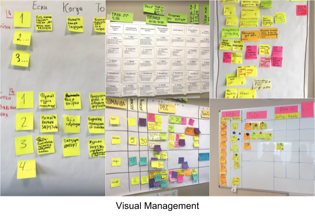
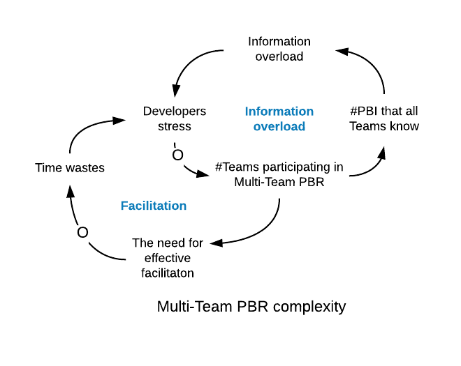
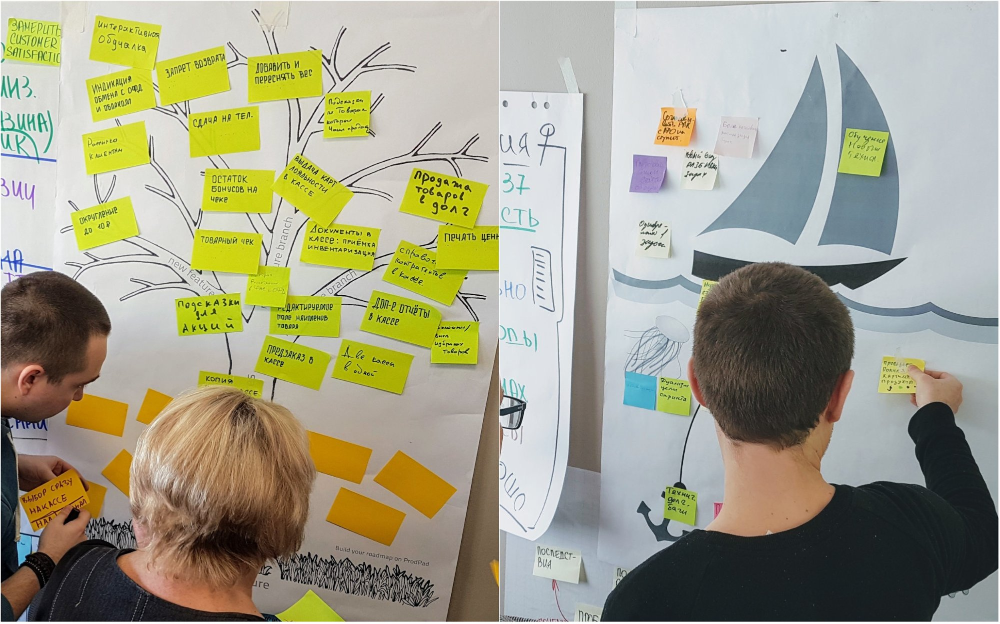
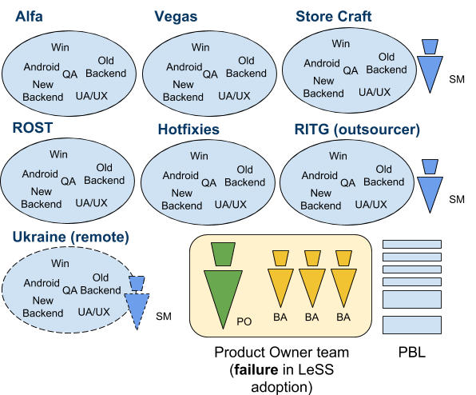
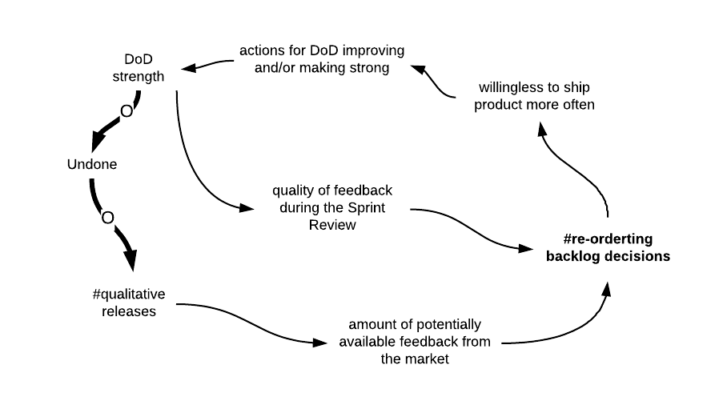

学习如何在MTS Kassa中学习

学习历程

当我查看案例研究文本时，我会发现它具有学习型组织的旅程，学习如何进行变革以及为什么的人们的感觉。 因此，请阅读并欣赏一个故事，即勇敢的人们如何开始永无止境的学习之旅。

旅途前

МТS收购LiteBox

2017年，俄罗斯最大的电信公司MTS购买了LiteBox的控制权股票，后者经营着基于云的零售自动化软件业务：仓库处理系统，采购管理，分析报告等。

{width="6.5in"
height="4.241666666666666in"}

LiteBox成为庞大的MTS公司（拥有70,000名员工）的一部分，但在管理自己的业务方面几乎保持完全自主权。 到LeSS实施时，该公司已拥有200多名员工，并成为一个独立的业务部门。

商业机会和紧迫感

MTS管理层向我寻求帮助。 2017年底，我们进行了首次谈判。 LiteBox管理层预计从2018年7月1日开始将掀起一股巨大的客户浪潮（或者说是海啸）。用户群将增加大约100倍。 2017年12月，LiteBox的客户数量超过6000名，到2018年秋季预计将超过100,000。LiteBox管理部门希望使产品开发具有适应性并易于扩展。 在与高级经理进行了数次面对面会谈之后，我们同意从一些电话采访开始，然后进行更深入和结构化的公司审核。

学习组织设计

组织设计看起来非常可预测，并且基于传统的管理方法。 公司分为职能部门或孤岛（财务，采购，销售，IT，市场营销，人力资源）。 每个人都由自己的一组经理管理，这些经理由自己的KPI激励。

{width="6.5in"
height="2.8715277777777777in"}

IT部门结构

尽管最终目标是改变整个公司，但我们还是开始采访了来自IT部门的人员。 他们正在开发核心产品和主要价值主张。 这就是我发现的。

组成团队的发展。

30多个开发人员正在所谓的"项目"团队中组织产品。 每个"项目"都是围绕架构组件，技术或功能组织的。 因此，他们有7个"项目"：旧后端，新后端，android，windows，测试，分析和API团队。

{width="6.5in"
height="4.526388888888889in"}

技术堆栈由几种编程语言和相关框架组成：Javascript，Android，Python，SQL，Java。

协调角色和等级

由于"项目"都无法创造可用的增量并为客户创造有价值的东西，因此需要几个协调角色和职能层次结构：

-   分析部门主管。

-   测试部门负责人。

-   首席建筑师。

-   后端技术负责人。

-   Android开发技术负责人。

-   Windows开发技术负责人。

-   发布工程师。

他们是采用Scrum术语的完全传统的组织。 简而言之，就是完全伪造的敏捷/
Scrum不变。 采访之后，我在LiteBox办公室花了两天时间练习[[Go
See]{.underline}](https://translate.googleusercontent.com/translate_c?depth=1&hl=en&rurl=translate.google.com&sl=en&sp=nmt4&tl=zh-CN&u=https://less.works/less/management/go-see.html&xid=17259,15700002,15700023,15700186,15700191,15700256,15700259,15700262,15700265,15700271&usg=ALkJrhiiM_QRy-ShEjQOt-5GBxXvFxUlBQ) 。 除了采用机械或[*复制粘贴*[ Scrum]{.underline}](https://translate.googleusercontent.com/translate_c?depth=1&hl=en&rurl=translate.google.com&sl=en&sp=nmt4&tl=zh-CN&u=https://agilix.nl/blog/481-the-problems-of-scaling-scrum&xid=17259,15700002,15700023,15700186,15700191,15700256,15700259,15700262,15700265,15700271&usg=ALkJrhgaunPTnbrq387030QYAK5DGO6bSg)方法外，我立即注意到另外两件事：

-   每个项目都旨在最大程度地利用，显然这是每个人的最终目标。

-   IT开发遭受了大量来自生产的错误/事件的困扰。

我的观察和结论

LiteBox具有层次结构和功能性组织设计，并包含所有相关和众所周知的问题。

依赖关系。 由于组织结构的原因，所有组件团队都无法向客户交付任何功能。 所有组件团队都具有依赖性，从而导致不必要的计划和协调角色。

交接和瀑布般的风格。 组件（"项目"）之间存在大量交接，导致排队人数众多，并延迟了客户反馈。 从开始到完成功能的平均周期时间为6-7周。

单功能专家。 组织结构鼓励像业务分析师，测试人员或开发人员这样的单一职能角色，这使组织变得脆弱并且容易受到市场变化的影响。 当前的组织结构已针对人员的忙碌（"利用"）进行了优化，而不是针对灵活性和快速的价值交付进行了优化。

狭窄的焦点。 团队没有看到整个产品，而只是部分零件。 开发人员专注于他们个人的忙碌，而不是系统效率和快速的价值交付。 从其中一个采访中引述："没有感觉到所有团队都为共同的目标而共同努力。"开发人员并没有完全理解他们开发的功能的价值和目的，因为他们只是组成部分。

缺乏透明度。 商界人士遭受透明度降低的困扰。 他们真的不知道开发小组的真正进展是什么。 一次要处理很多事情（大型WIP）。 工作分散在各个团队中。 每个人都在努力工作，并在当地尽力而为，但是开发小组根本没有效果。

需求管理不佳。 没有单一的需求来源。 团队抱怨优先级冲突，因为如此多的利益相关者能够推动他们的工作：业务分析师，CTO，呼叫中心，市场部门等。没有确定的订购要求流程。 员工认为，当前的需求管理系统是"垃圾"。

研究整个公司

经过一系列电话采访和在LiteBox办公室工作了几天之后，我将自己的观察结果介绍给了高层管理人员，然后赶往总部对整个公司进行了深入评估。 我们与公司高级管理层和员工举行了为期两天的研讨会，重点讨论公司的结构，价值，价值流等。我们的目标是制定行动计划并制定下一步计划。 我们在研讨会上使用的一些工具是：

-   斯科特-莫顿图。 这证明了关键的公司建设要素之间的联系：战略，流程，人员和结构。

-   加权SWOT分析。 它是在混合组中创建的。 从1到5权衡了所有因素的重要性。

-   价值流图。 这项技术使我们可以洞悉产品开发流程中的浪费量（从客户要求到价值交付）。 通常，它是从首次致电客户支持开始的，并以新版本结束。

评估结果。 详尽的公司评估证明了我有关组件团队及其功能失调的最初结论。 价值流图还显示，特征从开始到结束的平均循环时间为6-7周。 我喜欢经理人有一些"啊哈！"的事实。 研讨会期间：

-   他们同意，对于这样的中型公司而言，层次结构太多了。

-   了解个人的KPI和奖金可以在本地优化公司的某些部门（销售和市场营销），并且将一个职能与另一个职能相对立。

-   会议室中的每个人都同意该公司没有明确的愿景和战略计划。

建议。 难怪在审核之后我的建议是：

-   IT产品组中的一些Scrum培训可以教育所有人。

-   针对CxO人员的Scrum培训。

-   战略规划研讨会，以制定未来1-2年的公司愿景和战略。

-   逐步简化组织结构，从职能组织转变为基于团队的组织。

-   启动试点功能团队，如果成功，请继续使用LeSS。

{width="6.5in"
height="4.4222222222222225in"}

旅程开始-LeSS领养准备

为什么采用LeSS需要更改结构

有效采用LeSS（也有效采用单一团队Scrum）通常意味着组织*结构*发生变化（ *指南：三项采用原则* ）。 原因是大多数组织结构已针对单个输出进行了优化，并且在设计中进行了许多本地优化。 LeSS降低了旧结构带来的组织复杂性，并引入了新的更简单的结构。 LeSS优化目标如下，而这些目标通常需要更改结构以支持它们：

-   首先交付最高的客户价值。

-   便宜而容易的适应性（"为一角钱打开一角钱"）。

-   学习。

学习基础Scrum

我们邀请了高级管理人员，一些开发人员以及所有职能部门的经理（市场，销售，合规性等）参加为期2天的专业Scrum基金会（PSF）培训。 这帮助他们了解了单团队Scrum的价值观和原则。 LeSS中提供了一些指南，以帮助在组织中实施此框架（ *指南：入门* ）。 该指南的第一步是： *教育所有人* 。 现在，我意识到我从一开始就没有适当地教育所有人，因此也没有遵循指南。 这很快就导致了志愿服务和支持收养方面的问题。

使管理与变革故事保持一致

经过培训，我们再次召集高级管理人员，共同创造一个变革的故事。 这是给公司中每个人的信息，解释了公司为什么要努力变革。 幸运的是，我们从一开始就获得了公司所有者的支持。 但这还不够。 我们一直在寻求整个高级管理团队的帮助和支持。 为什么？ Scrum和敏捷原则的大规模采用并不局限于开发团队。 它涉及产品管理，预算，发布，营销，销售和人力资源政策。 由于公司是由职能部门组成的，因此任何高级职能经理都可能破坏这一重大变化。

因此，这里有一个变革故事研讨会。 结果，我们有两个工件。 第一个是矩阵，其中填充了风险/机会/问题/紧急情况。 经理们统一了他们的观点以及他们为什么需要Scrum。

{width="6.5in"
height="5.425694444444445in"}

第二个工件是一个变化的故事。 它是[[精益变更管理]{.underline}](https://translate.googleusercontent.com/translate_c?depth=1&hl=en&rurl=translate.google.com&sl=en&sp=nmt4&tl=zh-CN&u=http://leanchange.org/&xid=17259,15700002,15700023,15700186,15700191,15700256,15700259,15700262,15700265,15700271&usg=ALkJrhiUxiqCyiPF1ylTgGJ6Gofb4xYUxA)运动中的有用工具。 对于其他公司而言，这似乎是一条简短而引人注目的信息，其中强调了以下要点：

-   为什么我们现在需要更改。

-   我们将要做的。

"在我们敏捷小之前。 我们喜欢它是因为我们是自治的，所有信息都是透明的。 然后有一天，我们成长并变得更大，并获得了MTS的投资。 这影响了我们的思维并增加了工作量。 这就是为什么我们需要对结构和过程进行更改，以便变得更加有效，消除错误并提高产品质量。 我们需要指导和指导方面的支持以实现敏捷性。"

研讨会结束后，我们确保每个员工都能收到数字版本的变更故事。

{width="6.5in"
height="5.397916666666666in"}

用飞行员学习Scrum

根据LeSS规则，较小的LeSS实现必须"一次全部"完成。 这意味着每个星期五，每个人都在具有传统组织结构的公司中工作，然后在星期一，将产品组的组织设计转换为新的组织。 尽管此方法具有所有优点，但我还是无法"出售"该翻转。 尽管如此，他们还是同意成立一个试点功能团队，如果成功的话，随后将完全采用LeSS。

试点团队结果

-   在第一个Sprint中，试点功能团队能够发布一个新功能，该功能在启动过程中接受客户采访后意外地添加到了产品待办事项列表中。 未满足的需求很快被发现，该功能在一周内发布。

-   最终用户参加了Sprint评论，并定期提供定性和定量反馈。 我们发现，以前从未在公司中衡量过客户满意度。

-   在一些Sprint中，团队动力发生了很大变化。 他们开始学习，并逐渐成为多功能开发人员。 例如，在回顾展期间一位经验丰富的Windows开发人员表示，他将在几个月内开始编写Android代码。

-   团队成员的思想和行为发生了变化。 他们开始成对工作，并且经常蜂拥而至。 他们掌握了这样一个想法：如果每个人都单独处理自己的事情，那么他们就不可能互相帮助，而且从长远来看，他们彼此学习。

-   该团队能够一次在三个不同的渠道中实现多种功能。

-   产品负责人获得了更加透明的开发过程。 他说，他喜欢团队像黑盒子一样工作，可以选择PBI，并在不需要额外的协调，控制等情况下最终提供完整的功能。

-   团队直接与市场互动。 他们不需要任何其他角色来进行协调，而且他们是独立的。

-   与组件团队开发相比，功能开发的平均周期时间减少了2-3倍。

我注意到一些组件团队成员开始访问Sprint评论。 他们对试点团队的工作很感兴趣。

我们发现了该飞行员的一些负面或困难后果：

-   产品负责人承受着巨大的压力。 他必须与飞行员功能团队和其他组成团队同时工作。 他管理了2个产品待办事项列表-一个以客户为中心的试点项目，另一个为组件团队提供技术任务的PBI。

-   功能团队在与组件团队不同的环境中运行。 产品负责人保护飞行员免受Sprint中的干扰，例如生产错误和技术支持的要求。 因此，有些人说功能团队不能被认为是对他们有说服力的实验。\
    > \*功能团队和业务分析师小组之间存在紧张关系。 开发人员开始直接与客户沟通。 业务分析师将功能团队的概念视为对其工作岗位的威胁。

-   功能团队无法独立向市场发布功能。 产品小组中的发布工程师仍然扮演着角色，他们进行了最终的系统测试，并为大量功能做出了"可以发布"的决定。 因此，功能开发的周期时间确实减少了很多，但高级准备时间却差不多。 功能已经完成，但必须排长队才能发布。

公司战略研讨会

采用LeSS是整个公司转型的更大举措的一部分。 公司评估后的建议之一是进行战略会议。 为期3天的MTS
Kassa战略会议分为两个部分。 前两天用于建立组织构想和新的业务战略。 在第三天，创建了接下来几个月的路线图。

视觉故事。 第二天的重点是建立公司愿景。 有两个活动：首先，使用时间表来显示公司历史中最重要的事件和产业图的创建（趋势，参与者，行业，未来市场需求）；其次，将参与者分成小组，由他们创建自己的团队。公司愿景故事的版本。 我们要求小组想象该公司在2年内的成功，"想象2年过去了，MTC
Kassa的故事被刊登在商业杂志的封面上。 那里会有什么图片/照片/报价？ 这篇文章是关于什么的？ 标题是什么？ 公司的主要进展是什么？"

进行封面故事的愿景练习后，我们开始编写简短的愿景声明。 我们希望在所有参与者（将近30人）中达成共识。 我们花了几个小时在上面，但是值得这么做，因为参与者说，他们的确受到了创建的愿景的启发，该愿景是：

*每个俄罗斯企业家都选择我们的B2B服务生态系统作为其业务的助手。*

{width="6.5in"
height="6.567361111111111in"}

结果。 战略会议的最重要成果之一是高级管理人员中出现的适应性组织的概念。 他们一致认为，当前的组织设计已经过优化，可以使人们忙碌。 这与适应性不一致，因此，组织设计的一项关键新决定是采用LeSS。

我们将人们召集在一起，围绕着非常明亮和鼓舞人心的愿景，然后制定了公司路线图。 事实证明，这对于创建产品待办列表也是一个很好的输入。

{width="6.5in"
height="4.520833333333333in"}

采用LeSS的后续步骤

2017年夏天，我参观了米兰的克雷格·拉曼（Craig
Larman）的LeSS课程。 他值得纪念的建议之一是"像政治家一样思考，而不像工程师一样"。 尽管产品负责人要求我尽快实施LeSS，但Craig的建议帮助我推迟了采用。 在试点功能团队取得初步成功之后，我观察到管理层的信任度有所提高。 因此，到那时我们已经获得了全面的管理支持。 大！ 但是另一方面，我意识到组件团队的许多开发人员仍然对LeSS持怀疑态度。 我们想对他们进行教育，以便让他们*成为改变的*志愿者而不是*囚徒* （ *指南：三项领养原则* ）。

转型积压

产品负责人，产品小组的一些志愿者，飞行员的Scrum
Master，我组成了最初的转型小组。 以下是一些项目：

-   进行LeSS基础认证（CLB）培训。

-   举办多个瘦咖啡研讨会，回答有关LeSS的常见问题。

-   创建初始产品积压。

-   创建*HitMap* 。

-   促进团队自我设计研讨会

-   创造完美的目标。

-   团队选择Scrum Master。

-   创建完成定义（DoD）。

-   建立社区并找到指导者。

-   进行初始策略路由。

回顾过去，我们花了将近两个月的时间来准备更改LeSS结构。

学习LeSS框架

因为每个人都已经参加了Scrum Basics培训，所以我认为为期一天的[[LeSS
Basics认证（CLB）培训，]{.underline}](https://translate.googleusercontent.com/translate_c?depth=1&hl=en&rurl=translate.google.com&sl=en&sp=nmt4&tl=zh-CN&u=https://less.works/courses/less-basics.html&xid=17259,15700002,15700023,15700186,15700191,15700256,15700259,15700262,15700265,15700271&usg=ALkJrhgOsqJtP_9ymFOCJYDuWqV8h7rb2Q)然后再进行一些瘦咖啡活动，就足以使人们接受。 我错了。 现在，我相信在介绍新的组织结构之前最好花几天时间研究LeSS。 人们确实需要了解LeSS背后的原理。 您至少需要几天的时间，才能证明精益思维，排队论和系统思维是LeSS规则的基础（ *指南：三种采用原则* ）。

第一个Sprint立即出现了旧习惯和对局部个体优化的倾向。 我肯定会花一些时间与开发人员一起进行系统建模和创建一些因果关系图（CLD）。 人们在租用和拥有该过程之间存在很大差异。 在为期3天的培训中，也可以更全面地介绍一些主题。

协调似乎是最热门的话题。 人们不相信使用简单的指南（ *指南：Just
Talk，指南：在代码中进行交流，指南：社区，指南：开放空间* ）来管理协调是因为狭窄的专家文化和协调角色在那里很长一段时间。 在培训开始时，开发人员用协调问题填写了三个活动挂图。 我请他们创建一个简单的表，该表有两列："要协调的内容"和"协调技术"。 在介绍了所有LeSS协调实践之后，我请与会人员在正确的栏中填写适当的协调实践。

研讨会向人们概述了LeSS，大多数参与者的问题都已结束。 但是，我觉得这只是一个简短的介绍。 我希望我坚持通过系统图表更深入地了解LeSS原理，这可能会导致更多的认同和对系统思想，排队论和精益思想的更好理解。

{width="6.5in"
height="4.527777777777778in"}

试试...精益咖啡活动

在变更的早期阶段，愤怒，不确定性和挫败感达到顶峰。 所有变更管理模型都强调了沟通的价值，而精瘦的咖啡格式是最大化沟通的一种好方法。 它有助于提供诚实的对话并减少未知数。 我发送了一封邮件，并邀请所有人参加瘦身咖啡会议。 我想"如果没人进来怎么办？ 那将是彻底的失败。" 幸运的是，有很多人进来，我们进行了精彩的讨论。 不幸的是，LeSS简介和培训非常简短。 人们仍然有很多问题，瘦咖啡形式帮助他们找到了答案。 我长期使用瘦咖啡，我的经验告诉我，有多少人在喝咖啡，通常表明他们对这个话题的兴趣水平。

选择产品负责人

对于产品负责人而言，CTO是自然的选择。 他是公司的联合创始人之一，比其他人更了解市场，业务和客户。 选择是如此自然，以至于我没想到会有任何副作用，但是几个月后它们就变得可见了。

产品积压创建

所有需求都位于一个Redmine工具中。 由于当前的组织设计是基于组件团队的，因此产品待办列表主要包含针对组件团队的大量技术任务，因此没有用。 因此，我们以公司愿景，中期业务目标为自己武装起来，并从头开始创建了产品待办列表。

我们在产品待办事项列表中使用了可视化管理方法。 现在它变得可见且有形，由活动挂图纸和便签纸制成。

{width="6.5in" height="4.70625in"}

尝试...使用HitMap分析产品积压

LeSS原则之一就是以[[客户为中心]{.underline}](https://translate.googleusercontent.com/translate_c?depth=1&hl=en&rurl=translate.google.com&sl=en&sp=nmt4&tl=zh-CN&u=https://less.works/less/principles/customer-centric.html&xid=17259,15700002,15700023,15700186,15700191,15700256,15700259,15700262,15700265,15700271&usg=ALkJrhiYsiLBMv-3VgSz6AnTeJzF35i3xw) 。 这意味着要创建有助于首先交付最高客户价值的组织设计。 我们不确定所有功能团队是否应该能够同时在所有三个UI平台上交付价值。 根据客户群组建团队可能是有意义的。 我们希望HitMap给我们一个答案。 这是一个非常简单而可靠的工具。 它有助于查看每个PBI使用了哪些架构组件。 HitMap轮廓看起来是这样的：

{width="6.5in"
height="3.033333333333333in"}

*完善的目标*是创建功能团队，以从产品待办列表中选择任何PBI，并将每个Sprint至少一次独立地投放到市场。 假设我们在Android和iOS平台上都需要相同的产品功能。 我们可能需要在每个团队中创建具有iOS和Android功能的功能团队。

我们花了几个小时来创建HitMap。 我要求产品负责人在几个月前订购产品待办事项列表，以得到广泛的了解。 最后，我们在几张纸上贴满了贴纸。 当我们完成工作后，对于产品负责人来说，他显然需要与试点团队类似的全功能团队，以获取最大的敏捷性。 他计划开发的主要产品功能都需要通过所有三个I
/ O渠道（Web，Android，Windows）进行。

{width="6.5in"
height="4.540972222222222in"}

团队自我设计工作坊

创建HitMap之后，产品负责人确定他需要完整的功能团队。 我帮助他召开了一次会议，他向所有人介绍了最终的HitMap。 产品负责人的观点非常强烈，创建功能团队的想法没有明显的阻力。 每个人都可以看到跨功能的跨组件功能团队可以为公司提供最大的灵活性，并从产品待办列表中交付最高价值的功能。 然后，我们要求人们为组建团队设置约束条件，然后他们想到了：

-   跨功能（所有开发，测试，开发等）。

-   跨组件（所有平台：Windows，Android，Web）。

-   UI / UX。

-   人数从6到9人（推荐）。

-   在同一房间内的同一位置。

-   我可以和这些人一起工作。

我将不详细描述此过程，最好在[[Ahmad
Fahmy的文章中]{.underline}](https://translate.googleusercontent.com/translate_c?depth=1&hl=en&rurl=translate.google.com&sl=en&sp=nmt4&tl=zh-CN&u=http://www.ahmadfahmy.com/blog/2013/12/5/the-rise-of-the-team&xid=17259,15700002,15700023,15700186,15700191,15700256,15700259,15700262,15700265,15700271&usg=ALkJrhjXpQiPjChmzryPMZCGzZ27NG79vg)对此进行阅读。

我想强调一些我们面临的有趣观点。 首先，试点小组的成员被允许加入其他小组，但没有人离开小组。 其次，经过两轮比赛（15分钟），我们有两个稳定的团队可以满足所有限制条件。 尽管如此，第三团队仍然缺乏UI
/ UX技能。 我不得不进行很长时间的讨论，决定是：

-   团队中的某人将学习UI / UX。

-   使用协调技术*Traveler* （ *指南：Traveler* ）。

团队自我设计研讨会之后，进行了一些团队建设活动：

-   团队想出了名字（"阿尔法"，"维加斯"，"星际争霸"，"马戏团"）。

-   玩了"技能市场"游戏。

-   完成了所有团队的能力矩阵。 开发人员评估了他们的技能水平，并指出了他们想要提高的技能。

第二天早上，当我来到办公室时，开发人员已经搬到了新房间。

{width="6.5in"
height="4.574305555555555in"}

完美愿景

LeSS的基本原则之一是[[向完美的持续改进]{.underline}](https://translate.googleusercontent.com/translate_c?depth=1&hl=en&rurl=translate.google.com&sl=en&sp=nmt4&tl=zh-CN&u=https://less.works/less/principles/continuous-improvement-towards-perfection.html&xid=17259,15700002,15700023,15700186,15700191,15700256,15700259,15700262,15700265,15700271&usg=ALkJrhhpmh_QSfXiZPboPDpgQRxC4hHftw) 。 借助LeSS框架，您可以无休止地为客户提供价值。 例如，没有其他协调角色。 如果框架将它们包含在设计中，那么如果将其嵌入系统设计中，人们将有何动机对其进行改进呢？ LeSS的目标是使多团队环境中的单团队Scrum成为可能，而无需引入新的角色和规则（原理： [[大规模Scrum是Scrum]{.underline}](https://translate.googleusercontent.com/translate_c?depth=1&hl=en&rurl=translate.google.com&sl=en&sp=nmt4&tl=zh-CN&u=https://less.works/less/principles/large_scale_scrum_is_scrum.html&xid=17259,15700002,15700023,15700186,15700191,15700256,15700259,15700262,15700265,15700271&usg=ALkJrhiqQauxSEpm0p9qxdGFp9s20IrWyQ) ）。

产品组或组织的完美愿景是永远无法实现的状态。 可以在创建完美愿景的背景下考虑任何改进实验。

我的同事塞萨里奥·拉莫斯（Cesario
Ramos）给了我一个关于一个组织的完美愿景的例子。 我已经打印了它，并将副本分发给所有人，以作为可能的例子。 我们要求团队提出自己的完美愿景。 在20分钟内，我们在活动挂图上写下了所有想法并投票。

在回顾展期间，我们在做出决策时就提到了完美愿景。 例如，曾经有一个想法来创建专门的协调角色。 这与完美愿景相冲突，团队代表对此表示反对。

{width="6.5in"
height="4.003472222222222in"}

完成（DoD）的定义

我们以试点功能团队DoD为基准，但是我们仍然花了一些时间来设计最终的DoD。 通常，开发人员对测试术语（集成，端到端，功能，压力，性能）有不同的理解。 而且，他们的术语过于复杂和繁琐。 结果，我建议简化分类（ *实验：尝试...简单测试分类* ）。 它就像一个魅力。 飞行员功能小组决定采用与LeSS规则相符的功能更强的DoD。 他们的清单包括附加的代码审查和更严格的测试覆盖范围规则。

{width="6.5in"
height="4.527083333333334in"}

选择Scrum Master

在LeSS中，Scrum
Master是一个专职的角色，可与1-3个团队合作。 我们渴望在改变组织结构的那一天从市场上聘请经验丰富的Scrum
Master。 不幸的是，它从未发生过。 因此，我最终决定成为第二位Scrum
Master，直到有人可以代替我为止。 我们有2个全职Scrum大师（Sergey
Gospodchikov和我）与4个团队合作。

团队通过投票和选择来选择想要合作的Scrum Master。 我们促进了为Scrum
Master建立期望列表的过程。 此列表中有一些有趣的主题：

-   Scrum Master可以从团队中获得一个黑点。

-   当您被团队开除时，请不要生气。

与社区一起学习

在第一个Sprint之前，我们提供了从社区开始的团队。 我们以开放空间会议的形式进行的。 每个想要建立社区的人都会走到房间的中央，然后大声宣布，然后在便签上写下它的名字，然后放在活动挂图上。 这就是在不到半小时的时间内创建14个社区的方式。

第一个社区在几天之内启动，其余社区在前两个Sprint中启动。 我们确保他们有Scrum
Master支持以帮助他们定义：

-   社区宗旨。

-   工作协议。

我启动并支持了Scrum
Master社区（ [[指南：社区]{.underline}](https://translate.googleusercontent.com/translate_c?depth=1&hl=en&rurl=translate.google.com&sl=en&sp=nmt4&tl=zh-CN&u=https://less.works/less/structure/communities.html&xid=17259,15700002,15700023,15700186,15700191,15700256,15700259,15700262,15700265,15700271&usg=ALkJrhhSem46EhV177yMBABTq-M8Drr4yA) ）。 我们每周开会约一个小时，以分享新实践和Scrum
Master技术。 例如，有很多关于促进和团队指导的会议。

开发人员定期开会，并愉快地参加了社区。 我记得有一次专门的会议用mob编程技术进行了自动化测试。 一位设计师之所以加入它，是因为她想开始研究自动化。 人们想学习！

{width="6.5in"
height="4.468055555555556in"}

初始PBR

产品愿景和商业模式。 使开发人员对产品的理解不仅在视觉层面，而且更深入地进入*业务模型* ，这很有用。 LeSS产品组是具有营销，销售，合规性和法律的较大组织环境的一部分。 等等。 这就是为什么我们开始进行初始PBR的原因，团队先填充业务画布，然后将它们合并为一个。 我们一一讨论了所有商业模式领域，产品负责人对我们进行了纠正。

{width="6.5in"
height="3.6013888888888888in"}

尝试...项目拆分研讨会。

这是一个典型的问题：团队无法将PBI切成更小的PBI。 当您拥有功能团队时，这一点就变得尤为重要，因为我们希望减少小批量生产的可变性，从而减少总的周期时间。 我们建议团队在所有团队参与的情况下举办分组讨论会。

我分发了带有模式和拆分项目示例的纸页（ *实验：尝试...拆分产品待办事项项目* ）。 然后，我启动计时器10分钟，并要求参与者阅读文档。 学习的最有效方法是教别人，所以10分钟后，我要求他们结成对，并给他们10分钟的时间来分享学习材料。 然后，产品负责人从产品待办列表中选择了一个大型PBI。 人们组成了小的混合群体，然后开始分裂。

20分钟后，我们合并，并要求每个小组分享他们的结果。 我们重点介绍了最成功的拆分选项。 我曾经在第一个Sprint期间将拆分模式表带到所有PBR，以便可以轻松地引用它。

尝试...估计和相关网络。

当多个团队处理同一个产品待办事项列表时，需要调整估算单位。 试点功能团队已经具有相对尺寸估计的经验，并且完成了许多项目。 我们创建了一个*估算网* ，在其中放置已完成的项目以进行基准测试。 然后，我主持了一个研讨会，试点功能团队成员向其他开发人员解释了*参考PBI，*并帮助他们调整了故事要点。

{width="6.5in"
height="2.1756944444444444in"}

促进第一个多团队PBR。 在LeSS实施团队获得专门的分析小组制定的规范之前。 现在，他们负责自己澄清每个项目的细节。 我们邀请了领域专家到会议室。 团队组成混合小组，并在四个站按不同的墙壁区域进行组织。 每个站点都有一位专家帮助他们澄清PBI。 在25分钟内，每个人都顺时针移动到另一个测站（锚定专家除外）。 上一组已经在活动挂图上留下了注释，图表和说明，这确实有所帮助。 因此，团队需要一个多小时来澄清三个PBI。 休息后，我们再次重复该过程。

{width="6.5in"
height="4.454861111111111in"}

采用LeSS结构

还记得产品组有一个组件结构吗？ 现在，在团队自我设计研讨会之后，结构发生了变化，开发人员组成了4个新的功能团队。 每个团队都是一个跨部门，跨职能的自治部门，可以从产品待办列表中获取任何PBI。 团队的名字是："阿尔法"，"维加斯"，"
StoreCraft"，" Hotfixies"。

{width="6.5in"
height="4.013888888888889in"}

在旧的结构中，有一个业务分析师团队，其中有四个人。 那些家伙非常了解产品及其领域。 产品支持人员决定是否应将任何客户请求发送给开发小组，还是应通过自定义产品设置来进行管理。 他们大部分时间都在编写规范并将其推向组件团队。

采用LeSS的根本失败。 我建议将业务分析师加入团队，他们得到了邀请，但是积极抵制新流程和采用LeSS。 我们将他们留在团队之外，产品负责人要求他们在多团队PBR中代表他。 这是一个不熟练的想法，也是采用LeSS的根本失败。 这个想法是真正的客户和用户（不是BA）直接与真正的编码员交谈，而中间没有人，而前BA自愿加入团队并成为常规团队成员。 这种情况与采用LeSS的关键规则和指南相反。 因此，这不是正常/健康的采用方法，因为由于缺乏对LeSS志愿服务的含义的理解，以及消除将BA作为中间人的重要性，因此该基本要素并未固定。

我未能理解志愿服务原则。 采用LeSS的三项原则之一是使用*志愿服务* （ *指南：三项采用原则* ）。 我和产品小组误解了志愿服务。 它包含的含义是，除非他们完全了解LeSS规则并自愿遵守，否则没人会加入产品组。 我们在收养过程中有"反收养"人员，这与即将发生的情况相反。

从那一刻起，我们有了一些不自愿加入LeSS领养的人，他们仍然在领养之内并与之抗争。 这引起了很多痛苦和沮丧，因为"反收养"人们试图撤消这些变化。 他们渴望将所有内容恢复到以前的状态和组件团队的结构。

中间人造成浪费。 BA停止创建规范并将其移交给他们，并开始与产品待办事项上的团队合作。 不幸的是，他们的重点转向在开发人员与客户/用户之间充当中间人：

-   与利益相关者（合作伙伴，内部营销，销售，合规）进行交谈。

-   与客户支持交谈。

-   与客户交谈。

这些正是真正的开发人员在采用LeSS时要做的事情。 但是中间商的职位继续造成浪费和问题，这些问题和问题打算在采用LeSS时予以消除。

发布经理。 仍然保留了一段时间的另一个协调角色是发布经理。 在进行结构更改时，自动化测试包很小，因此该小组遭受了大量手动端到端测试。 那是最有能力的发布经理的工作。 这种测试立即成为完成定义（DoD）的一部分，并且团队开始自己进行此操作，同时扩展了自动化工具包以摆脱手动测试。

在以前的组件结构中，发布经理是最终决定是否可以增加增量的人。 她得到了留在任何团队的邀请，但拒绝了邀请。 这再次说明了我如何误解了采用LeSS的自愿原则。

积极的一点是，发布经理没有抵制LeSS流程，而是积极参与了LeSS事件（多团队改进，总体回顾），并领导了一个社区（系统测试）。 在两个月内，团队提高了技能，每个团队都可以自己将增量交付市场。 那时，发布经理加入了其中一个团队，成为第二位全职Scrum
Master，并取代了我。 那是我的建议，因为我注意到她有正确的心态，渴望学习并且想帮助使用帮助风格而不是命令和控制的人。

管理。 开发中的所有管理角色都立即被正式解散。 协调员和经理现在成为团队中的开发人员。 因此，不再有"团队领导者"和"技术领导者"的称号。 仍然有一个由他们自己的经理领导的支持和培训部门，但它们不属于LeSS组。 我认为，将来它们可能会被LeSS产品组吸收，而DoD将通过添加新活动来扩展：为客户创建视频和网站教程。

用LeSS学习冲刺

第一冲刺

正如俄罗斯谚语所说，"旋转之前必须先破坏"。 对于第一个Sprint来说确实如此。 尽管进行了所有准备和培训，但团队面对面遇到了局部优化的弊端。 以前，公司中没有以客户为中心的产品积压。 现在，产品待办订单中的订单主要由对客户的重要性决定。

当Android开发人员和设计师查看Product
Backlog时，他们可能会发现第一个Sprint的工作量不足。 他们不得不在Sprint中花费大量时间来研究和帮助他人。 这是Scrum收养中的一种常见模式：第一次，始终存在但隐藏在筒仓中的"知识债务"突然变得痛苦不堪。 在孤岛（和知识债务）很大的大规模采用中尤其如此。 这种新的"学习的组织转移"（使用1986年HBR
Scrum原始论文的语言）对于小组成员来说是非常陌生的，以至于有些人对教学感到不舒服，而不是"做一些有成果的事情"。

我们发现了一些在启动过程中没有考虑到的问题。 例如，如何处理来自技术支持的紧急任务和错误。 另外，我们没有考虑如何提前进行回归测试。 不幸的是，这是巨大的技术负担，并且自动化测试的覆盖率很低。

我还注意到，人们因大量的培训和漫长的（3天）启动而感到非常疲倦。 尽管如此，第一次Sprint审查还是成功的。 团队在Sprint审查期间显示了PBI。 参加活动的内部利益相关者也给予了他们积极的反馈。

在第一个Sprint期间，出现了很多问题，并且积累了很多问题。 团队中有许多类似的问题，因此在Sprint评论结束时，我建议与产品组中的每个人一起参加比以往更长的总体回顾。 我们花了三个小时，耐心等待。 结果是：

-   针对那些在Sprint期间没有足够的工作来开发其主要技能的开发人员的脚本：帮助团队中的某个人（通过配对），继续学习新技能，帮助其他团队。

-   如何进行回归测试并实际释放增量。 我们澄清了先前创建的完成定义（DoD），并对其进行了扩展。

-   在Sprint期间如何处理紧急任务和错误：它们是通过单独的闲置渠道进行沟通的，任何有空位的团队都可以接受。

第一个Sprint并不容易，但是产品负责人和大多数开发人员都致力于向前和成功。

采用视觉管理

产品积压的可视化管理。 我们从一开始就可视化了产品积压（ *实验：尝试...对产品或发布积压的可视化管理* ）。 产品负责人和反对Scrum采纳的两个人（因此不应该成为该小组的成员）（两位业务分析师）维护着Product
Backlog，该清单也一直存在。 每个PBI都由董事会上的粘性代表。 项目沿着墙从左到右移动，进入"就绪"状态，最终成为Sprint
Backlog的一部分。

Sprint
Backlog的可视化管理。 我建议团队可视化他们的Sprint待办事项列表，并限制进行中的工作（WIP）。 我们举办了一个关于限制队列大小的简短研讨会，并播放了[[FeatureBan]{.underline}](https://translate.googleusercontent.com/translate_c?depth=1&hl=en&rurl=translate.google.com&sl=en&sp=nmt4&tl=zh-CN&u=https://www.agendashift.com/featureban&xid=17259,15700002,15700023,15700186,15700191,15700256,15700259,15700262,15700265,15700271&usg=ALkJrhhOFC_E5vQOzTjB2CzzEppZABSXVQ) 。 我认为这段简短的比赛完美地说明了为什么您需要限制WIP以及如何更好地管理队列。 每个团队都为Sprint
Backlog设置了明确的WIP限制。

可视化管理有助于协作。 在LeSS中，团队之间没有依赖关系。 为什么？ 任何功能团队都可以跨代码库为其项目工作。 团队管理彼此之间的协调，应用诸如持续集成，社区，多团队研讨会以及共享和交换工作之类的想法。 因此，只有合作和共享工作的机会。

在Sprint计划2中，我们发现在即将到来的Sprint中标记需要几个团队之间协作的PBI很有帮助。 通常，它只是上面写有协调技术的另一个小工具（例如"侦察员"，"组成指导者"，"只是说说"等）。

视觉管理工作协议。 所有主要的工作协议（国防部，"现成"等）和回顾性决定与产品待办事项表都保存在同一房间。 我们将LeSS事件时间表安排在可视时间表中，并将其挂在走廊上。 旁边还有一个社区活动时间表。

{width="6.5in"
height="4.520833333333333in"}

尝试...视觉会议。

我是David
Sibbet和视觉会议概念的粉丝。 我喜欢在会议期间可视化所有内容。 我将视觉会议称为"活着的"，是因为它们可以激发高水平的参与度，对正在发生的事情有一个全面的了解，并支持小组记忆。 以下是"活动"会议与"死"会议的区别：

-   与会者们站着并进行了积极的讨论。

-   以小组形式（最多5人）进行工作。

-   没有电子设备，只有胶粘物，标记，剪刀，活动挂图和纸。

-   可视化正在讨论的所有内容（听到所有人的声音）。

-   分叉和合并的周期有助于团队从小组讨论和自主讨论中受益，并在全体会议期间与他人保持同步（合并）。

{width="6.5in"
height="4.497916666666667in"}

协调

有趣的是，在引入LeSS之前，团队将协调视为最重要的问题。 我在喝咖啡的时候注意到，大多数问题都与协调有关。 我们很快解决了这个问题。 在一次全部更改结构之前，我们进行了[[LeSS基础认证（CLB）]{.underline}](https://translate.googleusercontent.com/translate_c?depth=1&hl=en&rurl=translate.google.com&sl=en&sp=nmt4&tl=zh-CN&u=https://less.works/courses/less-basics.html&xid=17259,15700002,15700023,15700186,15700191,15700256,15700259,15700262,15700265,15700271&usg=ALkJrhgOsqJtP_9ymFOCJYDuWqV8h7rb2Q)培训，在此我们讨论了协调。 从我的观察中可以看出，当时使用的最常见的协调做法是*"指南：在代码中*进行*交流"* ， *"指南：Just
Talk*及其更高级的版本*Just
Shout"* 。 团队还在Sprint计划2期间及时选择了所需的实践。 LeSS依靠基于自我组织的新兴协调。 自组织的重要要素之一是所有团队在与一个大走廊相连的旁室的位置。 我们还有一个联合会议室，里面装有所有信息辐射器。

冲刺计划一

在Sprint
Planning的第一部分开始前一个小时，产品负责人和两名业务分析师对产品待办事项进行了最终更改。 然后，所有团队的代表（通常每个团队2人）参加了Sprint
Planning One。

会议议程 。 我们通常遵循以下议程：

-   产品待办事项更新（未完成的工作返回到产品待办事项，并重新估算剩余的工作）。

-   产品负责人简要介绍了产品待办事项列表的顶部，并根据要求澄清了这些项目的最终次要细节。

-   再次查看"完成的定义（DoD）"。

-   团队代表从"就绪"列的顶部实际选择PBI，并将它们放在团队的泳道中。

-   找到团队之间进行合作的机会，并在董事会上形象化他们。

-   确定团队是否需要*多团队* Sprint计划二。

-   为整个产品组定义一个通用的Sprint目标和/或为团队定义单个的Sprint目标。

{width="6.5in"
height="4.520833333333333in"}

冲刺目标 。 LeSS没有提到Sprint目标，因为LeSS的原则之一是" [[大规模Scrum是Scrum"]{.underline}](https://translate.googleusercontent.com/translate_c?depth=1&hl=en&rurl=translate.google.com&sl=en&sp=nmt4&tl=zh-CN&u=https://less.works/less/principles/large_scale_scrum_is_scrum.html&xid=17259,15700002,15700023,15700186,15700191,15700256,15700259,15700262,15700265,15700271&usg=ALkJrhiqQauxSEpm0p9qxdGFp9s20IrWyQ) ，因此LeSS不会复制Scrum指南中的*元素* （ *以避免重复* ）。

LeSS中冲刺目标的例子 。 问题出现了-是为整个产品组定义一个Sprint目标，还是每个团队都应该有自己的Sprint目标，或者两者都定义？ 没有正确的答案。 我认为，所有选项都是可能的。 这里有一些例子：

1.  第一个Sprint的共同目标是"启动LeSS"。 除此之外，阿尔法团队有自己的目标"为收银员创建订单"。

2.  第二个Sprint的共同目标是"告别组成团队的传统"，每个团队还有其他目标："完成货物进口模块"，"完成收银员的订单创建"，"收银员+
    > MGTS"， "发布+ yandex OFD"。\
    > 如您所见，可能有不同的组合。 我个人很喜欢整个产品组定义一个共同的Sprint目标。

冲刺计划二

在我们的案例中，Sprint计划的第二部分是微不足道的。 在第一部分中揭示了所有协调的可能性之后，团队确定了是否应该一起计划几个团队的计划。 在这种情况下，团队决定在一个大的联合会议室中进行Sprint计划2（ *指南：多团队Sprint计划2* ）。 但是通常团队只是去他们的房间，并在Scrum
Master的帮助下创建了他们的Sprint
Backlog。 最多花了30-40分钟。 现在，我对Sprint
Backlog工具的建议与LeSS指南相符（ *指南：Sprint
Backlog的无软件工具* ）：

不要为Sprint
Backlog使用任何软件工具； 仅使用物理视觉管理，可能是墙上的卡片（大型Scrum：LeSS的更多功能）

{width="6.5in"
height="4.561111111111111in"}

在LeSS中学习精炼

在大规模Scrum中，PBR成为强制性*事件* （而不是*activity* ）。 之所以会发生这种情况，是因为PBI在大型产品组中确实非常庞大，并且强烈需要整个团队进行广泛的学习和协调，并且实际需要安排与客户和用户的最少会议次数。.在LeSS中，有几种选择可以进行PBR（ *指南：产品待办事项细化类型* ）：

-   具有团队代表的总体PBR，这意味着高水平的分析和愿景，估计和分解项目（ *指南：总体PBR* ）。

-   多团队PBR。 一个房间中的多个团队可以同时优化多个PBI（首选）（ *指南：多团队PBR* ）。

-   单队PBR。 和通常的单团队Scrum一样。

对于应该使用的策略路由的组合没有任何规则，但是LeSS建议进行多团队策略路由。 让我们仔细看看。

整体PBR

在第一个Sprint中，整个PBR花费了我们几个小时的时间，这应该算是短时间了。 每个人都精疲力尽。 在下一个Sprint中，通过更好的简化，时间减少了两倍。 开放的讨论形式花了很长时间，使人们脱离了联系，感到无聊。 我严格限制所有活动的时间，并建议举办一个大型活动以保持精力充沛。

我们坚持相同的促进模式。 产品负责人选择了下一个PBI进行讨论并从墙上撤下。 然后他回答了5-10分钟的澄清问题。

然后进行了明确的估计。 如果PBI超过13分，我们将其拆分（实验：尝试...像树状拆分一样，更喜欢像细胞一样的拆分）。

{width="6.5in"
height="4.459027777777778in"}

多团队PBR

谁会想到-为什么几个团队需要在一个房间里工作并同时优化几个PBI？ 每个团队进行自己的单支球队PBR会*在本地* "效率"更高吗？ 让我们弄清楚。

适应性 。 如果几个团队知道几个PBI，则产品负责人可以尽早决定为即将到来的Sprint提供哪个PBI，而不受特定团队中有限知识的约束。 它为更改产品所有者的优先级提供了更大的灵活性。

了解产品 。 PBI团队了解的越多，他们对业务领域和产品本身的了解就越大。 考虑到只有一个团队可能会遗漏的方面，更多的大脑思考这些项目会创建更彻底的说明（ *原理：关注整个产品* ）。

基于自组织的协调 。 当团队了解许多PBI时，他们可以在Sprint中互相帮助。 因此，出现了基于自组织的协调。 这是*系统模型的*外观：

{width="6.5in"
height="5.6819444444444445in"}

多团队PBR的复杂性

多团队PBR有许多好处。 尽管如此，还是有问题。 让我们看看它们。

信息超载 。 同一房间中参与多团队PBR的团队越多，他们认识的PBI越多。 因此，信息过载可能是多团队PBR的副作用。

便利化 。 要让数十人参加该活动并不容易。 如果使用不当，则会造成浪费，并且开发人员不再希望成为多团队PBR的一部分。 让我们在系统模型中进行探索：

{width="6.5in"
height="5.170138888888889in"}

多团队PBR简化技巧

我想分享一些使多团队PBR更有效的技巧。

做好充分的准备 。 准备最多可能需要几个小时。 它包括但不限于：事先与活动利益相关者会面，制定便利计划，在活动挂图上进行可视化（目的，议程）以及在活动前准备房间（移走桌子，椅子，放置活动挂图）等等）。

-   热身 。 我认为，重要的是要通过小型游戏或破冰船开始任何LeSS活动以提高参与度。 您可以在《 [[超越破冰者]{.underline}](https://translate.googleusercontent.com/translate_c?depth=1&hl=en&rurl=translate.google.com&sl=en&sp=nmt4&tl=zh-CN&u=http://www.movingbeyondicebreakers.org/&xid=17259,15700002,15700023,15700186,15700191,15700256,15700259,15700262,15700265,15700271&usg=ALkJrhhuGUVB_Kk53nb2b_bMuy_RP_FEDA) 》一书中找到许多此类活动。

-   小团体 。 您可以使用小组和其他分散技术有效地促进与大量人的会议。 [[促进者参与式决策指南]{.underline}](https://translate.googleusercontent.com/translate_c?depth=1&hl=en&rurl=translate.google.com&sl=en&sp=nmt4&tl=zh-CN&u=https://www.amazon.com/Facilitators-Participatory-Decision-Making-Jossey-bass-Management/dp/1118404955&xid=17259,15700002,15700023,15700186,15700191,15700256,15700259,15700262,15700265,15700271&usg=ALkJrhiby_76QVBETqgH_QkXgnwcSW-Beg)一书中有许多小组形式的工作。

集中化破坏了能源； 分散创建它（大型Scrum：LeSS带来更多好处）。

混合组 。 除了先前的建议外，最好是由来自不同团队的成员组成的小组进行工作。

首先与每个团队的人员组成临时的混合小组。 例如，两个团队重组为两个混合组（大型Scrum：LeSS的更多功能）。

这是增强不同团队之间的协作并减少信息分散的方法。 每个团队的每个成员都是常识难题的一部分。

Diverge-Merge和旋转 。 除了前面的两个建议外，这是用于大型简化手续的另外两种可用的技术。 首先是将PBI分配给每个小组，让他们在多个站点并行工作并完善直到"就绪"状态，然后将每个人都纳入公开讨论中。

小组花一些时间在房间的不同区域分别工作，以完善不同（或相同）的项目，然后花时间在一起共享见解，提出问题并寻求其他协调机会（大型Scrum：LeSS带来更多信息）
。

轮换表示小组在多个回合中从一个站点到另一个站点按顺时针方向移动，而业务专家仍然停留在该站点上。 每个工作站都在自己的PBI上工作。 我非常喜欢这种做法，并且对它的有效性有多种经验。 想象一下，在第一轮大约需要20到25分钟之后，另一个小组接近了该站。 该小组尚不熟悉该功能，但是他们拥有有关占用该站点的先前小组创建的有关接受标准，图形等的信息。 他们所需要的只是掌握新信息。

视觉管理 。 通常，当人们在会议期间使用电子设备时，这些会议就死定了。 有人用手中的键盘成为了瓶颈，其他人看着他们的电话也很无聊。 另一方面，剪刀，纸，贴纸和活动挂图可以促进协作。

工作常规 。 如果可能的话，我会从进行多团队PBR的房间里卸下所有椅子。 与人们站在一起的会议更加活跃，人们参与度更高，精力更充沛并且保持专注。

"就绪"的定义 。 当团队为在工作站上完善的PBI拥有相同的"就绪"定义时，团队会蓬勃发展，因为这可以大大降低变异性。 这是我们一开始就同意的"准备就绪"的第一个版本：

-   每个PBI都有一个大小估计（以磅为单位）。

-   产品负责人提供了商业价值估算。

-   PBI小于13点，否则将被分割。

-   对功能的理解至少为10分之7，其中10是对PBI的特殊理解，无需其他说明。

-   如果需要图形界面，则可以使用HI模型。

-   验收标准已经到位。

严格的计时 。 不要让会议"崩溃"。 对世界咖啡厅的所有活动和回合使用严格的时间盒（旋转），并用信号提醒小组。 时间到了，别害怕明确地停止小组，问他们需要多少时间。

意见反馈 。 在每个PBR事件结束时进行一次小型回顾。 我要求每个人以1到10个投票的比例评估事件的有效性，并附上详细的反馈。

我们尝试了不同格式的多团队PBR。 结果，经过一段时间，我们获得了一种稳定的格式，此后我们没有做太多更改：

-   团队，产品负责人（可选）和专家参加多团队PBR。

-   混合小组被组织。

-   混合小组选择要讨论的产品待办事项并将其带到工作站。

-   在车站工作，估算，完善和编写直至"就绪"状态的验收标准。 如有必要，可以添加模型，图表，示例和其他图形说明。

-   专家留在车站，而其他参与者则进入房间（世界咖啡厅），探索由其他小组改进的PBI。

{width="6.5in"
height="4.527083333333334in"}

我发现，多团队PBR正确完成后，Sprint计划的两个部分都不会超过一个半小时（最多两个小时）。 多团队PBR已成为此采用中的关键事件，因为它是协调，更好地了解产品和适应性的驱动力。

Sprint评论

早期的Sprint审查是在没有最终用户的情况下进行的，并且产品负责人仅邀请内部客户。 团队希望在邀请市场嘉宾前练习这些活动。 这就是为什么Sprint评论的第一批访问者是其他部门的员工：技术支持，市场营销，销售，人力资源和法规遵从性。 我将描述通常的Sprint评论：

-   产品负责人打开会议，并朗读产品组致力于的Sprint目标。 产品负责人说完成了哪些项目。

-   团队很快分享了Sprint期间的主要障碍以及他们如何应对（或不应对）。

-   邀请来宾以集市的形式或以更结构化的*展会*形式参观一个或多个车站。 在每个站点中，我们至少有两个开发人员，其中一个演示了增量，然后要求公开反馈，另一个则默默地写下来。

-   演示之后，我们回到了公开讨论的形式。 产品负责人分享了市场新闻，更改了订单（如有）并回答了问题。

-   当客人离开房间时，团队和产品负责人合并了来自多个站点的反馈，并可以更新其中的一些工件：影响图，价值主张画布，故事映射，当然还有产品积压。

整个产品专注 。 我注意到，未积极参与站点的开发人员在站点之间进行了积极迁移，并向同行提供了反馈。 他们对其他人的工作变得真正感兴趣。 在这里和那里组成了小组，对产品进行了有趣的讨论。

{width="6.5in"
height="4.5472222222222225in"}

尝试...创新游戏。

最终用户每两个Sprint访问一次开发站点。 我们经常使用两个完美互补的创新游戏："快艇"和"修剪树"。 快艇可以很好地识别客户的痛苦和需要完成的工作。 *修剪产品树*非常适合为产品待办列表找到更好的解决方案（功能）。

{width="6.5in"
height="4.061111111111111in"}

团队回顾

对我而言，Scrum回顾展始终是一个特殊事件。 从组件团队结构向功能团队结构转变对人们来说是一个很大的转变。 因此，我期望在早期的回顾展中会出现无数的问题。 我是对的。 第一次冲刺对所有团队来说都是巨大的压力，我们在一个大事件中将总体回顾与团队回顾相结合，因为几乎所有问题都是相同的，并且在解决问题中包括整个产品组非常重要。 每个人的参与和*SMART*可行的改进都产生了很大的影响。 压力显着降低，在接下来的Sprint中，除了总体回顾之外，每个团队都进行了自己的团队回顾

系统和团队层面的障碍 。 在全面回顾期间讨论系统问题时，我总是要求团队将系统障碍与团队障碍分开。 我经常从*影响力圈子*开始。 我介绍了活动挂图，上面画有两个嵌入的圆圈，内部的圆圈充满了团队可以自行解决的主题，外部的圆圈充满了跨领域的关注。

{width="6.5in"
height="4.468055555555556in"}

整体回顾

Sprint的结束是在本周末（星期五），这就是为什么决定在下一个Sprint的星期二下午进行全面回顾。 它的永久参与者是产品所有者，Scrum
Master和团队代表。

完善愿景和八个讨论主题 。 开球时，团队创造了完美的愿景。 对于组织如何看待理想，这是一个永远无法达到的核对清单。 检查了总体回顾期间所做的任何决定，以了解其与完美愿景的一致性。 总体回顾集中在八个主题上，您可以[[在此处查看]{.underline}](https://translate.googleusercontent.com/translate_c?depth=1&hl=en&rurl=translate.google.com&sl=en&sp=nmt4&tl=zh-CN&u=https://less.works/less/framework/overall-retrospective.html&xid=17259,15700002,15700023,15700186,15700191,15700256,15700259,15700262,15700265,15700271&usg=ALkJrhhYKTT8FN7G7Rfk_OiLp395OfmNpA) 。 我们在每次回顾展上都提醒他们，以及许多已经被遗忘且没有重点关注的问题。

我想列举在回顾展期间讨论过的一些问题：

-   所有团队均已完成所有国防部标准。

-   加强完成定义（DoD）。

-   在Sprint中分发生产错误。

-   团队与技术支持小组的互动。

-   更改发布周期。

{width="6.5in" height="4.4875in"}

学习与7个团队合作

当我得知MTS和LiteBox在2017年同意将团队数量增加到7个时，这真是一个很大的惊喜。因此，在结构改变之后，甚至很快有更多新团队加入了产品组。

RITG团队来自外包合作伙伴 。 产品负责人对组建新团队感到​​非常热情，他与该市的一家外包公司建立了合作关系。 在数周内，一个名为RITG的新团队被添加到产品组中。 在几次Sprint中，我们试图将人们融入流程中，但不幸的是失败了。 在PBR期间，我们遭受了沟通问题的困扰。 此外，它们没有出现在"
Sprint评论"中，然后我建议将它们实际带到办公室。 尽管产品负责人成功了，但这并不是一件容易的事。 从那时起，我们在办公室有5个位于同一地点的团队。

ROST团队在办公室 。 同时，内部HR功能帮助我们创建了另一个名为ROST的功能团队。 前飞行员功能团队的两名成员加入了Sprint，使他们的过渡更加舒适。

来自乌克兰的远程团队 。 从产品开始，MTS
Kassa在乌克兰就有几家开发商。 这些人甚至参加了最初的Scrum培训。 我们同意不将它们包括在产品组中，直到他们可以在基辅组建一个共同定位的功能团队（他们在远程工作并且居住在乌克兰的不同城市）为止。 终于发生了。

不幸的是更多的中间商 。 我之前提到过，采用该技术的主要失败点之一是涉及不支持变更计划并充当团队和客户之间的中间人的人员。 团队数量增加了，并且功能失调的业务分析组也增加了。 已经聘请了一位新的业务分析师，主要从事对外活动。 这是当时结构的外观：

{width="6.5in" height="5.3875in"}

将重点从本地改进转移到系统改进

在最初的几个月中，我们专注于在新的LeSS结构中建立有用的流程，熟练地举行了LeSS活动（相信我，多团队PBR和Sprint
Review很难有效实施）并且确实取得了很多进步。 最初，大多数开发人员是LeSS的新手，我们处理的大多数问题是：

-   学习和发展多功能人士。

-   在Sprint期间互相帮助。

-   对PBI进行分组。

-   Sprint Backlog工具。

-   在Sprint待办事项列表中限制WIP。

从一开始，功能团队与社区之间的协调就如同魅力。 无论如何，经过一段时间后，很明显，我们应该关注的大多数问题都在系统级别上。 几乎所有系统问题都与3个主要主题相关：技术债务，CI
/ CD和从想法/利益相关者请求到交付的需求流。

过去的社区

社区还活着 。 7个月后，仍然有5个社区（CI / CD，QA，Scrum Master，UI /
UX，前端）仍然存在，有2个社区（CI / CD和后端）合并为一个社区（CI /
CD），其他社区则死亡。 那是正常的。 出生和死亡的过程对于社区来说应该是自然的。

协调 。 社区每周或每两周定期开会。 每个社区都有自己的松弛沟通渠道。 在最初的几个月中，Scrum
Masters极大地参与了会议的组织，但是随着时间的流逝，人们变得更加熟练，学会了自己的帮助。 无论如何，Scrum
Master服务仍然可以按需提供，有时社区会要求它。 例如，我记得对于前端社区来说，当他们不得不选择多个框架之一时，这一点很重要。 这确实是一个艰难而复杂的决定。 他们需要帮助，并邀请了Scrum
Master协助他们最终达成共识。 每个社区在一个放置公告的大房间中都有自己的墙面空间。

社区建议将PBI包括在内 。 会议的结果通常是一组技术性PBI和改进，社区建议团队和产品所有者将其包含在Product
Backlog中。

{width="6.5in"
height="3.751388888888889in"}

随时间改变需求流

需求有多个问题 。 回顾总体回顾中提出的系统问题，很明显，其中许多问题与需求流有关。 的确，在最初的几个月中，我专注于团队的教练和活动协助。 我没有足够的时间来指导产品负责人和/或不愿加入LeSS的BA团队，因此没有花足够的时间陪伴他们。 我从主要内部利益相关者（市场营销，销售部门）那里得到的反馈是，他们对产品组不满意。 这对他们来说是一个黑匣子，他们告诉我产品负责人对他们的要求没有给予足够的重视。 另一件事是-我意识到从Product
Backlog到Sprint的项目流程还不够好。 PBR的运行不像我希望的那样顺利，有时团队会为Sprint选择过于模糊（"未就绪"）的功能。 我建议重点关注需求流，这就是我们所做的。

产品车间 。 我为产品负责人，BA，Scrum
Master和团队代表进行了为期2天的密集动手研讨会，在此期间，我们有：

-   使用电梯间距格式调整产品视觉。

-   使用Job / Pains / Gains模板彻底分析和讨论了8个客户档案。

-   为下一季度制定了业务目标，并使之达到了SMART（降低客户流失率）。

-   创建影响图并确定影响的优先级。

-   产品积压清单中与影响图有关的已过滤功能。

-   产品故事中某些重要功能的用户故事映射。

产品负责人现在已经配备了新工具，他还看到了愿景，业务目标，客户目标和功能之间的紧密联系。 从那时起，我们建议团队采用不同的总体PBR和多团队PBR格式。

{width="6.5in"
height="4.465277777777778in"}

调整后的提炼工艺

在产品研讨会结束后，我们邀请了团队代表（他们轮换每个Sprint以避免特权或单一职位），并共同为整个团队和多团队PBR创建了一个新流程。 这就是我们来到的。

{width="6.5in"
height="4.634722222222222in"}

整体PBR ：

-   简短的讨论和快速的估计

-   如果估计超过13个点，则使用故事映射或拆分模式来分析特征。

单队PBR ：仅适用于乌克兰团队。

多团队PBR ：

-   对于3组不同的团队，每个Sprint进行2次。

-   详细讨论。

-   已创建验收标准。

-   如有必要，可对估算进行改进。

与需求打交道的新流程比以前的流程要好得多。 首先，该过程变得更加严格。 我们明确定义了每个步骤的输入和输出。 另一个重要的事情是，现在每个功能都清楚地表达了与客户和业务目标的关系，这对于内在动机很重要。 每个团队都再次前往分解车间并学习了故事映射技术。 确实，在一些Sprint中，新流程对团队来说非常令人愉快（至少他们告诉过我们），并且流程得到了改善。 现在，我们在Sprint期间的惊喜减少了，产品负责人有更多的空闲时间（他只访问了整个PBR），并且周期时间减少了。

经验教训和产生的实验

您可以在课文中阅读一些实验（ *尝试...避免......* ），因为它们非常适合案例故事。 在下面，您可以找到我回顾了整个LeSS的采用之后出现的一些实验。 您可能会认为它们是我的经验教训。

避免......请持怀疑态度的人参加

在典型的分层功能组织设计中，人们充当机器齿轮，仅执行一项功能。 但是人们具有学习的元技能，并且可以在基于团队的组织设计中变得更加灵活（ *指南：构建基于团队的组织* ）。 在更改团队结构之前，我注意到有些人对公司将成为基于团队的组织这一事实感到明显不满。 他们真的想成为狭窄的单身专家，对Scrum感到非常不满，并且对此非常明确。 他们没有隐藏自己的动机，而且很直率。 老实说，我想尽快获得LeSS，现在我知道那是一个巨大的错误。 您甚至无法想象如果几个人真的想破坏这种变化会给他们造成多大的损害和伤害。 Kotter博士有一段[[有用的录像带]{.underline}](https://translate.googleusercontent.com/translate_c?depth=1&hl=en&rurl=translate.google.com&sl=en&sp=nmt4&tl=zh-CN&u=https://www.youtube.com/watch%3Fv%3DWdroj6F3VlQ&xid=17259,15700002,15700023,15700186,15700191,15700256,15700259,15700262,15700265,15700271&usg=ALkJrhi3JB_uNuX6F6zfeWusZ84c_1ANJQ) ，讲述了抵抗运动，他的建议是：

"不管他们与您的关系有多强，都不要管他们，因为如果您将它们放到帐篷里，它们会造成很大的损害，以至于改变将被破坏。"

尝试...以后仅使用志愿者翻转

相反，要做好结构准备，并尽可能使用100％的志愿者。 这将节省您的时间，并使各方更乐于采用LeSS。

避免......团队和Scrum主管向产品负责人报告

正如我之前解释的那样，作为产品负责人的CTO对我们来说是很自然的选择。 几个月后，我们仍然受到负面影响。 正如公司管理层所预测的那样，客户群迅速增长，并且产品组承受着提供更多产品的巨大压力。 新的请求通常来自市场营销，销售，以及新客户要求定制解决方案等。由于我不注意产品所有者在变更结构之前雇用并解雇了开发人员，实际上没有任何改变。 球队直接向他报告。 例如，想要加薪的开发人员需要与他取得联系并开始谈判。 我想引用《 *指南：LeSS组织结构* ：

"在这种组织结构中，重要的一点是，团队和产品负责人是同行，他们没有等级关系"。

一位Scrum大师告诉我，产品负责人开始质疑团队的预测，对他们施加压力，并长期对其表现不满意。 Scrum
Masters尽其所能，尽力保护自己的团队，但在总体回顾期间，他们曾经与产品负责人发生冲突，并被警告可能被解雇。 我们设法解决了冲突，但是从那一刻起，很明显，产品负责人成为团队的老板是组织上的障碍。 它在我们的障碍列表中。 仍在努力。

避免...在无法交付DoD时扩展

DoD和透明的可移植增量每个Sprint都是Scrum的核心，但在扩展环境中显得尤为重要。 为什么？ 增加新的团队并拥有薄弱的国防部意味着您也要扩大功能障碍。 未完成的工作随着更多的团队而积累得更快。 如果您的技术债务很大，请不要添加新团队，添加新团队就像用汽油扑灭大火一样。 相反，应专注于删除撤消的操作并使增量完全透明。

尝试...使DoD尽可能详细

创建完成定义（DoD）的初稿后，通过了一些Sprint，直到我们注意到所有团队并没有平等地遵循DoD。 我们开始调查此问题，发现它的第一个版本不够详细，可以用不同的方式解释。 并非所有术语和词对所有团队都具有相同的含义。 协议不是100％明确。 因此，我们再次合作澄清了国防部，并使其尽可能详细和具体。 现在，我建议您使用以下格式定义DoD：将其放在活动挂图上并创建两列。 在"活动"列中描述活动本身，在"标准"列中回答问题：我们如何衡量或清楚地了解活动是否真正完成？ 准备花2-3个小时来澄清国防部，但这是值得的。

{width="3.229861111111111in"
height="1.5666666666666667in"}

尝试...解释国防部定义适应性

我发现许多产品小组发现国防部是一个正式的检查清单，却不知道国防部确实定义了它们的适应性。 我还发现，当您向团队和企业展示国防部定义其敏捷性时，他们开始更加认真地看待国防部。 为此使用系统图。 我在LeSS推出几个月后就做到了，现在将在LeSS进一步努力的开始时做。

{width="6.5in"
height="3.6840277777777777in"}

尝试...成熟勇敢的Scrum大师

即使对于单团队而言，Scrum也是一个巨大的变化。 拥有*勇敢的* Scrum
Master似乎是LeSS采用成功的关键因素之一。 勇敢的Scrum
Master是指一个坚实而经验丰富的人，能够谈论不受欢迎的事情并能够揭露丑陋的真相。 我的一位客户（一家大银行）决定聘请经验不足的年轻大学毕业生，并让他们成为Scrum
Master。 实验惨败。 年轻人能够学习如何便利。 他们准备了精美的活动挂图，并绘制了可爱的燃尽图。 但是他们从未成为变革推动者，也无法消除任何组织障碍。 他们还不够成熟，没有做好在压力下工作的准备。 在MTS
Kassa中，很高兴与2位优秀且成熟的Scrum
Master合作，保护了团队，有时直接面对产品负责人和高级管理层。 谢谢他们！

尝试...向其他LeSS采用方法学习

2018年，我帮助三家公司采用了LeSS，并认识了很多人，包括产品负责人和Scrum
Masters。 DoDo
Pizza是2018年在俄罗斯采用LeSS的公司之一。 他们在工程实践方面尤其强大。 产品负责人询问他是否可以访问并查看LeSS在该公司中是如何实施的，我帮助他到达了那里。 他回来了很多见解，我想这非常有帮助，因为许多技术相关的PBI随后就在Product
Backlog中出现。 那从来没有发生过。

尝试...获得经验丰富的LeSS导师

在采用MTS
Kassa的过程中，我并不孤单。 到那时，我已经获得了经验丰富的导师Cesario
Ramos的帮助，他是LeSS认证培训师（CLT）。 一年中，我们通过聊天进行了交流，还共同培训了三门LeSS认证从业者（CLP）课程。 在共同训练期间，我可以听到切萨里奥（Cesario）的许多战争故事，并且在回答学生棘手的问题时也观察到了他。 每次培训我都会从他那里学到新东西，每堂课都是独一无二的。 除了共同培训外，我的导师还支持我根据要求为不同的研讨会提供他的个人资料：LeSS中的完美愿景，产品定义，人员和奖励。 拥有经验丰富的LeSS教练作为您的导师是发生在我身上并且可能会发生在您身上的最好的事情之一。 这是个人成长的加速！

结果

这是我参与过的最具活力的变革之一。 我的教练参与始于2018年1月，至今仍在继续。 计划在今年年底之前将更多的团队添加到产品组中。 显然，还需要增加一个频道（iOS）。

当我问产品所有者（也是公司的CTO）时，他从LeSS中学到的最有价值的东西是什么，他提到了几点：

-   通过添加独立的功能团队，可以轻松进行扩展的能力。

-   优先级保持透明（一个通过产品待办事项列表），并清晰地概述了正在进行的工作和进度。

-   快速交付价值。 回到2018年1月进行的第一次审核，该功能的平均周期为5周。 现在，该功能通常在两周的Sprint中完成。

总结一下，我想从我的观点强调一些其他重要的观点：

-   一月份，我开始与一个人们不想学习的典型职能组织合作。 在半年的时间里，HI设计师想开始学习编程，这是另一个组织，五个社区蓬勃发展，人们不断开发新技能。

-   人们在一对一的对话中指出，他们对工作的感觉更好。 一月份，他们都是狭窄的专家，他们希望尽可能地"利用"自己。 *项目*团队的开发人员不想合作并互相帮助。 通过实施LeSS，人们终于意识到了他们内部需要改进，学习和变得更好。 太神奇了吗？

学分

我要感谢谢尔盖·穆齐坎托夫（Sergei Muzykantov）和罗曼·阿里菲林（Roman
Ariffulin）公司的高级经理，他们在2018年1月相信LeSS概念。该案例是俄罗斯第一个官方的LeSS案例研究。 谢尔盖和罗曼确实是先驱。 感谢他们的勇气和前进的愿望。

另外，我还要感谢谢尔盖·格斯波奇科夫（Sergey
Gospodchikov）。 他是俄罗斯第一位LeSS Scrum
Master。 他对Scrum价值观，毅力和非凡执着的奉献精神为整体成功做出了巨大贡献。

版权所有© [[2014〜2020 The LeSS Company
BV]{.underline}](https://translate.googleusercontent.com/translate_c?depth=1&hl=en&rurl=translate.google.com&sl=en&sp=nmt4&tl=zh-CN&u=http://less.works/&xid=17259,15700002,15700023,15700186,15700191,15700256,15700259,15700262,15700265,15700271&usg=ALkJrhhgDIc_2RUaSwNLp91Qf5Z_zRWVSw)保留所有权利

[[关于我们]{.underline}](https://translate.googleusercontent.com/translate_c?depth=1&hl=en&rurl=translate.google.com&sl=en&sp=nmt4&tl=zh-CN&u=https://less.works/resources/about.html&xid=17259,15700002,15700023,15700186,15700191,15700256,15700259,15700262,15700265,15700271&usg=ALkJrhjuKl42YfkpiwJzchXbRxNk7F5ZVw) \| [[隐私]{.underline}](https://translate.googleusercontent.com/translate_c?depth=1&hl=en&rurl=translate.google.com&sl=en&sp=nmt4&tl=zh-CN&u=https://less.works/resources/privacy.html&xid=17259,15700002,15700023,15700186,15700191,15700256,15700259,15700262,15700265,15700271&usg=ALkJrhid1K9Gy5R7eg1-tNQhAqcQm4CSXw) \| [[技术支持]{.underline}](mailto:support@less.works) [[联系我们]{.underline}](https://translate.googleusercontent.com/translate_c?depth=1&hl=en&rurl=translate.google.com&sl=en&sp=nmt4&tl=zh-CN&u=https://less.works/resources/contact.html&xid=17259,15700002,15700023,15700186,15700191,15700256,15700259,15700262,15700265,15700271&usg=ALkJrhh3kYX75_y52CKToss0N6z2qVNC9g)

    
